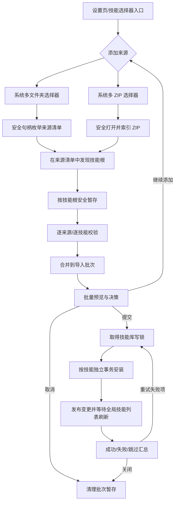

# Desktop 批量技能导入设计

Feature Name: desktop-skill-import
Updated: 2026-08-23

## Description

Desktop 在技能设置页提供批量导入工作台，支持以下组合：

- 一次选择多个技能文件夹；
- 一次选择多个 ZIP；
- 单个文件夹或 ZIP 包含多个技能；
- 在预览阶段继续追加文件夹或 ZIP。

Desktop 先以安全句柄枚举文件夹或索引 ZIP，在不复制内容的来源清单中发现技能根，再把每个技能根安全复制或解压到批次暂存区，统一展示技能列表、风险、批次内重名和已有技能冲突。用户逐项决定安装、替换或跳过，Desktop 在同一技能库写锁内按技能执行独立事务，最终汇总成功、失败和跳过结果。

方案继续使用 Agent Skills 的 `<skill-name>/SKILL.md` 格式，不改变技能目录格式或用户技能来源。升级时先把历史会话中缺失的技能列表冻结为当时的默认技能快照，之后导入不会改变已有会话快照。

## Product Decisions

### 为什么首版支持批量

社区技能通常以仓库或合集 ZIP 分发，一个来源包含多个技能。只支持单技能会迫使用户重复执行选择、预览和确认，无法解决“添加技能太麻烦”的核心问题。因此批量不是后续优化，而是本次导入入口的基础能力。

### 批次处理原则

1. **来源隔离**：一个 ZIP 存在安全问题时拒绝该 ZIP，不影响批次中的其他来源。
2. **技能隔离**：一个技能元数据无效时禁用该技能，不影响其他有效技能。
3. **逐项事务**：一个技能安装失败时回滚该技能，已经成功的技能保持成功。
4. **批次写锁**：提交期间通过进程内读写锁和跨进程文件锁阻止所有 Desktop 实例读取或写入技能库，避免观察到半个批次或误恢复活动事务。
5. **显式覆盖**：用户技能冲突默认跳过；Desktop 不静默覆盖。
6. **稳定结果**：技能按来源加入顺序和来源内相对路径排序处理，结果可复现。
7. **后台文件操作**：技能读取和写入、来源暂存、取消清理、批次提交和恢复均运行在阻塞线程池，不占用 Tauri 主事件循环。
8. **有限暂存**：文件和目录都计入条目上限；每个实例只保留一个批次，全部活动实例共享 1 GiB 暂存配额。

## User Experience

### 入口

#### 设置页主入口

“设置 → 技能”顶部操作区：

```text
技能
管理内置技能和自定义技能

[新建技能]  [导入技能 ▾]
```

“导入技能”菜单：

```text
选择文件夹…   可一次选择多个文件夹
选择 ZIP…      可一次选择多个 ZIP
```

自定义技能为空时，空状态同时显示“新建技能”和“导入技能”。

#### 技能选择器次级入口

新建任务和当前会话的 `SkillsMenu` 底部增加：

```text
管理和导入技能…
```

该入口打开“设置 → 技能”，不在窄选择器中直接承载文件树、风险确认和批量结果。运行中的会话保持菜单触发器和底部管理入口可用，但技能勾选控件禁用；现有会话技能快照不会因导入自动变化。

### 批量预览工作台

选择来源后打开 `BatchSkillImportDialog`：

```text
┌──────────────────────────────────────────────────────────────┐
│ 导入技能                                      [添加来源 ▾]   │
│ 3 个来源 · 12 个技能 · 8 可导入 · 2 冲突 · 1 风险 · 1 无效 │
├──────────────────────────────────────────────────────────────┤
│ [全部 12] [可导入 8] [冲突 2] [风险 1] [无效 1]             │
├──────────────────────────────────────────────────────────────┤
│ ☑ code-review       claude-skills.zip     可导入       [⌄]  │
│ ☑ test-generator    local-skills/         包含脚本     [⌄]  │
│ ☐ deploy            team-skills.zip       已存在  [跳过 ▾]  │
│ ◉ docs-helper       a.zip                 批次重名      [⌄]  │
│ ○ docs-helper       b.zip                 跳过          [⌄]  │
│ ⊘ broken-skill      bad.zip               名称无效      [⌄]  │
├──────────────────────────────────────────────────────────────┤
│ ☑ 我已检查所选技能中的可执行内容                            │
│ 已选择 9 个                         [取消] [导入 9 个技能]   │
└──────────────────────────────────────────────────────────────┘
```

每个技能项可以展开，展示：

- 名称、描述、来源文件和来源内相对路径；顶层 `name` 与技能根目录名不同时，明确显示“安装目录将使用 `<name>`”；
- 文件数量和总大小；
- 文件树与按需文本预览；
- 可执行文件和能力声明；
- 批次内重名、内置覆盖或用户技能冲突；
- 无效原因。

批次内同名项使用单选语义，最多选择一个候选。用户技能冲突默认“跳过”，用户主动改成“替换”后才进入提交集合。内置冲突显示“覆盖内置”提示。

### 结果视图

批次提交后，弹窗切换为结果视图：

```text
导入完成

成功 7 · 失败 1 · 跳过 4

✓ code-review
✓ test-generator
✕ deploy-helper    磁盘空间不足          [重试]
— docs-helper      批次内重名，已跳过

[关闭] [重试失败项]
```

成功技能立即进入“自定义技能”分组。失败项保留暂存数据供重试；关闭批次后清理剩余暂存数据。

## Architecture



导入采用 `batch_id` 标识批次，采用 `item_id` 标识技能项。前端无法指定本地绝对路径；来源选择、路径遍历、解压、暂存和安装全部由 Rust 壳执行。

## Skill Discovery

### 发现算法

每个通过路径与条目安全校验的来源清单执行深度优先扫描；发现完成后只暂存已发现技能根的后代，不复制技能之外的来源内容：

1. 从来源根目录开始；
2. 跳过 `.git`、`__MACOSX`、`.imports`、`.backups`、`.transactions` 和平台元数据文件；
3. 当前目录存在普通文件 `SKILL.md` 时，将当前目录登记为技能根；
4. 登记技能根后不再扫描该目录的后代，避免把技能自身的示例或参考资料误识别为独立技能；
5. 当前目录不存在 `SKILL.md` 时继续扫描普通子目录；
6. `.claude`、`.agents` 和 `.ohmyagent` 不属于跳过目录，因此仓库兼容技能可以被发现。

该规则同时支持：

```text
selected-folder/SKILL.md
selected-folder/skill-a/SKILL.md
repo/.claude/skills/skill-a/SKILL.md
archive-wrapper/skills/skill-a/SKILL.md
```

发现顺序为来源加入顺序，然后按来源内规范化相对路径排序。

### 名称规则

Desktop 使用顶层 frontmatter `name`，缺省使用技能根目录名；ZIP 虚拟根目录技能缺省使用来源 ZIP 文件名去除 `.zip` 后的 stem。`desktop/src/skills.rs::parse_frontmatter` 的顶层键规则作为规范口径；解析结果和回退名称必须通过现有 `valid_skill_name`：1–64 字节 ASCII，只允许字母、数字、`-`、`_`、`.`，不得以 `.` 开头。安装目标只能以该已验证名称作为单个路径组件在固定用户技能库句柄下创建，禁止绝对路径、分隔符、`.`、`..` 和任何路径重新解析。

同步修改 `agent/internal/skills/skill.go`：`parseFrontmatter` 跳过带缩进的 YAML 行，避免嵌套 `metadata` 或 `arguments` 中的 `name`、`description` 覆盖顶层字段；`parseSkillMetadata`、`parseFrontmatter` 以及技能元数据调用链中每一个可能先读取 `SKILL.md` 的 `bufio.Scanner` 都显式调用 `Scanner.Buffer`，最大 token 设为 `MAX_SKILL_MD_BYTES + 1`。这样外层 Scanner 不会在进入 frontmatter 解析前先拒绝 Desktop 接受的长单行。两侧使用共享测试样例验证预览名称、安装目录和 Agent catalog 名称一致。

为保证跨平台和会话快照语义稳定，Desktop 不在预览阶段写入用户技能库，也不探测卷的大小写行为。每个名称直接生成可移植名称键 `portable_name_key = ascii_lowercase(name)`：批次内相同键的技能属于重名组；现有用户技能仅在名称完全相同时允许“替换”；可移植名称键相同但大小写不同的用户技能属于不可替换冲突，用户需要先统一名称。这样替换不会把已有会话快照中的 `foo` 变成 Agent 只识别的 `Foo`。导入还统一拒绝 Windows 保留名和尾随点号，保证已导入技能可跨支持平台复制。内置技能名称完全相同时允许显式覆盖；可移植名称键相同但大小写不同时标记为不可安装冲突，因为 Desktop 最终会把用户技能和内置技能复制到同一个会话技能目录，大小写不敏感文件系统无法安全共存。

## Secure Staging

### 文件夹来源

文件夹导入不得复用面向已受信技能库的路径式 `copy_dir`。安全枚举和逐技能复制流程：

1. 打开并固定用户选择的根目录句柄；
2. 先用父目录句柄逐级枚举安全来源清单，只记录规范相对路径、条目类型、稳定文件标识和不跟随链接的元数据；在清单中发现技能根后，再仅复制这些技能根的后代；
3. 复制时从父目录句柄重新打开条目并复核稳定文件标识和类型，变化时拒绝来源；
4. 每一级使用“不跟随符号链接/重解析点”的平台语义；
5. 从父目录句柄读取不跟随链接的条目类型，只允许普通目录和普通文件；Unix 在内容打开前拒绝 FIFO、socket、块/字符设备等特殊文件，并以 `O_NONBLOCK|O_NOFOLLOW` 打开后再次 `fstat` 确认仍为同一普通文件，Windows 使用等价的非阻塞磁盘文件类型校验；
6. 打开普通文件后从文件句柄读取元数据和内容；
7. 每个技能根独立流式累计 entry 和实际读取字节；超过 1,000 个 entry、50 MiB、单文件 10 MiB 或 `SKILL.md` 1 MiB 时停止复制并删除该技能的部分暂存，只把该技能标为无效，再继续同来源下一个技能；
8. 批次累计超过 10,000 个 entry 或 500 MiB 时停止并删除整个新来源暂存，保持批次原有来源不变；
9. 在复制前为全部待暂存相对路径建立目标卷碰撞集合；创建目录使用独占创建并校验磁盘返回的实际名称和类型，创建文件使用 `create_new`。如果大小写敏感来源卷上的两个不同路径在暂存卷解析为同一对象，或发生文件/目录别名冲突，则拒绝并清理整个来源，绝不覆盖先创建对象；
10. 不在校验后按未经复核的原始路径重新打开文件，也不以枚举时的元数据大小代替实际字节计量；
11. Unix 使用 `openat`/`O_NOFOLLOW` 或等价能力；
12. Windows 使用拒绝 reparse point 的句柄打开方式；
13. 平台无法保证安全打开时拒绝该来源。

安全枚举在记录每个文件或子目录前累计来源清单 entry、检查规范相对路径深度和暂存目标卷对象碰撞，空目录同样计数；达到批次条目上限或发现碰撞时停止并清理新来源。逐技能复制在写入前执行技能级硬上限，避免一个超大技能先耗尽批次额度而连带删除同来源后续合法技能。这保证并发进程无法在检查和读取之间替换条目越出所选根目录，也不能用海量空目录或超大前置技能绕过资源限制。

### ZIP 来源

ZIP 先安全打开和索引，再按发现的技能根解压到独立暂存目录。用户选中路径必须从父目录句柄以“不跟随链接、非阻塞”的方式打开，只接受复核后的普通磁盘文件；Unix 使用 `O_NOFOLLOW|O_NONBLOCK` 后 `fstat`，Windows 拒绝 reparse point 和非 disk file。这样选中后被替换为 FIFO、设备或链接的 ZIP 会在阻塞打开前被拒绝。

归档句柄元数据超过 500 MiB 时直接拒绝；随后从固定大小尾部窗口解析 EOCD/Zip64 记录，在构造条目索引前拒绝超过 10,000 个条目、超过 32 MiB 的中央目录或越出归档边界的偏移。ZIP 解析器必须基于 `Read + Seek` 惰性读取，不得把整个归档或中央目录无界加载到内存。完整索引先执行以下校验并发现技能根，任一结构或路径安全错误拒绝整个 ZIP：

- 规范化路径；
- 拒绝绝对路径、Windows 路径前缀和 `..`；
- 拒绝符号链接条目；
- 维护归档逻辑路径集合，预先拒绝不同条目在暂存卷上的大小写/别名碰撞和文件目录类型冲突；
- 每遇到一个文件或目录条目就累计条目数并检查路径深度，空目录同样计数。

发现完成后只解压技能根后代。每个技能独立累计 entry 和实际写入字节；超过技能级 entry/字节、单文件或 `SKILL.md` 上限时停止并删除该技能的部分暂存，只将该技能标为无效。创建目录时校验磁盘返回的实际名称和类型，创建文件时使用 `create_new`；任何索引后对象碰撞仍拒绝整个 ZIP。批次或配置目录总配额超限时停止并删除整个新来源暂存。

ZIP 安全校验失败拒绝整个 ZIP，因为同一归档中的条目共享信任边界。其他文件夹或 ZIP 继续进入当前批次。

### 限制层级

```rust
const MAX_SOURCES_PER_BATCH: usize = 100;
const MAX_SKILLS_PER_BATCH: usize = 100;
const MAX_ENTRIES_PER_BATCH: usize = 10_000; // files + directories
const MAX_BYTES_PER_BATCH: u64 = 500 * MIB;
const MAX_ENTRIES_PER_SKILL: usize = 1_000; // files + directories
const MAX_BYTES_PER_SKILL: u64 = 50 * MIB;
const MAX_STAGING_BYTES_PER_CONFIG: u64 = 1 * GIB;
const MAX_STAGING_ENTRIES_PER_CONFIG: usize = 20_000;
const MAX_ZIP_SOURCE_BYTES: u64 = 500 * MIB;
const MAX_ZIP_METADATA_BYTES: u64 = 32 * MIB;
const MAX_PATH_DEPTH: usize = 64;
const MAX_BYTES_PER_FILE: u64 = 10 * MIB;
const MAX_SKILL_MD_BYTES: u64 = 1 * MIB;
```

批次限制在添加来源时增量计算，失败和空来源也计入 100 个来源上限。文件和目录均占一个 entry，防止海量空目录绕过文件数和字节限制。每个实例最多一个活动批次；全部实例在 `<app_config_dir>/skill-import-staging.lock` 下预留和释放配置目录级暂存字节与条目配额，遍历循环在创建条目前更新条目预留并以实际写入字节更新字节预留，确保并发实例累计不超过 1 GiB 和 20,000 个条目。超限来源不合并到现有批次，已经预览的技能项保持不变。

## Components and Interfaces

### Rust 数据模型

```rust
#[derive(Serialize, Clone)]
pub struct SkillImportCurrentSnapshot {
    pub snapshot_revision: u64,
    pub batch: Option<SkillImportBatchPreview>,
}

#[derive(Serialize, Clone)]
pub struct SkillImportBatchPreview {
    pub batch_id: String,
    pub phase: SkillImportBatchPhase,
    pub snapshot_revision: u64,
    pub in_flight_source_picks: usize,
    pub catalog_revision: Option<u64>,
    pub sources: Vec<SkillImportSource>,
    pub items: Vec<SkillImportItem>,
    pub totals: SkillImportTotals,
}

#[derive(Serialize, Clone)]
pub struct SkillImportItem {
    pub item_id: String,
    pub source_id: String,
    pub order: usize,
    pub source_display_name: String,
    pub relative_root: String,
    pub name: Option<String>,
    pub portable_name_key: Option<String>,
    pub description: String,
    pub files: Vec<SkillImportFile>,
    pub total_size: u64,
    pub risks: Vec<SkillImportRisk>,
    pub validity: SkillImportValidity,
    pub conflict: SkillImportConflict,
    pub duplicate_group: Option<String>,
    pub state: SkillImportItemState, // pending | succeeded | failed | skipped
    pub last_error: Option<String>,
}

#[derive(Deserialize)]
pub struct SkillImportDecision {
    pub item_id: String,
    pub action: SkillImportAction, // install | replace | skip
}

#[derive(Serialize)]
pub struct SkillImportBatchResult {
    pub batch_id: String,
    pub catalog_revision: Option<u64>,
    pub items: Vec<SkillImportItemResult>,
    pub success_count: usize,
    pub failure_count: usize,
    pub skipped_count: usize,
}
```

`source_display_name` 只包含文件或末级目录显示名。原始绝对路径只保存在 Rust 暂存状态中，不返回 WebView。

### 暂存状态

```rust
struct StagedImportSource {
    source_id: String,
    order: usize,
    source_path: PathBuf,
    staged_root: PathBuf,
    fingerprint: SourceFingerprint,
}

struct StagedImportItem {
    source_id: String,
    order: usize,
    root: PathBuf,
    preview: SkillImportItem,
}

#[derive(Serialize, Clone, Copy)]
#[serde(rename_all = "kebab-case")]
enum SkillImportBatchPhase {
    Collecting,
    Validating,
    Submitting,
    Completed,
    RetryValidating,
    Retrying,
}

struct StagedImportBatch {
    sources: Vec<StagedImportSource>,
    items: Vec<StagedImportItem>,
    source_keys: HashSet<SourceKey>,
    created_at: SystemTime,
    snapshot_revision: u64,
    phase: SkillImportBatchPhase,
    in_flight_source_picks: usize,
}

pub(crate) struct SkillImportState {
    batches: Mutex<HashMap<String, StagedImportBatch>>, // 0 or 1 entry per instance
    snapshot_clock: AtomicU64,
    staging_root: PathBuf,
    staging_lock_path: PathBuf,
    instance_id: String,
    instance_lease: Arc<File>,
}

#[derive(Clone)]
pub(crate) struct SkillStoreState {
    lock: Arc<RwLock<()>>,
    process_lock_path: PathBuf,
    catalog_revision_path: PathBuf,
    legacy_session_baseline_path: PathBuf,
    recovery_issues: Arc<Mutex<Vec<SkillRecoveryIssue>>>,
}

#[derive(Serialize)]
#[serde(tag = "code", rename_all = "kebab-case")]
pub enum SkillCommandError {
    RecoveryPending { issues: Vec<SkillRecoveryIssue> },
    Busy,
    InvalidRequest { message: String },
    Io { message: String },
}

#[derive(Serialize)]
pub struct SkillRecoveryResolveResult {
    pub preserved_path: Option<String>,
    pub catalog_revision: u64,
}

#[derive(Serialize)]
pub struct SkillMutationResult {
    pub catalog_revision: u64,
}

#[derive(Serialize)]
pub struct SessionSkillsMutationResult {
    pub skills: Vec<String>,
    pub skills_revision: u64,
}

#[derive(Serialize)]
pub struct SkillsCatalogSnapshot {
    pub revision: u64,
    pub skills: Vec<SkillInfo>,
}
```

`SkillImportState` 和 `SkillStoreState` 提供 `pub(crate) fn new()`，供父模块 `main.rs` 初始化。字段保持私有。

生命周期：

1. 首次选择来源时创建唯一的 `Collecting` 批次；实例已有活动批次时不创建第二个批次，WebView 通过 `skills_import_current` 取得现有完整快照重新附着；
2. 每个实例同一时刻最多执行一个来源选择/索引操作；在打开系统对话框前把 `in_flight_source_picks` 从 0 原子改为 1，已有在途操作时返回 `Busy`，完成、取消或失败后恢复为 0；只有 `Collecting` 批次允许预留和合并来源；
3. 继续添加来源时更新同一批次，重复来源按规范来源标识去重；失败和空来源同样计入 100 个来源上限；配置目录级字节与条目配额在独立 staging 文件锁内原子预留和释放；
4. 首次提交在批次临界区验证阶段和 `in_flight_source_picks == 0` 后从 `Collecting` 切换为 `Validating`，冻结来源追加；完成其余预检和指纹复核后切换为 `Submitting`，任一预检失败则切回 `Collecting`；
5. 首次提交期间 cancel、重复 commit、新的或在途来源合并均被 Rust 拒绝；被拒绝的在途来源合并会删除本次暂存并释放配额；
6. 首次提交后，每个技能项从 `pending` 进入 `succeeded`、`failed` 或 `skipped`，批次进入 `Completed`；
7. 重试在批次临界区从 `Completed` 切换为 `RetryValidating`；预检成功后进入 `Retrying`，失败则回到 `Completed`；两个阶段均拒绝 cancel 和其他提交；
8. `succeeded` 和 `skipped` 是终态，只有 `Completed` 批次中的 `failed` 可以重试；
9. 为支持来源共享暂存目录，批次关闭前保留来源暂存数据和全部结果元数据；cancel 只允许 `Collecting` 且 `in_flight_source_picks == 0`，或 `Completed` 阶段。成功取消在同一临界区递增实例级 `snapshot_clock`、移除批次并发布 `{ snapshot_revision, batch_id, deleted: true }` 墓碑事件，再在阻塞线程池删除目录和释放配额；`Collecting` 但仍有在途来源时返回 `Busy`，不能移除唯一批次槽；
10. 每个 Desktop 进程把批次存放在 `<app_config_dir>/skill-import-staging/<instance-id>/` 并持有实例 lease 文件锁；应用启动时尝试非阻塞取得其他实例的 lease，只删除锁已释放且不属于未完成安装事务的孤儿实例目录，不使用 24 小时宽限。

### Tauri 命令

```rust
#[tauri::command]
pub async fn skills_import_current(
    state: State<'_, SkillImportState>,
) -> Result<SkillImportCurrentSnapshot, SkillCommandError>;

#[tauri::command]
pub async fn skills_import_pick(
    app: AppHandle,
    state: State<'_, SkillImportState>,
    source_kind: SkillImportSourceKind, // folders | zips
    batch_id: Option<String>,
) -> Result<Option<SkillImportBatchPreview>, SkillCommandError>;

#[tauri::command]
pub async fn skills_import_read_text(
    state: State<'_, SkillImportState>,
    batch_id: String,
    item_id: String,
    relative_path: String,
    offset: u64,
    limit: u64,
) -> Result<SkillImportTextChunk, SkillCommandError>;

#[tauri::command]
pub async fn skills_import_commit(
    app: AppHandle,
    imports: State<'_, SkillImportState>,
    store: State<'_, SkillStoreState>,
    batch_id: String,
    decisions: Vec<SkillImportDecision>,
    executable_content_reviewed: bool,
) -> Result<SkillImportBatchResult, SkillCommandError>;

#[tauri::command]
pub async fn skills_import_cancel(
    state: State<'_, SkillImportState>,
    batch_id: String,
) -> Result<(), SkillCommandError>;

#[tauri::command]
pub async fn skills_recovery_list(
    store: State<'_, SkillStoreState>,
) -> Result<Vec<SkillRecoveryIssue>, SkillCommandError>;

#[tauri::command]
pub async fn skills_recovery_resolve(
    store: State<'_, SkillStoreState>,
    transaction_id: String,
    action: SkillRecoveryAction, // restore-backup | keep-installed | preserve-files
) -> Result<SkillRecoveryResolveResult, SkillCommandError>;
```

打开导入入口时前端先注册 `skills-import-updated` 监听，再调用 `skills_import_current`，避免查询与监听之间丢失完成事件。命令返回 `SkillImportCurrentSnapshot { snapshot_revision, batch }`；revision 来自实例级 `snapshot_clock`，即使 `batch=None` 也保留最后版本。批次快照包含同一 revision、phase、在途来源数和每项累计终态；Rust 在同一批次临界区内每次创建批次或修改 phase、在途计数、技能项状态时先推进 clock，再发出携带 `{ batch_id, snapshot_revision, deleted: false }` 的事件；取消则发布更高 revision 的删除墓碑。

WebView 重载后据 current envelope 重新附着：`batch=None` 清除弹窗状态，活动阶段显示不可关闭进度，`Completed` 直接恢复结果视图，`Collecting` 恢复预览。事件触发的并发 `skills_import_current` 响应只在 `snapshot_revision` 大于当前值时接受；更高 revision 的墓碑或 `batch=None` 清除旧批次，取消前克隆的旧响应不能把已删除批次重新附着。卸载时先取消监听，再丢弃在途响应。

`skills_import_pick` 在 Rust 侧调用系统多选文件对话框。`batch_id=None` 且实例已有活动批次时返回 `Busy`，前端重新调用 `skills_import_current`；没有活动批次时先占用实例唯一的临时批次槽，选择成功后创建批次，取消或失败则释放槽，因此外部观察不到空批次。传入已有 `batch_id` 时仅能向 `Collecting` 批次追加来源。命令在打开对话框前登记唯一的在途来源操作，已有操作时返回 `Busy`；暂存完成后再次检查批次阶段再合并；取消文件选择返回 `None`，仅撤销在途计数，不修改已有来源。

上述命令均为 async handler，只在事件循环中解析参数和克隆 `Arc` 状态；文件对话框之外的目录遍历、分页读取、复制、哈希、删除、文件锁等待、事务日志、重命名与同步操作全部通过 `tauri::async_runtime::spawn_blocking` 执行。现有 `skills_list`、`skills_save`、`skills_delete` 和 `skills_set_default` 同步迁移为 async handler，其完整技能库操作及两层锁等待也在 `spawn_blocking` 内执行；Driver 的 `materialize_skills` 保持现有阻塞线程执行方式。阻塞闭包不得持有 `tauri::State` 借用，也不得在持有同步锁时 `.await`。

所有技能库 IPC 使用可序列化的 `SkillCommandError`，前端按 `code` 区分恢复待处理、忙碌、请求错误和 I/O 错误；Driver 内部使用对应的 `SkillStoreError` 保留同一错误类别，不把 `RecoveryPending` 降级成普通字符串。现有 `skills_save`、`skills_delete` 和 `skills_set_default` 改为返回 `SkillMutationResult`，`skills_recovery_resolve` 返回的结果也携带 `catalog_revision`；每个结果都是该命令持有写锁时提交的 revision。

`skills_import_current` 只短暂取得批次 mutex，并在同一临界区读取 `snapshot_clock` 与克隆可选批次，保证 envelope 版本和内容一致；pick/commit/cancel 的阻塞文件操作不得跨 I/O 持有该 mutex，创建、删除、phase、在途计数和逐项终态只在短临界区更新并推进 clock，因此重附着查询和进度事件在后台操作期间可响应。

`skills_import_read_text` 使用 `batch_id + item_id + relative_path` 定位文件，并在已验证的技能根句柄内读取。分页参数允许预览大于 1 MiB 的合法文本文件，单次 `limit` 上限为 1 MiB。

### 批次提交校验

commit 先原子取得批次活动阶段，再取得技能库两层写锁并在任何写入前完成全批次预检。`CommitPhaseGuard` 负责在所有错误和 task join 失败路径恢复可操作阶段：首次校验失败回到 `Collecting`，重试校验失败回到 `Completed`；只有预检全部成功才进入执行阶段。开始逐项写入后 guard 的回退目标改为 `Completed`，并把尚未产生终态的本次决策项标为 `failed`，避免 panic 或 join 失败留下永久活动阶段。

首次提交必须满足：

- `batch_id` 存在，阶段为 `Collecting` 且 `in_flight_source_picks == 0`，随后在同一临界区切换为 `Validating`；
- 决策集合恰好包含每个 `pending` 技能项一次，并且所有 `item_id` 唯一；
- 无效技能只能是 `skip`；
- 相同 `portable_name_key` 的技能最多一个使用 `install` 或 `replace`；
- 名称完全相同的用户技能冲突必须使用 `replace` 或 `skip`；
- 与用户技能或内置技能存在名称大小写冲突的技能和无效技能只能使用 `skip`；
- 不存在名称完全相同用户技能冲突的技能不能使用 `replace`；
- 选中技能包含可执行内容时 `executable_content_reviewed=true`；
- 暂存文件的大小和内容指纹仍与预览一致；
- 全部条件通过后，仍在批次临界区将 `Validating` 切换为 `Submitting`。

重试提交必须满足：

- 原子地把批次阶段从 `Completed` 切换为 `RetryValidating`；
- 每个决策对应当前状态为 `failed` 的技能项，并且所有 `item_id` 唯一；
- 在技能库写锁内按当前用户/内置 catalog 重新计算每个失败项的冲突、大小写冲突和动作合法性，并复用首次提交的名称、风险确认、可执行内容确认与暂存指纹校验；
- 如果另一进程新增、删除或替换了同名技能，使原动作不再合法，则预检零写入失败，把更新后的冲突写回批次快照并回到 `Completed`；用户必须在结果视图重新选择“替换/覆盖/跳过”并确认后才能再次重试；
- `succeeded` 和 `skipped` 技能项不能再次提交；
- 未包含在本次重试决策中的失败项保持 `failed`；
- 全部条件通过后，仍在批次临界区将 `RetryValidating` 切换为 `Retrying`。

预检失败时不安装任何技能；冲突变化时先更新失败项预览和 `snapshot_revision`，再恢复批次到 `Collecting` 或 `Completed` 并返回批次级错误。预检通过后按 `SkillImportItem.order` 稳定处理决策，并持久化每个技能项的终态或最新失败原因；执行完成后阶段统一进入 `Completed`。Rust 壳仅允许 `Collecting` 且无在途来源，或 `Completed` 批次执行 cancel，其他状态返回 `Busy`。`SkillImportBatchResult` 和可重附着快照每次返回批次全部技能项的累计状态；至少一项成功时还返回最终 `catalog_revision`，供 Provider 等待目标版本，因此成功数、失败数和跳过数始终覆盖完整批次。

## Transaction and Concurrency

### 逐项事务

每次技能库操作先取得进程内锁，再取得 `<app_config_dir>/skills.lock` 的 OS advisory 文件锁：读取使用共享锁，写入和恢复使用独占锁。文件锁句柄覆盖完整操作并由 OS 在进程退出时自动释放；无法取得文件锁时等待或返回忙碌错误，不得执行事务恢复。这样第二个 Desktop 进程不会把第一个进程仍在运行的事务当作崩溃残留。

技能库内使用不会被 `scan_store` 识别的目录：

```text
<app_config_dir>/skills/
├── .imports/<transaction-id>/
├── .backups/<transaction-id>/
├── .transactions/<transaction-id>.json
└── <skill-name>/
```

每个技能项执行：

1. 将技能项复制到 `.imports/<transaction-id>/` 并复核内容；
2. 原子写入并同步事务日志，阶段为 `prepared`；
3. 新装时将临时目录重命名为目标目录；
4. 替换时将原目录移入备份，更新阶段为 `backup-created`，再将临时目录重命名为目标目录；
5. 每次重命名后同步技能库父目录；
6. 成功后更新阶段为 `installed`，删除备份和事务日志；
7. 失败时恢复当前技能的原目录，记录失败结果并继续下一个技能。

批次不是全有或全无事务。前一个技能成功后，后一个技能失败不会撤销前一个技能。

### 崩溃恢复

`recover_skill_transactions` 在 Driver 启动和首个技能库读取之前取得进程内写锁与跨进程独占文件锁并运行。每次普通 `skills_list` 或 `materialize` 使用“检查直到在读锁下稳定”的恢复预检循环：

1. 取得进程内读锁和跨进程共享锁，在锁内扫描持久事务目录并重新校准 issue；
2. 没有事务日志时保持两层读锁并直接执行本次扫描/物化；
3. 只存在已登记的不可自动恢复 issue 时，在锁内立即返回 `RecoveryPending`；
4. 存在尚未分类或可自动恢复事务时释放读锁，按固定顺序取得两层独占锁，运行一次自动恢复并登记仍失败的 transaction ID，然后释放独占锁回到步骤 1；
5. 同一 transaction ID 一旦登记为不可恢复，下一轮走步骤 3，不会重复恢复形成死循环；独占锁到读锁交接期间若出现新事务，下一轮步骤 1 会发现并处理，不能越过检查读取缺失目录。

因为最终事务检查和技能读取发生在同一段跨进程共享锁内，其他进程不能在两者之间开始写事务；已初始化进程也能接管另一进程之后崩溃留下的事务。

每次技能库读写操作都从持久事务日志重新校准 `recovery_issues`：磁盘日志已被其他进程解决时移除本地旧 issue，日志内容变化时更新候选。任一写操作在修改技能、默认值或迁移基线前，必须在已持有的两层独占锁内运行一次 `recover_skill_transactions`；可自动恢复事务全部清理后才继续写，仍有任何未解决事务则返回 `RecoveryPending`，不得让新写入落在旧事务状态之上。内存列表只是当前磁盘状态的缓存，不能单独作为阻塞依据。

- 阶段为 `prepared`：目标存在时删除未安装临时目录；目标缺失时恢复可用备份。
- 阶段为 `backup-created`：将可能存在的新目标移入隔离目录，再恢复原备份。
- 阶段为 `installed`：目标存在时完成清理；目标缺失且备份存在时恢复备份。
- 文件状态与事务阶段不匹配：保留全部数据，将事务加入 `recovery_issues`，阻止写入对应 `portable_name_key`。

`SkillRecoveryIssue` 返回 `backup_available`、`installed_available`、`isolated_available`、`authoritative_target_missing` 和允许的 `actions`。只要重新校准后的任一恢复问题满足 `authoritative_target_missing=true`，除 `skills_recovery_list` 和 `skills_recovery_resolve` 外的 `skills_list`、`skills_save`、`skills_delete`、`skills_set_default`、批次 commit 和会话 `materialize` 均返回结构化 `SkillCommandError::RecoveryPending`/`SkillStoreError::RecoveryPending`；不得删除或重写现有会话技能目录，避免在恢复完成前固化缺失 catalog。

`skills::materialize` 不再先删除现有会话技能目录：它在同级临时目录中完成全部扫描和复制，成功后以“旧目录移入临时备份 → 新目录原子重命名到目标 → 删除备份”的顺序切换，任一步失败都恢复或保留旧目录。`desktop/src/driver/session.rs::resume_engine` 对任何物化错误都必须停止并传播到 `spawn_resume` 和连接状态，禁止继续调用 `session/create`。连接状态载荷扩展为 `ConnStatusPayload { connected, text, code?: ConnStatusErrorCode }`；`RecoveryPending` 映射为稳定的 `code="skill-recovery-pending"`，Chat UI 提供“打开技能恢复”操作，其他物化错误使用 `skill-materialize-failed`。这样不存在以残缺派生目录降级启动或 UI 无法区分恢复门控的路径。

设置页通过 `skills_recovery_list` 条件展示操作：备份有效时显示“恢复原版本”；目标版本有效时显示“保留已安装版本”；两者都无效时显示“保留恢复文件并解除阻塞”。最后一个操作把所有残留移动到 `<app_config_dir>/skill-recovery/<transaction-id>/`，删除事务日志并解除名称写入阻塞。`skills_recovery_resolve` 在两层写锁内从磁盘重新验证候选和动作可用性后执行，并通过 `SkillRecoveryResolveResult.preserved_path` 返回实际保留目录供 UI 展示。解决操作删除或更新持久事务后立即刷新本进程缓存；其他进程会在下一次门控检查时自行校准并解除阻塞。事务日志、事务目录和父目录均按阶段同步，确保两次重命名之间退出后仍可确定恢复动作。

### 共享技能库锁

应用为同一配置目录维护一把进程内 `Arc<RwLock<()>>` 和一个固定跨进程锁文件。`main.rs` 创建 `SkillStoreState` 后，将同一 `Arc` 与锁文件路径注入 `OhmyDriver`/Driver 内部状态；`materialize_skills` 在进入 `spawn_blocking` 前克隆状态，并在闭包内覆盖完整扫描和递归复制持有两层读锁。

- `skills_list` 持有进程内读锁和跨进程共享文件锁；
- `skills::materialize` 的完整扫描和递归复制持有两层读锁；
- `skills_save`、`skills_delete`、批次 commit 和事务恢复持有进程内写锁和跨进程独占文件锁；
- 批次 commit 从全批次预检开始到全部技能项处理结束持有一次两层写锁。

所有路径的锁顺序固定为“进程内锁 → 跨进程文件锁”；任何路径都不得反向获取。跨进程锁等待只发生在 `spawn_blocking` 中。

现有 `skills_gate` 继续串行化本进程会话操作，并增加固定路径 `<app_config_dir>/session-skill-locks/<session-id>.lock` 的跨进程独占文件锁。`session_open`、恢复、`session_set_skills` 和 `session_delete` 对同一会话都按以下顺序获取；其中打开/恢复/修改技能持有会话文件锁直到有效快照读取、原子物化和 `session/create` 全部完成，确保另一进程不能在 create 前切换同一派生目录：

```text
skills_gate → session skills file lock → SkillStoreState
```

会话删除持有 session file lock 后删除 sidecar 和派生目录，但不获取 `SkillStoreState`。技能库写操作不得获取 `skills_gate` 或 session file lock，防止反向死锁。

## Frontend Components

### `SkillsCatalogProvider`

在 App 工作台和设置页共同父级增加 `SkillsCatalogProvider`，集中维护技能列表、加载状态和单调递增的 revision。`skills_list` 返回 `SkillsCatalogSnapshot { revision, skills }`；`SkillsSection`、新建任务和当前会话的 `SkillsMenu` 均消费同一 catalog，不再各自用一次性 effect 缓存 `skillsList()`。`skills_save`、`skills_delete`、`skills_set_default`、批次 commit 和恢复操作成功后统一调用 `refreshSkillsCatalog()`；批次至少一项成功时，在启用结果视图关闭按钮前等待刷新完成。这样保持挂载但被 `inert` 的 NewTaskModal/Composer 在设置关闭后立即看到新技能和最新默认值。

Provider 以服务端 `revision` 作为 catalog 新旧的第一判据：响应 revision 大于当前值时无论请求 generation 都接受，小于当前值时丢弃；revision 相等时内容必须相同，仅最新 generation 可以结束对应 loading 状态。请求 generation 只管理 pending/loading，不得丢弃更高服务端 revision。写操作等待至少观察到该写事务返回的目标 revision 后才报告 UI 完成，避免交叉 save/delete/default/import 响应回退列表。

每个技能库写事务在持有两层写锁时原子递增并同步 `<app_config_dir>/skills.revision`；批次在释放写锁前把最终 revision 写入批次快照和结果，崩溃恢复若改变权威技能目录也必须递增 revision。每个 Desktop 进程由 Rust 监视该文件，变化时向本 WebView 发出 `skills-catalog-changed`；Provider 收到后刷新。为覆盖文件监视事件丢失，窗口重新获得焦点、打开设置技能分区或展开任一 `SkillsMenu` 时也调用 `skills_list` 比较 revision。由另一个 Desktop 进程产生的变更因此不会永久留在本实例缓存中。

### 历史会话快照迁移

现有缺失 `meta.skills` 的会话会动态跟随默认技能，和“已有会话快照不变”冲突。Driver 在开放任何 `skills_save`、`skills_delete`、`skills_set_default` 或批量 commit 前，在技能库两层写锁内执行一次幂等基线迁移：取得修改前的默认启用名称，扫描当前持久会话 ID，并把每个缺失显式字段的 `session_id → skills` 映射原子写入和同步到 `<app_config_dir>/legacy-session-skills-v1.json`。迁移不改写会话 sidecar，因此不会与会话事件写入或删除发生丢失更新，也不会重建已删除目录；会话 ID 不复用，映射中残留的已删除 ID 无副作用。

Driver 和 `sessions_list` 解析会话技能时按“sidecar 显式 `skills` → legacy baseline 映射”顺序返回有效显式快照，不再让历史会话回退到变化后的默认集；新建会话继续在创建时写入显式物化结果。`SessionMeta` 增加单调递增的 `skills_revision`，baseline 从缺失变为显式列表以及 `session_set_skills` 成功都推进该 revision。

Composer 的本地状态保存 `{ serverRevision, enabledSkills }`：同一 `sessionId` 收到更高 `meta.skills_revision` 时更新 `enabledSkills`，较旧轮询不得覆盖；`session_set_skills` 的 IPC 返回类型改为 `SessionSkillsMutationResult`，乐观修改只在响应的新 revision 和规范化 skills 列表后确认，失败回滚。迁移失败时技能库写操作返回错误，不允许先修改默认集。每次 `refreshSkillsCatalog()` 在接受新 catalog 前先等待会话状态层重新拉取有效快照，并确认当前已挂载 Composer 已消费对应 `skills_revision`，使原为 `enabledSkills=null` 的历史会话先更新为 baseline 列表，再观察新默认 catalog。

### `SkillsSection.tsx`

- 将“新建技能”和“导入技能”移动到分区顶部操作区；
- 自定义技能空状态复用两个操作；
- 管理批量导入弹窗的打开和安装成功后的全局 `refreshSkillsCatalog()`；
- 批次成功后展开“自定义技能”分组并高亮本批次新增技能；
- 调用 `skills_recovery_list` 展示异常事务横幅，并按可用候选提供“恢复原版本”“保留已安装版本”或“保留恢复文件并解除阻塞”；后者成功后展示命令返回的 `preserved_path`。

### `BatchSkillImportDialog.tsx`

新增批量导入主组件：

- 来源追加菜单；
- 批次统计摘要；
- 全部、可导入、冲突、风险、无效筛选；
- 技能项多选；
- 批次内重名单选组；
- 冲突动作选择；
- 可执行内容确认；
- 提交进度和结果视图。

提交开始后禁用关闭、Escape、来源追加和决策修改，直到 Rust 快照进入 `Completed`。如果至少一项成功后的 catalog 刷新返回 `RecoveryPending`，结果视图内嵌与 `SkillsSection` 相同的 `RecoveryPanel`，直接调用 `skills_recovery_list/resolve`；用户解决全部权威目录缺失问题后重试 catalog 刷新，再启用关闭。恢复操作不依赖关闭导入弹窗，因此不会形成模态死锁。

### `SkillImportItemRow.tsx`

单个技能项负责：

- 选择状态；
- 名称、描述、来源和状态徽标；
- 文件树和文本预览；
- 风险详情；
- 替换、覆盖内置或跳过动作。

按 `item_id` 作为 React key，不能使用技能名称，因为批次允许同名候选同时存在。

### 设置分区导航

将 App 当前无参数的设置打开逻辑扩展为 `openSettings(section?: SettingsSection)`，由 `SettingsNavigationContext` 向工作台子组件提供。`SettingsView` 接收 `initialSection`，每次新打开设置时将当前分区设为目标分区；没有参数时保持现有账号分区默认值。

### `SkillsMenu`

在 `desktop/ui-next/src/features/chat/composer/pickers.tsx` 的技能菜单底部增加“管理和导入技能”，通过 `useSettingsNavigation().openSettings("skills")` 打开技能分区。`SkillsMenu` 把现有单一 `disabled` 拆为 `triggerDisabled` 和 `selectionDisabled`：运行中会话保持 trigger 与底部管理入口可用，只禁用技能勾选和默认集修改。入口只负责导航，不修改当前会话选择。

### IPC 与国际化

`desktop/ui-next/src/lib/ipc/skills.ts` 增加批次、恢复模型和七个 IPC 封装（含 `skills_import_current`），其中恢复解决结果包含可选 `preserved_path` 和提交后的 `catalog_revision`；现有 `skillsList()` 改为返回带 revision 的 `SkillsCatalogSnapshot`，save/delete/default 返回 `SkillMutationResult`。会话 IPC 类型同步增加 `SessionMeta.skills_revision`、`SessionSkillsMutationResult` 和 `ConnStatusPayload.code`。`en.ts`、`zh.ts` 增加来源、数量摘要、状态、冲突动作、风险确认、恢复、进度和结果文案。

## Registration and Permissions

- `desktop/src/main.rs` 注册命令、管理 `SkillImportState`/`SkillStoreState`，并监视 `skills.revision` 向本实例 WebView 发布 catalog 变更事件；
- `desktop/build.rs` 加入 `skills_import_current`、`skills_import_pick`、`skills_import_read_text`、`skills_import_commit`、`skills_import_cancel`、`skills_recovery_list`、`skills_recovery_resolve`；
- `desktop/tauri.conf.json` 的 `main-app.permissions` 加入：
  - `allow-skills-import-current`
  - `allow-skills-import-pick`
  - `allow-skills-import-read-text`
  - `allow-skills-import-commit`
  - `allow-skills-import-cancel`
  - `allow-skills-recovery-list`
  - `allow-skills-recovery-resolve`
- 复用现有 `tauri_plugin_dialog`，不给 WebView 通用文件系统读取权限。

## Correctness Properties

1. 用户提交批次前，用户技能库不发生变化。
2. 一个来源失败不会移除同批次的其他来源。
3. 单文件、技能级大小或技能级条目超限只使所属技能无效，不会删除同一来源或阻止其他有效技能进入预览。
4. 相同可移植名称键的技能最多一个进入安装集合。
5. 用户技能只在名称完全相同的冲突项明确选择“替换”后改变，用户技能或内置技能的大小写异名不能进入安装集合。
6. 单个技能安装失败不会撤销批次中已经成功安装的技能。
7. 同一进程和不同 Desktop 进程中的技能列表、写操作、会话物化和事务恢复无法观察或修改活动批次的中间状态。
8. commit 失败或进程异常退出不会丢失被替换技能的原内容。
9. 任一首次提交或重试决策集合中的 `item_id` 唯一；任一技能项最多成功 commit 一次，已跳过技能项不能在重试中重新激活。
10. 批次进入 `Validating`、`Submitting`、`RetryValidating` 或 `Retrying` 后不接受来源或取消；预检失败后批次恢复到可操作阶段。
11. 每个实例最多一个可重新附着的活动批次，失败或空来源也受来源数限制；文件和目录均受条目及深度限制，全部活动实例的暂存总量不超过 1 GiB 和 20,000 个条目。
12. Desktop 预览名称、安装目录名单个安全组件和 Agent catalog 名称一致，包括 ZIP 虚拟根回退名称与接近 1 MiB 的单行内容。
13. WebView 或并发修改来源的进程无法使导入读取所选根目录之外的文件或突破实际字节上限。
14. ZIP 中不同逻辑条目不能覆盖或合并为同一个暂存对象。
15. 批次累计结果中的成功数、失败数和跳过数之和等于批次技能项总数。
16. 来源加入顺序和技能相对路径共同确定稳定安装顺序。
17. 已运行进程的普通读取会接管其他进程崩溃留下的可自动恢复事务；未解决问题不会使技能列表或会话物化静默遗漏权威目录缺失的技能，其他进程解决持久事务后本进程不会继续被旧缓存阻塞。
18. 任一进程修改技能库后，全部实例的已挂载技能选择器最终展示同一 revision 的技能列表和默认值；更高服务端 revision 不会因较旧请求 generation 被丢弃。
19. 首次技能库修改前，所有历史无快照会话都已冻结当时默认技能；导入不改变任何已有会话的显式快照。

## Error Handling

- 用户取消文件选择：保持批次不变，不显示错误。
- 来源不可读或无技能：显示来源级错误，保留其他来源。
- 实例已有活动批次：不创建第二批次，返回 `Busy` 并由 WebView 调用 `skills_import_current` 取得完整快照重新附着。
- ZIP 安全校验失败：删除该 ZIP 的全部暂存内容，保留其他来源。
- 单文件或技能级容量超限：删除单文件部分暂存并禁用所属技能项，保留同一来源中的其他技能。
- 单个技能名称或内容无效：禁用该技能项，允许导入其他技能。
- 批次条目、路径深度、批次字节或配置目录总暂存配额超限：立即停止并删除新来源暂存、释放全部条目与字节预留，保持已有预览项不变。
- ZIP 路径在暂存卷上发生对象碰撞：拒绝整个 ZIP 并删除该来源暂存。
- 文本预览失败：保留技能项，在文件面板显示局部错误。
- 批次存在在途来源、阶段不是可提交状态或决策包含重复 `item_id`：全批次预检失败，不写入技能库并恢复到 `Collecting`/`Completed` 可修正状态。
- `Validating`、`Submitting`、`RetryValidating` 或 `Retrying` 阶段收到 cancel/commit/pick：返回 `Busy`，不删除批次或来源暂存。
- 单个技能 commit 失败：回滚当前技能并继续处理后续技能。
- 回滚失败：保留备份，记录失败项和备份位置，继续处理不冲突的后续技能。
- commit 期间进程退出：下次启动在技能列表或会话物化前取得跨进程独占锁并执行事务恢复。
- 自动恢复无法恢复权威目录：单次恢复尝试后技能列表和会话物化返回 `SkillRecoveryPending`，不重复恢复循环并保留现有会话派生目录；导入结果视图内提供恢复操作。
- 结果视图关闭：清理失败项和跳过项的暂存数据。
- 应用异常退出：下次任一 Desktop 启动时通过 instance lease 识别并立即清理不活动进程的孤儿批次暂存。

## Test Strategy

### Rust：发现与安全

- 多选文件夹和多选 ZIP。
- 根目录单技能、ZIP 虚拟根无 `name` 时使用 ZIP stem、直接子目录多技能、深层兼容目录多技能。
- 发现技能根后停止扫描后代目录。
- `.claude`、`.agents`、`.ohmyagent` 被扫描，`.git`、`__MACOSX`、`.imports`、`.backups`、`.transactions` 被跳过。
- 同一来源重复添加时去重。
- ZIP Slip、绝对路径、Windows 前缀、符号链接、ZIP 与跨卷文件夹的暂存卷大小写/别名碰撞、归档输入/中央目录元数据和压缩炸弹限制。
- 技能 frontmatter 名称必须通过 `valid_skill_name` 且安装路径保持在技能库句柄下。
- 文件夹条目检查后被替换为符号链接或 reparse point 时中止；FIFO、socket、设备等特殊文件在阻塞打开前拒绝。
- 文件打开后增长时按实际字节硬截断；单文件、50 MiB 技能总量和 1 MiB `SKILL.md` 超限只使所属技能无效，同来源其他技能仍可导入，批次总量不能突破上限。
- 文件与空目录共同触发 entry 上限，超过 64 层的路径被拒绝，失败和空来源触发 100 个来源上限。
- 来源级、技能级、批次级和跨实例配置目录总字节/条目配额边界。
- 单实例只允许一个活动批次；多进程 instance lease 保留活动进程暂存并立即清理崩溃进程孤儿暂存。

### Rust：批次与事务

- 可移植名称键、与用户或内置技能的名称大小写冲突、Windows 保留名和尾随点号。
- 批次内相同可移植名称键的候选只能选择一个。
- 用户技能冲突默认跳过，明确替换后允许提交。
- 无效项不能进入安装集合。
- 可执行内容未确认时预检失败且零写入。
- 多技能全部成功、部分失败和全部失败结果计数。
- 中间技能失败后继续安装后续技能。
- 同一实例第二个并发来源选择返回 `Busy`；唯一在途来源阻止首次提交，进入验证或提交阶段后拒绝来源追加和在途合并。
- 首次提交预检失败回到 `Collecting`，重试预检失败回到 `Completed`。
- 在途来源以及验证、提交和重试阶段的并发 cancel/commit/pick 返回 `Busy` 且不删除批次槽或暂存。
- 首次提交必须覆盖全部 pending 项，跳过项进入终态，重试只接受 failed 项。
- 首次提交和重试均拒绝重复 `item_id`；另一进程在失败与重试间新增同名技能时，重试重新计算冲突并要求用户确认新动作。
- 累计结果计数始终等于批次技能项总数。
- 同一 `item_id` 不能成功提交两次。
- 每个文件系统步骤和两次重命名之间注入错误或进程重启。
- 自动恢复失败后的单次尝试、候选检测、条件操作、保留恢复文件和保留路径返回；不可恢复日志不会触发读取重试死循环。
- 已初始化第二进程在普通读取或直接 save/delete/default/batch commit 前接管第一进程新产生的可恢复崩溃事务；模拟独占锁释放到重取读锁之间出现新事务，读取仍重新检查。
- 任意物化错误保留旧会话派生目录并阻止 `resume_engine` 创建 Agent 会话；恢复待处理错误保持结构化。
- 双进程同时记录 issue 后，一方 resolve，另一方下一次读取从磁盘校准并解除旧缓存阻塞。
- 单进程与双 Desktop 进程并发 list/save/delete/batch commit/recovery/session materialize 的两层技能库锁和锁顺序。
- 双进程对同一 session 交错 open/set-skills/materialize/create/delete 时，session file lock 保证各次 create 观察对应显式快照。
- 历史 `meta.skills` 缺失会话在首次技能库写入前写入独立 baseline，和并发 sidecar 写入/删除不互相覆盖；迁移失败时零技能库写入。
- Desktop 与 Agent 所有 `SKILL.md` Scanner 对嵌套 frontmatter 和接近 1 MiB 单行的解析一致。

### UI

- 设置页顶部入口、自定义空状态入口和 `SkillsMenu` 精确跳转到技能分区；运行中会话可打开管理入口但不能修改勾选。
- WebView 在来源追加、首次提交和重试各阶段重载后，先监听事件再通过 `skills_import_current` 恢复 snapshot revision、phase、在途计数、进度和最终结果；current 逆序返回不回退状态。
- cancel 与 WebView 重载查询交错时，删除墓碑 revision 使取消前克隆的快照失效，批次不会重新附着。
- 添加多个文件夹、多个 ZIP，在预览中继续追加来源，并在来源仍在处理时禁用提交。
- 批次摘要和状态筛选。
- 全选、取消全选、无效项禁用和批次内重名单选。
- 顶层名称与目录名不同时显示安装目录变更提示；用户技能替换、内置覆盖和跳过动作。
- 文件树、分页文本预览和风险确认。
- 提交期间禁用关闭和决策修改。
- 部分成功结果、失败原因和失败项重试。
- 批量导入、编辑、删除和默认开关后，先同步历史会话有效快照并等待全局 catalog 刷新再允许关闭结果；已挂载的新建任务及 Composer 技能菜单同步刷新。
- 两个刷新请求逆序返回时优先接受更高服务端 revision；同 revision 才用 generation 管理 loading，旧响应不覆盖新 catalog；save/delete/default/recovery 返回目标 revision。
- `session_set_skills` 返回 `skills_revision`，同会话轮询和乐观响应逆序时不回退启用集。
- 第二 Desktop 进程修改技能库后，本实例经 revision 文件事件刷新；模拟丢失事件后，窗口聚焦或菜单打开仍能校准。
- 异常事务横幅、导入结果内联恢复面板、`conn-status.code` 结构化读取阻塞提示、按候选条件显示的恢复操作和保留路径。
- Escape、焦点顺序、键盘选择和中英文文案键完整性。

### 聚焦验证

- Rust：运行技能导入、技能库和会话物化相关测试。
- Agent：运行 `agent/internal/skills` 解析和 catalog 测试。
- UI：运行 `SkillsSection`、`BatchSkillImportDialog`、`SkillImportItemRow`、`SkillsMenu` 测试和 TypeScript 类型检查。
- 手工冒烟：macOS、Windows、Linux 分别验证多文件夹、多 ZIP、单 ZIP 多技能、部分失败和覆盖恢复。

## Future Extensions

Git 仓库和技能市场只需新增远程来源适配器，将来源内容安全生成到同一批次暂存区。多技能发现、批量预览、冲突决策、逐项事务和结果汇总均可复用。

后续可在批次和技能项上增加 repository、ref、commit SHA、版本、签名、更新时间和可信源策略，而不改变用户技能库目录格式。

## References

- [Claude Code Skills](https://code.claude.com/docs/en/skills)（访问于 2026-08-23）
- [Claude Code Plugins](https://code.claude.com/docs/en/discover-plugins)（访问于 2026-08-23）
- [Cursor Rules](https://cursor.com/docs/rules)（访问于 2026-08-23）
- [OpenAI Skills](https://learn.chatgpt.com/docs/build-skills)（访问于 2026-08-23）
- [GitHub Copilot Agent Skills](https://docs.github.com/en/copilot/concepts/agents/about-agent-skills)（访问于 2026-08-23）
- [Agent Skills Specification](https://agentskills.io/specification)（访问于 2026-08-23）
- `agent/doc/skills.md:7-63`
- `desktop/src/skills.rs:63-70`
- `desktop/src/skills.rs:163-229`
- `desktop/src/skills.rs:267-280`
- `desktop/src/skills.rs:308-365`
- `desktop/ui-next/src/features/settings/SkillsSection.tsx:50-95`
- `desktop/ui-next/src/features/settings/SkillsSection.tsx:144-328`
- `desktop/ui-next/src/features/chat/composer/pickers.tsx:313-473`
- `desktop/ui-next/src/lib/ipc/skills.ts:6-49`
