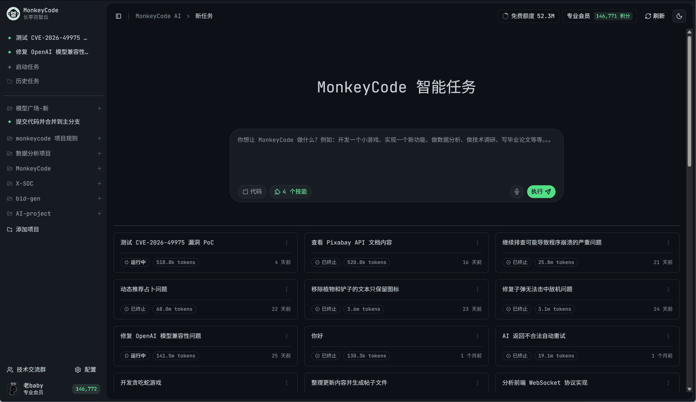
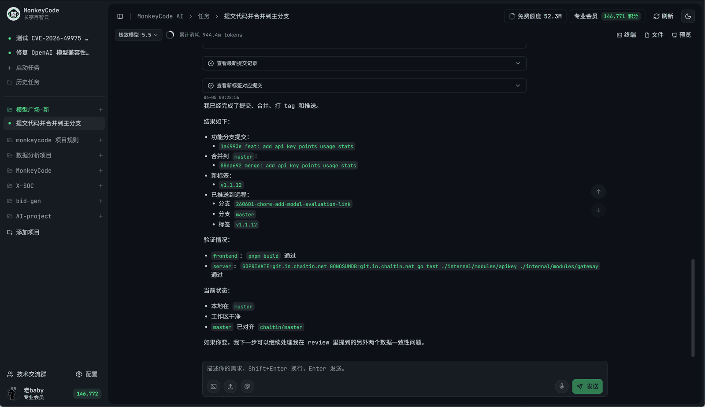

# MonkeyCode

<p align="center">
  
</p>

<p align="center">
  <a href="https://github.com/chaitin/MonkeyCode/actions/workflows/build.yml"></a>
  <a href="https://github.com/chaitin/MonkeyCode/actions/workflows/electron-release.yml"></a>
  <a href="./LICENSE"></a>
</p>

<p align="center">
  <a href="https://monkeycode-ai.com/">在线使用</a> ·
  <a href="#独立部署使用">独立部署</a> ·
  <a href="https://baizhi.cloud/consult">企业咨询</a>
</p>

## MonkeyCode 是什么

MonkeyCode 是一款开源的**企业级 AI 开发平台**，内置了开发环境管理、AI 模型管理、AI 任务管理、项目需求管理等能力，区别于其他的 vibe coding 工具，MonkeyCode 是真正面向专业开发团队的 AI 助手。

- 你可以部署在**企业内网**，分享给研发团队使用，让你的研发团队可以方便、快捷地启动开发任务；作为研发负责人的你可以对企业内的 AI 开发流程进行统一管理。
- 你可以直接使用我们的**在线环境**，内置了开发环境，内置了大模型，支持手机客户端，可以随时随地使用最领先的 AI Agent。

## 界面展示

<table>
  <tr>
    <td align="center">
      
      <br />
      <sub>AI 任务工作台</sub>
    </td>
    <td align="center">
      
      <br />
      <sub>云端终端与任务执行</sub>
    </td>
  </tr>
  <tr>
    <td align="center">
      
      <br />
      <sub>项目协作与文件管理</sub>
    </td>
    <td align="center">
      
      <br />
      <sub>移动端任务与文件管理</sub>
    </td>
  </tr>
</table>

## 功能与特色

你不需要自己拼工具、搭环境、来回切流程。把需求交给 MonkeyCode，它会从开发到验证一路接住，真正把 AI 编程变成可持续的工作流。

- **免费即用**：无需下载客户端，也不用折腾环境。浏览器打开、注册账号，几秒钟就能开始执行第一个 AI 开发任务。
- **云端开发环境**：不依赖本地开发机。每个任务背后都有一台真实服务器提供运行环境，编译、测试、预览都在云上完成。
- **全量主流模型**：GLM、Kimi、MiniMax、Qwen、DeepSeek 等都已接入，支持按任务类型切换，也能手动指定。
- **移动端原生支持**：深度适配 iOS / Android，PC 和手机数据实时同步。通勤路上也能把任务交给 Agent 继续跑。
- **完全开源**：核心代码全部公开在 GitHub。任何人都能审计、fork、二次开发，技术选型和安全策略自己掌控。
- **私有化离线部署**：对数据隐私要求高的企业和团队，可以把 MonkeyCode 独立部署到自己的内网中，数据不出本地。

## MonkeyCode 可以做什么

<table>
  <tr>
    <td>
      <h3>做个小游戏</h3>
      <p>一句话描述玩法，AI 帮你搭框架、处理碰撞检测、补音效，一个下午就能跑出可玩的版本。</p>
      <sub>HTML5 · Canvas · TypeScript · 零依赖</sub>
    </td>
    <td>
      <h3>实现一个需求</h3>
      <p>把需求丢进去，AI 读你的代码仓库、理解项目约定，直接改文件、跑测试、开 PR。</p>
      <sub>读懂代码风格 · 自动写单测 · 一键开 PR</sub>
    </td>
    <td>
      <h3>安全审查</h3>
      <p>上线前做一次体检。AI 扫常见漏洞、硬编码密钥、依赖风险，输出可修复的清单。</p>
      <sub>OWASP Top 10 · 依赖 CVE · SAST 规则</sub>
    </td>
  </tr>
  <tr>
    <td>
      <h3>写毕业论文</h3>
      <p>帮你查文献、列提纲、补实验代码、跑数据、画图、排版 LaTeX，从选题到定稿都能接力。</p>
      <sub>文献检索 · 实验脚本 · LaTeX 排版</sub>
    </td>
    <td>
      <h3>数据分析</h3>
      <p>丢一份 CSV 或 Parquet，描述你想看的角度。AI 自动清洗、建模、画图，再写一段可读结论。</p>
      <sub>Pandas / Polars · Matplotlib · 自动写结论</sub>
    </td>
    <td>
      <h3>产品 / 技术调研</h3>
      <p>AI 拉公开资料、跑 benchmark、出对比报告，带引用链接，适合做技术选型和产品预研。</p>
      <sub>公开资料聚合 · 横向对比 · 带引用</sub>
    </td>
  </tr>
</table>

## 使用指南

### 在线使用

直接访问 MonkeyCode 在线版即可开始使用：

[https://monkeycode-ai.com/](https://monkeycode-ai.com/)

### 独立部署使用

独立部署分 4 步：

1. 安装 MonkeyCode 控制台。
2. 安装开发环境宿主机。
3. 配置 AI 大模型。
4. 添加研发团队成员。

配置建议：

- MonkeyCode 控制台：最低 `2C / 4 GB / 40 GB`
- 开发环境宿主机：最低建议 `8C / 16 GB / 100 GB`

#### 1. 安装 MonkeyCode 控制台

联网安装：

```bash
bash -c "$(curl -fsSL 'https://monkeycode-ai.com/online/install')"
```

离线安装：

```bash
curl -fL -o monkeycode-offline-linux-amd64.tgz \
  https://monkeycode-release.oss-cn-hangzhou.aliyuncs.com/public/offline-package/monkeycode-offline-linux-amd64.tgz
tar -zxvf monkeycode-offline-linux-amd64.tgz
cd monkeycode-offline-linux-amd64/
sh install.sh
```

#### 2. 安装开发环境宿主机

进入控制台，在管理后台添加开发环境宿主机。宿主机用于运行 MonkeyCode Agent 沙箱，建议单独准备资源。

#### 3. 配置 AI 大模型

在管理后台配置可用的大模型服务。

#### 4. 添加研发团队成员

添加团队成员后，即可让研发团队开始使用 MonkeyCode。

## 同类项目对比

| 对比维度 | MonkeyCode | Cursor | Claude Code | Codex |
|---|:---:|:---:|:---:|:---:|
| 在线使用 | 🟢 | 🟢 | 🟢 | 🟢 |
| 本地 IDE | 🔴 | 🟢 | 🟢 | 🟢 |
| 本地 CLI | 🔴 | 🟢 | 🟢 | 🟢 |
| 需求与 SPEC 管理 | 🟢 | 🔴 | 🔴 | 🔴 |
| 云端开发环境 | 🟢 | 🟡 | 🟡 | 🟡 |
| 代码补全 | 🔴 | 🟢 | 🔴 | 🔴 |
| PR / MR 自动代码审查 | 🟢 | 🟡 | 🟡 | 🟡 |
| 团队协作 | 🟢 | 🔴 | 🔴 | 🔴 |
| 适配国产大模型 | 🟢 | 🔴 | 🔴 | 🔴 |
| 私有化部署 | 🟢 | 🔴 | 🔴 | 🔴 |
| 开源 | 🟢 | 🔴 | 🔴 | 🔴 |

## 社区与支持

欢迎加入技术社区，与更多开发者交流 MonkeyCode 的使用、部署和开发经验。

<table>
  <tr>
    <td align="center"><br/>微信交流群</td>
    <td align="center"><br/>飞书交流群</td>
    <td align="center"><br/>钉钉交流群</td>
  </tr>
</table>

你也可以通过以下入口获取支持：

- 使用文档：[https://monkeycode.docs.baizhi.cloud/](https://monkeycode.docs.baizhi.cloud/)
- 在线使用：[https://monkeycode-ai.com/](https://monkeycode-ai.com/)
- 企业咨询：[https://baizhi.cloud/consult](https://baizhi.cloud/consult)
- GitHub Issues：[https://github.com/chaitin/MonkeyCode/issues](https://github.com/chaitin/MonkeyCode/issues)

## Star History

[](https://star-history.com/#chaitin/MonkeyCode&Date)

## License

MonkeyCode 使用 [GNU Affero General Public License v3.0](./LICENSE) 开源。
