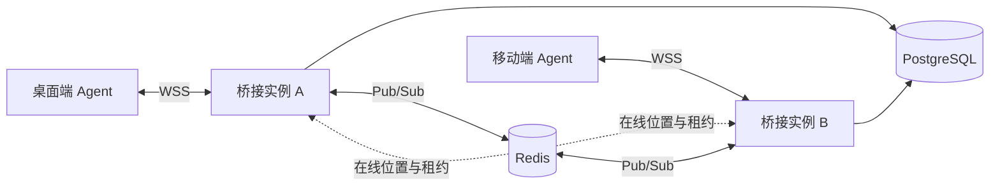
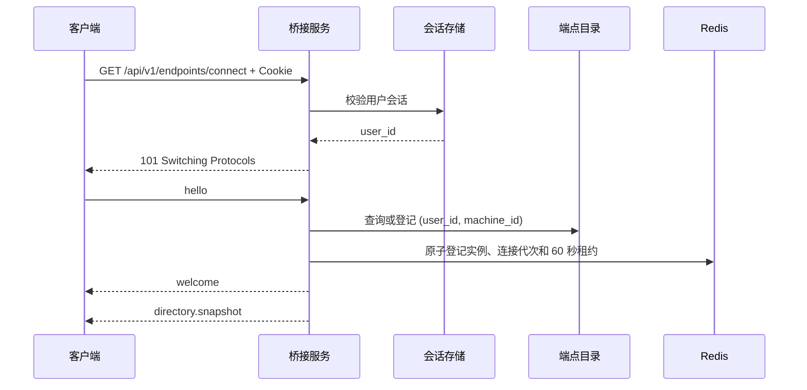

# MonkeyCode 端点桥接协议

## 1. 文档状态

- 协议主版本：`1`
- 设计状态：已确认
- 适用客户端：MonkeyCode 原生桌面端、原生移动端
- WebSocket 地址：`/api/v1/endpoints/connect`

本文定义 MonkeyCode 原生客户端之间的发现、鉴权和通用消息路由协议。桥接服务只提供端点目录、在线状态与消息路由，不理解 Agent 的任务、能力或业务载荷。

## 2. 目标

协议需要满足：

- 同一 MonkeyCode 用户的原生端点能够互相发现。
- 手机端、桌面端等端点能够双向传输通用 JSON 消息。
- 一个端点对应一个 Agent，所有 Agent 在核心协议中地位对等。
- 桥接服务负责用户鉴权、端点登记、在线状态与路由。
- 协议支持后端多副本部署。
- 现有任务流与任务控制 WebSocket 可以继续工作。

## 3. 非目标

协议首版不提供：

- 跨用户端点发现或通信。
- 团队、项目、管理员权限到端点权限的继承。
- 纯浏览器端点。
- 一个端点下注册多个 Agent。
- Agent 能力目录。
- 任务、会话、工具调用等业务模型。
- 端到端加密。
- 离线消息、消息补发或消息持久化。
- 自动重试、桥接层去重或“恰好一次”执行。
- WebSocket 二进制帧、超过 5 MiB 的文件传输或消息压缩。
- 业务广播。

具体 Agent 自行定义 `method` 和 `payload`。例如任务列表、任务接续和任务消息同步均属于 Agent 协议，不属于桥接核心协议。

## 4. 领域模型

### 4.1 端点与 Agent

端点是一个 MonkeyCode 原生应用安装实例，与一个 Agent 一一对应。任务是 Agent 管理的资源，不参与桥接层寻址。

协议寻址键为：

```text
(user_id, machine_id)
```

`machine_id` 由客户端首次安装时生成 UUID，并保存到系统安全存储。应用重启不改变机器标识；卸载重装后产生新机器标识，并被视为新端点。

机器标识只用于身份稳定性和路由，不是鉴权凭证。用户身份始终来自现有 MonkeyCode 登录 Cookie。

### 4.2 发现域

发现域严格限定为同一 `user_id`。团队成员、项目协作者和管理员权限都不能发现或访问其他用户的端点。

同一用户的新端点在完成登录和登记后即可进入发现域，无需其他端点确认配对。高风险业务操作是否需要额外确认，由 Agent 协议决定。

### 4.3 端点状态

端点只有两种持久化管理状态：

- `active`：允许连接并出现在发现目录中。
- `revoked`：禁止自动连接，不出现在发现目录中。

端点记录永久保留。首版不提供彻底删除。持有有效用户会话的客户端可以显式调用恢复接口，因此撤销是管理状态，不是失窃设备的安全处置边界。处置失窃设备还必须撤销其登录会话。

在线状态是临时状态，与持久化管理状态分离：

- `online`：当前存在有效桥接连接。
- `offline`：当前不存在有效桥接连接。

## 5. 总体架构



职责划分：

- PostgreSQL：持久化端点目录、端点资料与撤销状态。
- Redis：保存在线位置、连接代次、60 秒租约，并承担跨实例 Pub/Sub。
- 桥接实例：持有本实例 WebSocket、执行鉴权与校验、维护有界发送队列。
- 客户端：维护请求 pending、超时、响应关联、Agent 业务状态与幂等策略。

Redis 不可用时，服务端拒绝新桥接连接或返回 `service_unavailable`，不能降级为仅本实例可见的局部在线状态。

## 6. 端点资料

客户端在 `hello` 中上报：

| 字段 | 类型 | 说明 |
|---|---|---|
| `device_name` | string | 操作系统提供的设备名称 |
| `platform` | string | `macos`、`windows`、`linux`、`ios`、`android` |
| `os_version` | string | 操作系统版本 |
| `arch` | string | 例如 `arm64`、`x64` |
| `client_version` | string | MonkeyCode 客户端版本 |

服务端额外保存：

| 字段 | 类型 | 说明 |
|---|---|---|
| `alias` | string/null | 用户设置的端点别名 |
| `status` | string | `active` 或 `revoked` |
| `last_seen_at` | integer/null | 最后在线时间，Unix 毫秒 |
| `created_at` | integer | 首次登记时间，Unix 毫秒 |
| `updated_at` | integer | 最后更新时间，Unix 毫秒 |

展示名称按以下规则计算：

```text
display_name = alias ?? device_name
```

客户端每次连接可以更新 `device_name` 和系统资料，但不能通过 `hello` 覆盖 `alias`。

不上传用户名、IP、MAC、硬盘序列号、硬件指纹或完整硬件清单。

## 7. HTTP 接口

所有接口都使用现有 MonkeyCode 登录 Cookie 鉴权，用户范围从会话推导，不出现在路径参数中。

| 方法 | 路径 | 用途 |
|---|---|---|
| `GET` | `/api/v1/endpoints` | 查询当前用户全部端点，包括已撤销端点 |
| `GET` | `/api/v1/endpoints/{machine_id}` | 查询一个端点 |
| `PATCH` | `/api/v1/endpoints/{machine_id}` | 修改端点别名 |
| `POST` | `/api/v1/endpoints/{machine_id}/revoke` | 撤销端点并关闭其连接 |
| `POST` | `/api/v1/endpoints/{machine_id}/restore` | 恢复已撤销端点 |
| `GET` | `/api/v1/endpoints/connect` | WebSocket Upgrade |

HTTP 接口只能读取或修改当前用户自己的端点。不存在、属于其他用户或不可见的机器标识统一按资源不存在处理。

每个用户默认最多拥有 20 个未撤销端点。达到上限后，新机器标识无法完成连接登记；已有端点重连不受影响。上限允许私有化部署通过配置调整，服务端不得自动淘汰旧端点。

## 8. WebSocket 传输约束

### 8.1 连接安全

- 生产环境只允许 `wss://`。
- 开发模式仅允许 `localhost`、`127.0.0.1` 和 `[::1]` 使用 `ws://`。
- 升级请求使用现有 MonkeyCode 登录 Cookie 鉴权。
- 请求携带非空 `Origin` 时，必须匹配配置的可信来源白名单。
- 原生客户端可以不携带 `Origin`，但仍必须具有有效 Cookie。
- 新连接不能复用当前公共 WebSocket 工具中的宽松跨域设置。

### 8.2 帧格式

- 每个 WebSocket 文本帧承载一个完整 UTF-8 JSON 对象。
- 不使用 Base64 包装 JSON。
- 不接受 WebSocket 二进制帧。
- 禁用 `permessage-deflate`。
- 原始入站帧与规范化、注入服务端字段后的转发帧都不得超过 `256 KiB`。
- 单个本地文件最大 `5 MiB`，通过 Agent 自定义协议传输。

原始入站帧超过限制时使用 WebSocket 关闭码 `1009` 断开连接，不继续解析。原始帧未超限、但规范化后的转发帧超过限制时返回 `payload_too_large`，连接可以继续使用。

文件的方法名、分块、编码、校验和错误结构不属于桥接核心协议。Agent 产生的每个消息仍需遵守 JSON 对象载荷和 256 KiB 单帧上限。

### 8.3 单连接

一个端点同一时刻只允许一条有效连接。新连接鉴权和登记成功后，原子替换旧连接；旧连接收到关闭码 `4001`。

目录快照、协议错误和 Agent 业务消息全部复用这一条 WebSocket，不为任务、方法或目标端点创建额外连接。

## 9. 握手

### 9.1 连接流程



客户端必须在升级完成后 5 秒内发送 `hello`，收到 `welcome` 前不能发送 Agent 业务消息。

### 9.2 hello

```json
{
  "type": "hello",
  "protocol_versions": [1],
  "machine_id": "4f1207be-1ce0-4e88-8e3e-e92690567ec8",
  "profile": {
    "device_name": "Yoko 的 MacBook Pro",
    "platform": "macos",
    "os_version": "15.5",
    "arch": "arm64",
    "client_version": "260717.1"
  }
}
```

规则：

- `machine_id` 必须是规范 UUID。
- `protocol_versions` 是客户端支持的整数主版本列表。
- 服务端选择双方共同支持的最高版本。
- 没有共同版本时使用关闭码 `1002`。
- 新增可选字段保持向后兼容；删除字段、修改字段含义或交互语义需要新主版本。

### 9.3 welcome

```json
{
  "type": "welcome",
  "protocol_version": 1,
  "server_time": 1784280000000,
  "heartbeat": {
    "interval_ms": 30000,
    "timeout_ms": 10000
  },
  "limits": {
    "max_frame_bytes": 262144,
    "max_endpoints": 20
  }
}
```

## 10. 端点目录

### 10.1 全量快照

服务端只发送全量目录快照，不定义 revision、增量补丁、`upsert` 或 `remove`。

发送时机：

- 当前连接收到 `welcome` 后。
- 同一用户任一端点上线。
- 同一用户任一端点离线。
- 端点资料发生变化。
- 端点被撤销。
- 端点被恢复。

每次变化后，服务端向该用户全部在线端点发送新的完整快照。客户端必须使用新数组整体替换旧数组，不做增量合并。

### 10.2 directory.snapshot

```json
{
  "type": "directory.snapshot",
  "endpoints": [
    {
      "machine_id": "4f1207be-1ce0-4e88-8e3e-e92690567ec8",
      "device_name": "Yoko 的 MacBook Pro",
      "alias": "办公电脑",
      "display_name": "办公电脑",
      "platform": "macos",
      "os_version": "15.5",
      "arch": "arm64",
      "client_version": "260717.1",
      "protocol_version": 1,
      "online": true,
      "last_seen_at": 1784280000000
    }
  ]
}
```

WebSocket 快照只包含未撤销端点，并包含当前端点自身。HTTP 管理接口仍返回已撤销端点。

## 11. Agent 消息

### 11.1 消息类型

核心协议定义：

- `event`：单向 Agent 消息，不要求响应。
- `request`：要求目标 Agent 返回业务响应。
- `response`：引用一个请求的业务响应。

取消执行不属于核心协议。客户端可以停止本地等待；真正的业务取消由 Agent 定义普通方法。

### 11.2 method

`event` 和 `request` 必须携带 Agent 自定义 `method`，满足：

```regex
^[a-z][a-z0-9._-]{0,127}$
```

桥接服务只校验格式，不维护方法目录，也不理解方法语义。

### 11.3 payload

`payload` 必须是 JSON 对象。无参数时使用 `{}`，不允许顶层字符串、数字或数组。

### 11.4 message_id

每条 Agent 消息由发送客户端生成新的 UUIDv4 `message_id`。消息标识不承载时间或顺序语义。

### 11.5 请求与事件

客户端发送：

```json
{
  "type": "request",
  "message_id": "6ccdf7ee-10c2-4926-86ce-8f9ca82aa2ca",
  "target": "dc9e38fe-c928-42b1-b8eb-e8ca41d712fe",
  "method": "agent.example",
  "payload": {
    "content": "hello"
  }
}
```

桥接服务转发：

```json
{
  "type": "request",
  "message_id": "6ccdf7ee-10c2-4926-86ce-8f9ca82aa2ca",
  "source": "4f1207be-1ce0-4e88-8e3e-e92690567ec8",
  "target": "dc9e38fe-c928-42b1-b8eb-e8ca41d712fe",
  "method": "agent.example",
  "routed_at": 1784280000000,
  "payload": {
    "content": "hello"
  }
}
```

`event` 使用相同结构，只将 `type` 改为 `event`。

客户端不能上报 `source` 或 `routed_at`。发送方来源由桥接服务根据已鉴权连接注入。客户端伪造服务端字段时返回 `invalid_message`。

### 11.6 响应

```json
{
  "type": "response",
  "message_id": "05cc070a-be53-40b2-b09b-da77d2ea002f",
  "target": "4f1207be-1ce0-4e88-8e3e-e92690567ec8",
  "reply_to": "6ccdf7ee-10c2-4926-86ce-8f9ca82aa2ca",
  "payload": {
    "result": "ok"
  }
}
```

`response` 不重复 `method`。桥接服务仍会注入 `source` 和 `routed_at`。

### 11.7 顶层字段处理

- 桥接服务只构造并转发规范定义的顶层字段。
- 未知顶层字段被忽略并丢弃。
- `payload` 内字段保持原样。
- `source`、`routed_at` 等服务端专属字段由客户端上报时直接报错。

### 11.8 本地文件边界

文件始终保留在源端点本地，桥接服务不上传、不保存文件。其他端点通过 Agent 自定义消息访问文件。

核心协议只约束：

- 单个文件不得超过 `5 MiB`。
- 文件内容必须通过本协议的 Agent 消息传输。
- 每条消息必须遵守 JSON 对象载荷和 `256 KiB` 单帧上限。

核心协议不定义文件方法名、请求与响应结构、分块、编码、偏移、完整性校验、访问控制或业务错误，这些内容全部由 Agent 自行定义。

## 12. 请求状态与响应匹配

桥接服务不维护 Agent 请求状态。通用客户端库负责：

- 按 `message_id` 保存 pending 请求。
- 默认等待 30 秒，调用方可以按方法覆盖。
- 使用 `reply_to` 匹配响应。
- 超时后删除 pending，并返回本地状态 `outcome_unknown`。
- 迟到响应不恢复已经超时的请求。

客户端只有在以下条件全部满足时才能接受响应：

- `reply_to` 对应仍在等待的请求。
- `source` 等于原请求指定的目标端点。
- `target` 等于当前端点。
- 响应 `message_id` 是合法且未处理过的 UUIDv4。
- `type` 为 `response`。

重复、迟到或来源不匹配的响应被忽略，只记录不含载荷的元数据告警。

## 13. 路由与可靠性语义

### 13.1 单播与对等

Agent 业务消息只能单播，发送方必须明确指定目标机器标识。桥接层不区分控制端和被控端，所有端点完全对等。

端点目录快照由桥接服务发送，不属于 Agent 业务广播。

### 13.2 在线路由

桥接服务只向当前在线的目标连接路由消息，不保存消息供离线端点上线后补发。

### 13.3 无成功回执

桥接服务不发送成功送达确认。服务端成功写入目标连接也不能被发送方解释为 Agent 已收到或已执行。

- 可在路由阶段确定的失败通过协议错误返回。
- Agent 业务执行结果只能通过 `response` 表达。
- 请求超时表示结果未知，不表示目标未执行。

### 13.4 重试与去重

- 桥接服务不自动重试。
- 通用客户端库默认不自动重试。
- 桥接服务不按 `message_id` 去重。
- 相同 `message_id` 可能被重复投递。
- 只有 Agent 明确确认操作幂等时才能自行重试，并复用原消息标识。
- 接收端 Agent 负责幂等请求的去重或结果缓存。

### 13.5 顺序

在双方连接均未中断期间，桥接服务保证同一发送端点到同一目标端点的业务消息按发送顺序进入目标发送队列。

不保证：

- 不同发送方之间的全局顺序。
- 断线重连前后的连续顺序。
- 响应顺序与请求顺序一致。
- 按 `message_id` 排序。

需要更强顺序的 Agent 协议自行定义 `seq`。

## 14. 协议错误

桥接服务产生的协议错误与 Agent 业务响应分开。

```json
{
  "type": "error",
  "reply_to": "6ccdf7ee-10c2-4926-86ce-8f9ca82aa2ca",
  "error": {
    "code": "target_offline",
    "message": "目标端点当前离线",
    "retryable": true,
    "retry_after_ms": 1000
  }
}
```

`reply_to` 在错误由握手或无消息标识的系统操作触发时可以为空。`retry_after_ms` 仅在服务端能给出合理建议时出现。

核心错误码：

| 错误码 | 含义 |
|---|---|
| `invalid_message` | JSON 或信封不符合协议 |
| `unsupported_protocol` | 没有共同协议主版本 |
| `unauthorized` | 用户会话无效 |
| `endpoint_revoked` | 当前端点已被撤销 |
| `endpoint_limit_exceeded` | 用户未撤销端点达到上限 |
| `target_unavailable` | 目标不存在、属于其他用户或已撤销 |
| `target_offline` | 当前用户目录中的目标离线 |
| `target_busy` | 目标连接发送队列已满 |
| `stale_route` | 目标连接代次已变化 |
| `rate_limited` | 用户或端点触发限流 |
| `payload_too_large` | 规范化消息超过大小上限 |
| `service_unavailable` | Redis 或必要路由组件不可用 |

目标错误需要避免信息泄露：

- 不存在、属于其他用户或已撤销统一返回 `target_unavailable`。
- 只有同一用户目录中明确存在的离线端点才返回 `target_offline`。

`retryable=true` 只表示稍后重试可能成功，不授权客户端自动重试非幂等业务请求。

## 15. 心跳、会话与在线租约

### 15.1 WebSocket Ping/Pong

- 服务端每 30 秒发送 WebSocket 原生 Ping。
- 10 秒内未收到对应 Pong 时关闭连接。
- Electron、React Native 底层 WebSocket 自动回复 Pong，JS 业务代码无需处理。
- 不定义 JSON 心跳消息。

### 15.2 会话复验

每次心跳时同时重新检查 Redis 中的登录会话。会话过期、退出或被管理员撤销时，连接使用关闭码 `4003` 关闭。

### 15.3 在线租约

- Redis 在线租约 TTL 为 60 秒。
- 每次成功收到 Pong 后续租。
- 正常断开立即删除当前连接代次的租约并广播新目录快照。
- 实例异常退出时，后台协调器在租约过期后将端点判定为离线并触发全量目录快照。
- 路由发现目标实例不可达时立即返回 `target_unavailable`，不等待租约过期。

## 16. 多副本路由

### 16.1 在线位置

Redis 在线位置至少包含：

```text
user_id
machine_id
instance_id
connection_generation
lease_deadline
```

每次端点建立新连接时生成新的连接代次。登记新连接、替换旧连接和写入在线位置必须是原子操作。

### 16.2 跨实例消息

发送实例：

1. 根据 `(user_id, target_machine_id)` 查询 Redis 在线位置。
2. 同实例目标直接进入本地有界队列。
3. 跨实例目标通过目标 `instance_id` 的 Redis Pub/Sub 通道发送。
4. Pub/Sub 消息携带目标 `connection_generation`。

目标实例只有在本地当前连接代次完全匹配时才能投递，否则返回 `stale_route`。桥接层不自动重新查找或重试。

### 16.3 连接替换

新连接替换旧连接时：

1. Redis 原子写入新实例与新连接代次。
2. 通知旧实例关闭旧连接。
3. 旧实例清理时只能删除仍与自己连接代次匹配的租约。
4. 途中携带旧连接代次的消息被拒绝。

这可以避免跨实例竞态将消息投递给已被替换的旧 Agent。

## 17. 背压、优先级与限流

### 17.1 有界发送队列

每条连接使用同时限制消息数量和总字节数的有界队列。具体阈值由部署配置决定，不写入协议版本。

队列已满时：

- 当前业务消息不入队。
- 向发送方返回 `target_busy`。
- 不阻塞整个桥接实例。
- 不静默丢弃消息。

目标端点长期无法排空队列时，服务端关闭其连接并更新在线状态。

### 17.2 消息优先级

优先级从高到低：

1. WebSocket Ping/Pong 和 Close 控制帧。
2. 协议错误、撤销通知和目录快照。
3. Agent 业务消息。

高优先级消息可以插队，但调度器需要限制连续高优先级发送数量，避免业务消息永久饥饿。同一来源到同一目标的业务消息之间仍保持 FIFO。

### 17.3 双层限流

服务端同时按用户和发送端点限制：

- 单位时间消息数。
- 单位时间载荷总字节数。

具体阈值属于部署配置。首次超限返回 `rate_limited` 和可选 `retry_after_ms`；持续超限时使用关闭码 `1008`。

## 18. WebSocket 关闭码

| 关闭码 | 含义 | 自动重连 |
|---|---|---|
| `1000` | 正常关闭 | 否 |
| `1002` | 协议或版本不兼容 | 否 |
| `1008` | 鉴权或策略违规 | 否 |
| `1009` | 消息超过 256 KiB | 否 |
| `1011` | 服务内部错误 | 是 |
| `1012` | 服务重启 | 是 |
| `1013` | 服务过载 | 是 |
| `4001` | 被同机器标识的新连接替换 | 否 |
| `4002` | 端点被撤销 | 否 |
| `4003` | 登录会话失效 | 否 |

## 19. 客户端重连

网络中断以及 `1011`、`1012`、`1013` 使用指数退避并加入随机抖动：

```text
约 0.5s → 1s → 2s → 4s → 8s → 最大 30s
```

稳定在线 60 秒后重置退避计数。

`1000`、`1002`、`1008`、`1009`、`4001`、`4002`、`4003` 不自动重连。特别是 `4001` 必须停止自动重连，避免两个复制同一机器标识的客户端互相替换形成重连风暴。

## 20. 优雅停机

桥接实例进入停机状态后：

1. 停止接受新 WebSocket。
2. 不再接收新的 Agent 业务消息。
3. 向现有连接发送 `1012 Service Restart`。
4. 只删除与本实例、当前连接代次匹配的 Redis 租约。
5. 最多等待 10 秒完成关闭，然后退出。

客户端按重连退避策略连接其他实例。

## 21. 安全与隐私

### 21.1 服务端可见性

首版只提供 WSS 传输加密，不提供端到端加密。桥接服务会解析信封，并且技术上能够接触载荷字节，但不能解释 Agent 业务语义。

### 21.2 日志

任何环境和日志级别都不得记录 `payload` 原文。日志、指标和安全审计只允许记录：

```text
user_id
source_machine_id
target_machine_id
message_id
type
method
payload_size
route_result
latency
```

端点登记、撤销、恢复、连接替换、会话失效和鉴权失败进入安全审计日志。

### 21.3 授权校验

每次路由都必须根据连接上已鉴权的 `user_id` 检查目标，不信任客户端声明的用户或来源。管理员权限、团队角色和项目协作权限不能绕过发现域。

## 22. 与现有系统的关系

新协议以新增方式提供，不立即替换：

- `/api/v1/users/tasks/stream`
- `/api/v1/users/tasks/control`
- 其他现有任务与终端 WebSocket

第一阶段只完成端点发现和通用 Agent 消息通道。任务接续能力可以在后续作为 Agent 自定义协议实现，并逐步复用桥接通道。

## 23. 验收场景

实现至少覆盖以下场景：

1. 同一用户的桌面端和移动端分别连接不同后端副本，能够互相发现并双向路由。
2. 不同用户即使知道对方机器标识，也只能得到 `target_unavailable`。
3. 新连接使用相同机器标识时替换旧连接，旧连接停止自动重连。
4. 端点上线、离线、改名、撤销和恢复后，所有在线端点都收到新的完整目录快照。
5. 被撤销端点立即断开且不能自动登记；显式恢复后可以重新连接。
6. 用户退出登录后，桥接连接在一个心跳周期内关闭。
7. 超过 256 KiB 的消息使用 `1009` 关闭连接。
8. 目标离线、目标队列已满、路由代次过期时返回对应协议错误。
9. 同一来源到同一目标的业务消息在连续连接期间保持 FIFO。
10. 请求超时返回客户端本地 `outcome_unknown`，桥接服务不重试。
11. 重复 `message_id` 被桥接服务正常转发，接收端负责幂等。
12. Redis 不可用时新连接和跨实例路由失败关闭，不出现局部假在线。
13. 后端实例异常退出后，端点最迟在 60 秒租约过期后变为离线。
14. 滚动发布时客户端收到 `1012` 并按带抖动的退避策略重连。
15. 日志、指标、错误与审计中不出现业务载荷。
16. 小于等于 5 MiB 的本地文件可以通过 Agent 自定义消息传输，桥接服务不持久化文件。
17. 超过 5 MiB 的文件被 Agent 拒绝，具体错误结构由 Agent 定义。

## 24. 相关架构决策

- [端点发现限定于同一用户](../adr/0001-端点发现限定于同一用户.md)
- [使用安装级随机标识识别端点](../adr/0002-使用安装级随机标识识别端点.md)
- [首版不提供端到端加密](../adr/0003-首版不提供端到端加密.md)
- [桥接服务仅提供在线路由](../adr/0004-桥接服务仅提供在线路由.md)
- [每个端点只保留一条有效连接](../adr/0005-每个端点只保留一条有效连接.md)
- [端点鉴权复用用户会话](../adr/0006-端点鉴权复用用户会话.md)
- [端点与 Agent 一一对应](../adr/0007-端点与Agent一一对应.md)
- [请求状态由客户端维护](../adr/0008-请求状态由客户端维护.md)
- [核心协议不自动重试业务消息](../adr/0009-核心协议不自动重试业务消息.md)
- [核心协议使用 JSON 文本帧](../adr/0010-核心协议使用JSON文本帧.md)
- [桥接连接校验 WebSocket 来源](../adr/0011-桥接连接校验WebSocket来源.md)
- [桥接服务支持多副本路由](../adr/0012-桥接服务支持多副本路由.md)
- [桥接服务不记录业务载荷](../adr/0013-桥接服务不记录业务载荷.md)
- [文件保留在源端点本地](../adr/0014-文件保留在源端点本地.md)
