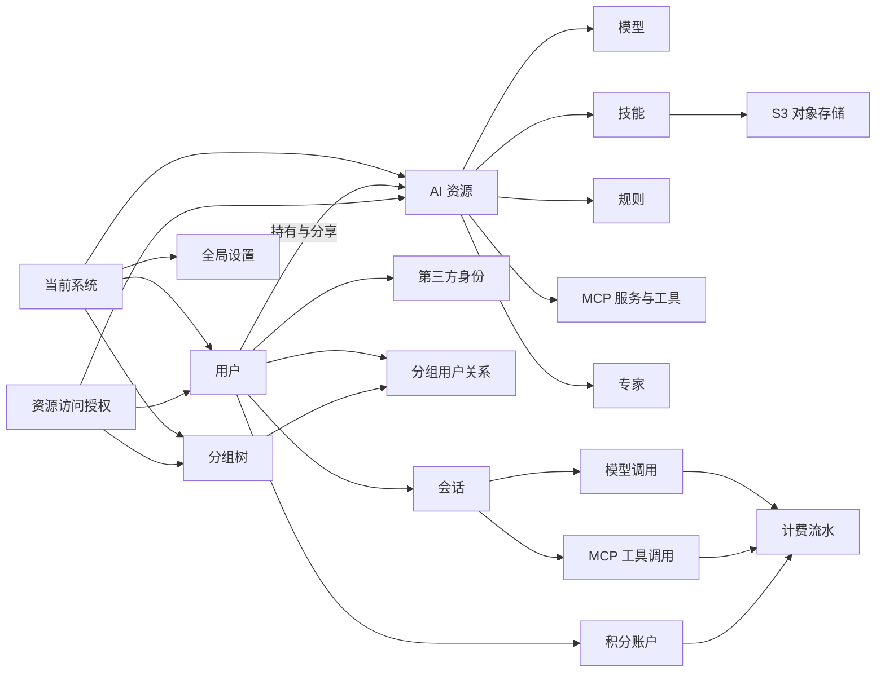

# MonkeyAI Admin 数据模型设计

> 状态：方案设计草案
>
> 数据库语义：PostgreSQL
>
> 覆盖范围：`monkeyai/admin` 第一期管理能力，不包含知识库

## 1. 目标与范围

本文档定义 MonkeyAI Admin 所需的领域实体、实体关系和字段。字段类型使用 PostgreSQL 类型表达，作为后续实现数据库结构的设计依据；本文档本身不包含 SQL，也不讨论已有数据库兼容或迁移方案。

当前版本确定：

- 表及字段；
- 字段含义、可空性、默认值和候选值；
- 实体之间的逻辑关系；
- 主键、外键、唯一约束、检查约束和查询索引；
- 敏感字段和统计事实的存储边界。

后续版本仍需确定：

- 分区、归档和冷热数据策略；
- 全文检索索引；
- 数据库实现与部署方案。

## 2. 核心建模决策

### 2.1 单实例边界

一套 MonkeyAI 实例只服务一组固定用户，不承担多租户能力。因此不设计租户实体，也不在业务表中保留租户标识字段。

### 2.2 统一用户实体

单实例部署下不区分全局登录账号和实例内身份，统一使用 `users`。登录凭据、角色、状态和用户资料都归属于该实体。

### 2.3 区分系统资源与个人资源

管理员维护的公共资源称为系统资源，用户持有的资源称为个人资源。资源使用 `ownership_type` 表达 `system` 或 `user`，并统一通过 `owner_user_id` 关联相关用户：系统资源记录创建它的管理员，个人资源记录当前所有者，不再额外保存 `created_by_user_id`。系统资源的 `owner_user_id` 在创建后保持不变，即使该用户不再是管理员；个人资源转移后只保留新的所有者，最初创建者可从 `audits` 追溯。个人资源默认只对所有者可用，所有者可以将资源分享给其他用户或分组。

### 2.4 资源访问授权直接建模

每条 `resource_access_grants` 直接记录被分享资源、被授权用户或分组以及 `read_only` 或 `read_write` 访问级别，不再设计独立的访问范围实体。

`read_only` 允许查看和使用资源，`read_write` 在此基础上允许修改资源配置或内容。分享、删除和转移所有权仍仅允许资源所有者或管理员执行，不随 `read_write` 一并授予。资源所有者隐式拥有完整权限，不需要为自己写入授权记录。

向父分组授权时，授权天然覆盖其所有后代分组中的用户。直接用户授权用于补充或提升个别用户的授权。同一用户同时命中多条授权时，访问级别采用最高级别，`read_write` 高于 `read_only`；使用要求同样采用更严格级别，`required` 高于 `optional`。

系统规则的强制启用与普通资源分享具有相同的“资源—用户或分组”关系，因此统一保存在 `resource_access_grants`，不再设计规则专用关系表。`access_level` 表示被授权者能对资源做什么，`usage_requirement` 表示被授权者能否自行决定是否使用，两者保持正交。`required` 目前只适用于系统规则，表示规则必须应用且用户不可自行移除；个人规则及其他资源只能使用 `optional`。

系统初始化时创建且仅创建一个根分组，管理接口不提供新建、移动或删除根分组的能力。根分组通过 `parent_id` 为空识别。管理员分组同样由系统初始化，并使用系统预设 ID 识别，其成员根据 `users.role = 'admin'` 动态确定，不写入 `group_users`。`groups` 不额外保存分组类型或系统标识字段。

### 2.5 S3 文件存储

文件内容统一保存到 S3 兼容对象存储，不保存到 PostgreSQL，也不设计独立的 `files` 表。需要持久化文件的资源直接保存 S3 Object Key 及必要的文件名、大小和摘要。

S3 Endpoint、Bucket、Region 和访问凭据属于部署配置，不保存到 `settings` 或其他业务表。数据库不保存预签名 URL，访问文件时根据 Object Key 动态生成。

### 2.6 全局设置集中存储

工作空间品牌、登录注册、OAuth 连接、邮件和计费规则都属于单实例唯一配置，统一保存到 `settings` 表，不再为其中任一配置建立独立表。

`settings` 按配置域分行，每个配置域使用一个 `jsonb` 保存全部配置。这样可以独立更新和审计某一类设置，同时避免持续增加物理列。

### 2.7 不保存邀请记录

本阶段不设计 `user_invitations`。用户创建、角色调整、启停等管理操作统一写入 `audits`，但不保存邀请令牌、邀请状态或邀请生命周期。

### 2.8 统计页面不保存二次汇总结果

实时状态、会话统计和模型统计由会话、模型调用、MCP 工具调用和计费流水聚合得到。本阶段不设计按小时或按天的汇总表。

### 2.9 计费流水不可变

用户当前余额保存在积分账户，所有扣费、发放、退款、周期重置和人工调整都写入计费流水。`credit_delta` 为负表示扣减，为正表示增加。

### 2.10 敏感信息暂存明文

本阶段不实现敏感信息加密，API Key、OAuth Secret、SMTP 密码、MCP Header 和 OAuth Token 均以明文保存。登录密码仍只保存不可逆哈希，不保存原始密码。应用日志、审计参数和错误消息不得写入敏感字段值。

## 3. 关系概览

## 4. 字段约定

| 约定 | 说明 |
| --- | --- |
| ID | 实体 ID 使用 `uuid`，默认由应用或 PostgreSQL 生成。 |
| 字符串 | 可变长度字符串统一使用 `text`，不在数据库层设置长度上限。 |
| 时间 | 业务时间统一使用 `timestamptz`，以 UTC 保存、按用户时区展示。 |
| 金额/积分 | 积分使用 `numeric(24,6)`，避免浮点误差。 |
| 计数 | Token、调用次数等可能持续增长的计数使用 `bigint`。 |
| 软删除 | 需要保留引用或历史的实体使用 `deleted_at`；事实表和流水表不软删除。 |
| 候选值 | 本文列出的候选值是当前领域词汇，后续应通过约束或枚举固定。 |
| 敏感信息 | 除登录密码仅保存不可逆哈希外，本阶段的密钥、Token 和认证 Header 均以明文保存。 |
| 默认时间 | 文中的“当前时间”表示写入时的数据库当前时间。 |

## 5. 用户与分组

### 5.1 `users`：用户

系统内的人员身份，同时承载登录资料、管理角色和启停状态。

| 字段 | PostgreSQL 类型 | 必填 | 默认值 | 说明 |
| --- | --- | --- | --- | --- |
| `id` | `uuid` | 是 | 自动生成 | 用户 ID。 |
| `name` | `text` | 是 | 无 | 用户显示名称。 |
| `email` | `text` | 是 | 无 | 用户主邮箱，也是默认登录标识。 |
| `avatar_url` | `text` | 否 | `NULL` | 用户头像地址。 |
| `password_hash` | `text` | 否 | `NULL` | 密码哈希；仅使用 OAuth 或邮箱验证码时可为空。 |
| `role` | `text` | 是 | `user` | 系统角色：`admin`、`user`。 |
| `status` | `text` | 是 | `active` | 用户状态：`active`、`disabled`。 |
| `joined_at` | `timestamptz` | 是 | 当前时间 | 成为系统用户的时间。 |
| `disabled_at` | `timestamptz` | 否 | `NULL` | 被禁用时间。 |
| `last_login_at` | `timestamptz` | 否 | `NULL` | 最近一次成功登录时间。 |
| `created_at` | `timestamptz` | 是 | 当前时间 | 创建时间。 |
| `updated_at` | `timestamptz` | 是 | 当前时间 | 最近更新时间。 |
| `deleted_at` | `timestamptz` | 否 | `NULL` | 软删除时间。 |

### 5.2 `user_identities`：第三方用户身份

记录用户通过 OAuth 获得的第三方身份。身份由签发方和签发方用户标识共同确定，不依赖可能被删除或重新创建的 OAuth 连接配置。

| 字段 | PostgreSQL 类型 | 必填 | 默认值 | 说明 |
| --- | --- | --- | --- | --- |
| `id` | `uuid` | 是 | 自动生成 | 第三方身份 ID。 |
| `user_id` | `uuid` | 是 | 无 | 对应用户 ID。 |
| `provider` | `text` | 是 | 无 | 提供方：`github`、`google`、`microsoft`、`gitlab`、`oidc`。 |
| `issuer` | `text` | 是 | 无 | 第三方身份的签发方或命名空间；OIDC 使用 `iss`，内置 OAuth 提供方使用系统定义的固定值。 |
| `provider_subject` | `text` | 是 | 无 | 提供方返回的稳定用户标识，与 `issuer` 共同确定第三方身份。 |
| `username` | `text` | 否 | `NULL` | 提供方侧账号名称。 |
| `email` | `text` | 否 | `NULL` | 提供方返回的邮箱快照。 |
| `avatar_url` | `text` | 否 | `NULL` | 提供方返回的头像地址。 |
| `created_at` | `timestamptz` | 是 | 当前时间 | 首次绑定时间。 |
| `updated_at` | `timestamptz` | 是 | 当前时间 | 最近同步时间。 |
| `deleted_at` | `timestamptz` | 否 | `NULL` | 解除绑定时间。 |

### 5.3 `groups`：分组

用于组织用户、承载授权范围并形成额度继承树。系统初始化时创建唯一根分组和管理员分组；管理端只能在已有分组下创建子分组。

| 字段 | PostgreSQL 类型 | 必填 | 默认值 | 说明 |
| --- | --- | --- | --- | --- |
| `id` | `uuid` | 是 | 自动生成 | 分组 ID；根分组和管理员分组使用系统预设 ID。 |
| `parent_id` | `uuid` | 否 | `NULL` | 父分组 ID；唯一根分组为空，其他分组必须有父分组。 |
| `name` | `text` | 是 | 无 | 分组显示名称。 |
| `created_by_user_id` | `uuid` | 否 | `NULL` | 创建者用户 ID；系统初始化的根分组和管理员分组为空。 |
| `created_at` | `timestamptz` | 是 | 当前时间 | 创建时间。 |
| `updated_at` | `timestamptz` | 是 | 当前时间 | 名称或层级最近更新时间。 |
| `deleted_at` | `timestamptz` | 否 | `NULL` | 普通分组的软删除时间；根分组和管理员分组不可删除。 |

### 5.4 `group_users`：分组用户关系

记录用户被直接分配到的普通分组；父分组用户数量通过后代分组汇总。根分组包含所有用户，管理员分组成员由 `users.role` 动态确定，两者均不写入本表。

| 字段 | PostgreSQL 类型 | 必填 | 默认值 | 说明 |
| --- | --- | --- | --- | --- |
| `id` | `uuid` | 是 | 自动生成 | 关系 ID。 |
| `group_id` | `uuid` | 是 | 无 | 分组 ID。 |
| `user_id` | `uuid` | 是 | 无 | 用户 ID。 |
| `assigned_by_user_id` | `uuid` | 是 | 无 | 执行分配的管理员用户 ID。 |
| `created_at` | `timestamptz` | 是 | 当前时间 | 分配时间。 |
| `removed_at` | `timestamptz` | 否 | `NULL` | 移出该分组的时间。 |

## 6. 系统设置

### 6.1 `settings`：全局设置

按配置域保存所有单实例唯一配置。每个 `key` 对应一条有效记录，全部配置均以明文保存在 `value`。

| 字段 | PostgreSQL 类型 | 必填 | 默认值 | 说明 |
| --- | --- | --- | --- | --- |
| `id` | `uuid` | 是 | 自动生成 | 设置记录 ID。 |
| `key` | `text` | 是 | 无 | 配置域标识：`branding`、`authentication`、`email`、`billing`。 |
| `value` | `jsonb` | 是 | 空对象 | 该配置域的完整明文配置，结构见下文。 |
| `schema_version` | `integer` | 是 | `1` | `value` 的结构版本。 |
| `updated_by_user_id` | `uuid` | 是 | 无 | 最近修改者用户 ID。 |
| `created_at` | `timestamptz` | 是 | 当前时间 | 创建时间。 |
| `updated_at` | `timestamptz` | 是 | 当前时间 | 最近更新时间。 |

### 6.2 `branding` 配置域

| JSON 路径 | JSON 类型 | 必填 | 默认值 | 说明 |
| --- | --- | --- | --- | --- |
| `value.workspace_name` | `string` | 是 | 无 | 工作空间显示名称。 |
| `value.product_name` | `string` | 是 | 无 | 面向用户展示的产品名称。 |

### 6.3 `authentication` 配置域

| JSON 路径 | JSON 类型 | 必填 | 默认值 | 说明 |
| --- | --- | --- | --- | --- |
| `value.password_enabled` | `boolean` | 是 | `true` | 是否允许密码登录。 |
| `value.email_code_enabled` | `boolean` | 是 | `false` | 是否允许邮箱验证码登录。 |
| `value.registration_enabled` | `boolean` | 是 | `false` | 是否允许通过邮箱自助注册新用户。 |
| `value.oauth_connections` | `array` | 是 | 空数组 | OAuth 连接列表。 |
| `value.oauth_connections[].id` | `string` | 是 | 自动生成 | OAuth 连接 UUID，用于管理列表中的连接项。 |
| `value.oauth_connections[].provider` | `string` | 是 | 无 | 提供方：`github`、`google`、`microsoft`、`gitlab`、`oidc`。 |
| `value.oauth_connections[].name` | `string` | 是 | 无 | OAuth 连接显示名称。 |
| `value.oauth_connections[].client_id` | `string` | 是 | 无 | OAuth Client ID。 |
| `value.oauth_connections[].client_secret` | `string` | 是 | 无 | OAuth Client Secret，明文保存。 |
| `value.oauth_connections[].issuer_url` | `string` | 否 | `null` | OIDC Issuer URL；非 OIDC 连接可为空。 |
| `value.oauth_connections[].enabled` | `boolean` | 是 | `true` | 是否允许用户使用该连接登录。 |

### 6.4 `email` 配置域

| JSON 路径 | JSON 类型 | 必填 | 默认值 | 说明 |
| --- | --- | --- | --- | --- |
| `value.sender_name` | `string` | 是 | 无 | 发件人显示名称。 |
| `value.sender_email` | `string` | 是 | 无 | 发件邮箱。 |
| `value.smtp_host` | `string` | 是 | 无 | SMTP 主机。 |
| `value.smtp_port` | `number` | 是 | 无 | SMTP 端口，值为整数。 |
| `value.smtp_username` | `string` | 是 | 无 | SMTP 用户名。 |
| `value.smtp_password` | `string` | 是 | 无 | SMTP 密码，明文保存。 |
| `value.smtp_encryption` | `string` | 是 | 无 | SMTP 加密方式：`starttls`、`tls`、`none`。 |

### 6.5 `billing` 配置域

| JSON 路径 | JSON 类型 | 必填 | 默认值 | 说明 |
| --- | --- | --- | --- | --- |
| `value.input_credits_per_million_tokens` | `number` | 是 | 无 | 每百万输入 Token 消耗积分。 |
| `value.cached_input_credits_per_million_tokens` | `number` | 是 | 无 | 每百万缓存命中输入 Token 消耗积分。 |
| `value.output_credits_per_million_tokens` | `number` | 是 | 无 | 每百万输出 Token 消耗积分。 |
| `value.quota_refresh_cycle` | `string` | 是 | 无 | 额度刷新周期：`daily`、`weekly`、`monthly`。 |
| `value.charging_mode` | `string` | 是 | `local` | 计费方式：`local`、`remote`。 |
| `value.remote_billing_base_url` | `string` | 否 | `null` | 百智云远程计费地址。 |
| `value.remote_billing_api_key` | `string` | 否 | `null` | 百智云远程计费 API Key，明文保存。 |

## 7. 资源访问授权

### 7.1 `resource_access_grants`：资源访问授权

每条记录表示将一个资源以某种访问级别授予一个用户或分组。没有授权记录的个人资源仅所有者和管理员可访问。系统规则需要强制启用时，也使用本表记录目标用户或分组。

当前各类资源分别存储在不同表中，因此 `resource_type + resource_id` 是逻辑上的多态引用。若约束设计阶段要求数据库强制外键完整性，再引入统一资源登记表，不在本阶段额外增加该层。

| 字段 | PostgreSQL 类型 | 必填 | 默认值 | 说明 |
| --- | --- | --- | --- | --- |
| `id` | `uuid` | 是 | 自动生成 | 资源授权 ID。 |
| `resource_type` | `text` | 是 | 无 | 被授权资源类型：`model`、`skill`、`rule`、`connector`、`expert`。Provider 不参与授权。 |
| `resource_id` | `uuid` | 是 | 无 | 被授权资源 ID，与 `resource_type` 共同定位具体资源。 |
| `user_id` | `uuid` | 否 | `NULL` | 被授权用户 ID；与 `group_id` 必须且只能填写一个。 |
| `group_id` | `uuid` | 否 | `NULL` | 被授权分组 ID；与 `user_id` 必须且只能填写一个，并覆盖其所有后代分组用户。 |
| `access_level` | `text` | 是 | 无 | 访问级别：`read_only`、`read_write`。 |
| `usage_requirement` | `text` | 是 | `optional` | 使用要求：`optional`、`required`；`required` 仅用于系统规则，表示规则必须应用且被授权者不能自行移除。 |
| `granted_by_user_id` | `uuid` | 是 | 无 | 执行分享的资源所有者或管理员用户 ID。 |
| `created_at` | `timestamptz` | 是 | 当前时间 | 首次授权时间。 |
| `updated_at` | `timestamptz` | 是 | 当前时间 | 访问级别最近更新时间。 |

专家授权只能使用 `read_only`。个人 Connector 不写入本表，仅所有者可用。

## 8. AI 资源

### 8.1 `models`：模型

| 字段 | PostgreSQL 类型 | 必填 | 默认值 | 说明 |
| --- | --- | --- | --- | --- |
| `id` | `uuid` | 是 | 自动生成 | 模型配置 ID。 |
| `ownership_type` | `text` | 是 | 无 | 所有权：`system`、`user`。 |
| `owner_user_id` | `uuid` | 是 | 无 | 关联用户 ID；系统模型记录创建它的管理员，个人模型记录当前所有者。 |
| `model_id` | `text` | 是 | 无 | 上游模型标识，例如 `gpt-5`。 |
| `display_name` | `text` | 是 | 无 | 管理端和客户端显示名称。 |
| `protocol` | `text` | 是 | 无 | 调用协议：`openai_chat_completions`、`openai_responses`、`anthropic`。 |
| `base_url` | `text` | 是 | 无 | 上游 API 基础地址。 |
| `api_key` | `text` | 是 | 无 | 模型 API Key，明文保存。 |
| `advanced_config` | `jsonb` | 是 | 无 | 模型能力和协议相关高级配置，当前结构见下文。 |
| `credit_multiplier` | `numeric(12,6)` | 是 | `1` | 相对系统基础模型价格的积分倍率。 |
| `enabled` | `boolean` | 是 | `true` | 是否允许新会话调用。 |
| `created_at` | `timestamptz` | 是 | 当前时间 | 创建时间。 |
| `updated_at` | `timestamptz` | 是 | 当前时间 | 最近更新时间。 |
| `deleted_at` | `timestamptz` | 否 | `NULL` | 软删除时间。 |

#### `advanced_config` 结构

| JSON 路径 | JSON 类型 | 必填 | 默认值 | 说明 |
| --- | --- | --- | --- | --- |
| `advanced_config.context_window_tokens` | `number` | 是 | 无 | 上下文 Token 上限，值为正整数。 |
| `advanced_config.max_output_tokens` | `number` | 是 | 无 | 单次响应允许生成的最大 Token 数，值为正整数。 |
| `advanced_config.supports_vision` | `boolean` | 是 | `false` | 是否支持图片输入。 |

### 8.2 `tags`：资源标签

所有可标记资源共用的系统级标签词表。资源与标签的关系统一保存在 `resource_tags`。

| 字段 | PostgreSQL 类型 | 必填 | 默认值 | 说明 |
| --- | --- | --- | --- | --- |
| `id` | `uuid` | 是 | 自动生成 | 标签 ID。 |
| `name` | `text` | 是 | 无 | 标签名称。 |
| `created_by_user_id` | `uuid` | 是 | 无 | 创建者用户 ID。 |
| `created_at` | `timestamptz` | 是 | 当前时间 | 创建时间。 |
| `updated_at` | `timestamptz` | 是 | 当前时间 | 最近更新时间。 |
| `deleted_at` | `timestamptz` | 否 | `NULL` | 软删除时间。 |

### 8.3 `skills`：技能

Skill 以 `SKILL.md` 所在目录为根打包为 ZIP，ZIP 根目录必须直接包含 `SKILL.md`。该文件是指令唯一权威来源，数据库只保存解析出的名称、描述和包对象元数据。

| 字段 | PostgreSQL 类型 | 必填 | 默认值 | 说明 |
| --- | --- | --- | --- | --- |
| `id` | `uuid` | 是 | 自动生成 | 技能 ID。 |
| `ownership_type` | `text` | 是 | 无 | 所有权：`system`、`user`。 |
| `owner_user_id` | `uuid` | 是 | 无 | 关联用户 ID；系统技能记录创建它的管理员，个人技能记录当前所有者。 |
| `name` | `text` | 是 | 无 | 技能名称，对应技能包中的规范名称。 |
| `description` | `text` | 是 | 无 | 技能用途说明。 |
| `package_file_name` | `text` | 是 | 无 | 导入时的技能包原始文件名。 |
| `package_s3_key` | `text` | 是 | 无 | 技能包在 S3 Bucket 中的 Object Key。 |
| `package_size_bytes` | `bigint` | 是 | 无 | 技能包字节数。 |
| `package_sha256` | `text` | 是 | 无 | 技能包内容的 SHA-256 摘要。 |
| `file_count` | `integer` | 是 | `0` | 技能包内文件数量。 |
| `enabled` | `boolean` | 是 | `true` | 是否可被 Agent 使用。 |
| `created_at` | `timestamptz` | 是 | 当前时间 | 创建时间。 |
| `updated_at` | `timestamptz` | 是 | 当前时间 | 最近更新时间。 |
| `deleted_at` | `timestamptz` | 否 | `NULL` | 软删除时间。 |

### 8.4 `resource_tags`：资源标签关系

统一记录资源与标签的关系，不为每一种资源建立专用标签关系表。`resource_type + resource_id` 是逻辑上的多态资源引用。

| 字段 | PostgreSQL 类型 | 必填 | 默认值 | 说明 |
| --- | --- | --- | --- | --- |
| `id` | `uuid` | 是 | 自动生成 | 关系 ID。 |
| `resource_type` | `text` | 是 | 无 | 资源类型：`model`、`skill`、`rule`、`connector`、`expert`。 |
| `resource_id` | `uuid` | 是 | 无 | 资源 ID，与 `resource_type` 共同定位具体资源。 |
| `tag_id` | `uuid` | 是 | 无 | 标签 ID。 |
| `assigned_by_user_id` | `uuid` | 是 | 无 | 执行标签关联的用户 ID。 |
| `created_at` | `timestamptz` | 是 | 当前时间 | 绑定时间。 |

### 8.5 `rules`：规则

| 字段 | PostgreSQL 类型 | 必填 | 默认值 | 说明 |
| --- | --- | --- | --- | --- |
| `id` | `uuid` | 是 | 自动生成 | 规则 ID。 |
| `ownership_type` | `text` | 是 | 无 | 所有权：`system`、`user`。 |
| `owner_user_id` | `uuid` | 是 | 无 | 关联用户 ID；系统规则记录创建它的管理员，个人规则记录当前所有者。 |
| `name` | `text` | 是 | 无 | 规则名称。 |
| `content` | `text` | 是 | 无 | 规则指令正文。 |
| `created_at` | `timestamptz` | 是 | 当前时间 | 创建时间。 |
| `updated_at` | `timestamptz` | 是 | 当前时间 | 最近更新时间。 |
| `deleted_at` | `timestamptz` | 否 | `NULL` | 软删除时间。 |

### 8.6 `connector_providers`：Connector Provider

保存一类远程 MCP 服务的稳定标识、连接模板和认证配置。系统 Connector Provider 对所有用户可见；个人 Connector Provider 仅所有者可见和使用。

| 字段 | PostgreSQL 类型 | 必填 | 默认值 | 说明 |
| --- | --- | --- | --- | --- |
| `id` | `uuid` | 是 | 自动生成 | Provider ID。 |
| `identifier` | `text` | 是 | 无 | 系统标识如 `github`，个人标识为自动生成的 `custom:<uuid>`；创建后不可修改。 |
| `name` | `text` | 是 | 无 | 默认显示名称。 |
| `description` | `text` | 是 | 无 | 服务能力说明。 |
| `ownership_type` | `text` | 是 | 无 | 所有权：`system`、`user`。 |
| `owner_user_id` | `uuid` | 是 | 无 | 系统 Connector Provider 记录创建管理员，个人 Connector Provider 记录所有者。 |
| `icon_file_name` | `text` | 否 | `NULL` | 图标原始文件名。 |
| `icon_s3_key` | `text` | 否 | `NULL` | 图标 S3 Object Key。 |
| `icon_mime_type` | `text` | 否 | `NULL` | 图标 MIME 类型。 |
| `icon_size_bytes` | `bigint` | 否 | `NULL` | 图标字节数。 |
| `icon_sha256` | `text` | 否 | `NULL` | 图标内容摘要。 |
| `transport` | `text` | 是 | `streamable_http` | 服务端远程 Transport；本期仅支持 `streamable_http` 并兼容 SSE。 |
| `server_url` | `text` | 是 | 无 | 默认上游 MCP URL。 |
| `authorization_mode` | `text` | 是 | 无 | `none`、`independent`、`centralized`；个人 Connector Provider 不允许 `centralized`。 |
| `authorization_method` | `text` | 否 | `NULL` | `oauth`、`http_header`；`none` 时为空。 |
| `header_schema` | `jsonb` | 是 | 空数组 | Header 名称、展示信息、必填性、敏感性和非敏感默认值。 |
| `oauth_discovery_type` | `text` | 否 | `NULL` | `oauth_authorization_server`、`openid_connect`、`manual`。 |
| `oauth_discovery_url` | `text` | 否 | `NULL` | 完整 RFC 8414 或 OIDC Discovery URL。 |
| `oauth_authorization_endpoint` | `text` | 否 | `NULL` | Manual 模式授权端点。 |
| `oauth_token_endpoint` | `text` | 否 | `NULL` | Manual 模式 Token 端点。 |
| `oauth_client_id` | `text` | 否 | `NULL` | 预先配置的 OAuth Client ID。 |
| `oauth_client_secret` | `text` | 否 | `NULL` | OAuth Client Secret，首版明文保存且 API 不回传。 |
| `oauth_scopes` | `text[]` | 否 | `NULL` | 请求的 OAuth Scope。 |
| `oauth_use_pkce` | `boolean` | 是 | `true` | 是否使用 PKCE。 |
| `last_discovered_connector_id` | `uuid` | 否 | `NULL` | 最近成功覆盖共享工具目录的 Connector ID。 |
| `enabled` | `boolean` | 是 | `true` | 是否允许创建新 Connector。 |
| `created_at` | `timestamptz` | 是 | 当前时间 | 创建时间。 |
| `updated_at` | `timestamptz` | 是 | 当前时间 | 最近更新时间。 |
| `deleted_at` | `timestamptz` | 否 | `NULL` | 软删除时间；存在有效 Connector 时禁止删除。 |

系统 identifier 格式为 `^[a-z][a-z0-9_-]{1,63}$` 且在实例内唯一。系统 identifier 是保留名称，用户只能基于系统 Connector Provider 创建个人 Connector。Header key 忽略大小写唯一；敏感 Header 不得设置默认值；`none` 不得声明敏感 Header。

### 8.7 `connectors`：Connector 实例

同一 Connector Provider 可创建多个实例。Connector 可覆盖 URL 和非敏感 Header，但不能覆盖授权模式和认证方式。

| 字段 | PostgreSQL 类型 | 必填 | 默认值 | 说明 |
| --- | --- | --- | --- | --- |
| `id` | `uuid` | 是 | 自动生成 | Connector ID。 |
| `provider_id` | `uuid` | 是 | 无 | 来源 Connector Provider ID。 |
| `ownership_type` | `text` | 是 | 无 | 所有权：`system`、`user`。 |
| `owner_user_id` | `uuid` | 是 | 无 | 系统实例记录创建管理员，个人实例记录所有者。 |
| `name` | `text` | 是 | 无 | 实例显示名称。 |
| `server_url_override` | `text` | 否 | `NULL` | 实例 URL 覆盖。 |
| `header_values` | `jsonb` | 是 | 空对象 | Header Schema 中非敏感 Header 的实例值。 |
| `provider_snapshot` | `jsonb` | 否 | `NULL` | `none`、`independent` 创建时的非密钥配置快照；`centralized` 必须为空。 |
| `enabled` | `boolean` | 是 | `true` | 是否允许新会话选择。 |
| `connection_status` | `text` | 是 | `unknown` | `connected`、`error`、`unknown`。 |
| `last_checked_at` | `timestamptz` | 否 | `NULL` | 手动测试或实际 MCP 请求最近更新时间。 |
| `last_error` | `text` | 否 | `NULL` | 最近一次脱敏错误。 |
| `created_at` | `timestamptz` | 是 | 当前时间 | 创建时间。 |
| `updated_at` | `timestamptz` | 是 | 当前时间 | 最近更新时间。 |
| `deleted_at` | `timestamptz` | 否 | `NULL` | 软删除时间。 |

个人 Connector 仅所有者可用且不支持分享。`none`、`independent` 使用创建时 Connector Provider 快照；`centralized` 始终使用当前 Connector Provider。删除 Connector 时撤销其凭证，历史调用继续保留。

### 8.8 `connector_credentials`：Connector 凭证

| 字段 | PostgreSQL 类型 | 必填 | 默认值 | 说明 |
| --- | --- | --- | --- | --- |
| `id` | `uuid` | 是 | 自动生成 | 凭证 ID。 |
| `connector_id` | `uuid` | 是 | 无 | Connector ID。 |
| `user_id` | `uuid` | 否 | `NULL` | 独立认证用户；集中认证为空。 |
| `http_headers` | `jsonb` | 否 | `NULL` | Header Schema 中的敏感值，首版明文保存。 |
| `oauth_access_token` | `text` | 否 | `NULL` | OAuth Access Token，首版明文保存。 |
| `oauth_refresh_token` | `text` | 否 | `NULL` | OAuth Refresh Token，首版明文保存。 |
| `oauth_token_type` | `text` | 否 | `NULL` | OAuth Token 类型。 |
| `oauth_scopes` | `text[]` | 否 | `NULL` | 实际授权 Scope。 |
| `oauth_expires_at` | `timestamptz` | 否 | `NULL` | Access Token 过期时间。 |
| `status` | `text` | 是 | `pending` | `pending`、`authorized`、`expired`、`revoked`、`error`。 |
| `authorized_at` | `timestamptz` | 否 | `NULL` | 最近授权成功时间。 |
| `refreshed_at` | `timestamptz` | 否 | `NULL` | 最近 Token 刷新时间。 |
| `last_error` | `text` | 否 | `NULL` | 最近一次脱敏授权错误。 |
| `created_at` | `timestamptz` | 是 | 当前时间 | 创建时间。 |
| `updated_at` | `timestamptz` | 是 | 当前时间 | 最近更新时间。 |
| `revoked_at` | `timestamptz` | 否 | `NULL` | 撤销时间。 |

认证方式以 Connector 实际 Connector Provider 为准，本表不重复保存 method。集中认证使用每个 Connector 唯一的 `user_id IS NULL` 有效凭证；独立认证 `user_id` 必填；`none` 不允许凭证。重新授权覆盖原记录。

### 8.9 `mcp_tools`：MCP 工具

工具目录按 Connector Provider 保存，同一 Connector Provider 的全部 Connector 共享目录、启停和计费配置。

| 字段 | PostgreSQL 类型 | 必填 | 默认值 | 说明 |
| --- | --- | --- | --- | --- |
| `id` | `uuid` | 是 | 自动生成 | 工具 ID。 |
| `provider_id` | `uuid` | 是 | 无 | 所属 Connector Provider ID。 |
| `name` | `text` | 是 | 无 | 上游工具名称，同一 Connector Provider 内忽略大小写唯一。 |
| `description` | `text` | 是 | 无 | 工具说明。 |
| `input_schema` | `jsonb` | 否 | `NULL` | 输入 JSON Schema。 |
| `enabled` | `boolean` | 是 | `true` | 是否允许该 Connector Provider 暴露工具。 |
| `credits_per_call` | `numeric(24,6)` | 是 | `0` | 集中认证成功调用的积分；其他模式固定 `0`。 |
| `discovered_at` | `timestamptz` | 是 | 当前时间 | 首次发现时间。 |
| `updated_at` | `timestamptz` | 是 | 当前时间 | 最近同步时间。 |
| `deleted_at` | `timestamptz` | 否 | `NULL` | 最新目录中未发现该工具的时间。 |

任意 Connector 成功执行 `tools/list` 后以最新结果覆盖共享目录。新工具创建，缺失工具软删除，再次发现同名工具时恢复。工具改名视为删除和新增。同步不覆盖管理员设置的 `enabled` 和 `credits_per_call`。

### 8.10 `experts`：系统专家

服务端只保存管理员创建的系统专家。个人专家仅由 Desktop 本地管理。本期修改即发布，不建立版本表。

| 字段 | PostgreSQL 类型 | 必填 | 默认值 | 说明 |
| --- | --- | --- | --- | --- |
| `id` | `uuid` | 是 | 自动生成 | 专家 ID。 |
| `name` | `text` | 是 | 无 | 专家名称。 |
| `description` | `text` | 是 | 无 | 专家用途说明。 |
| `prompt` | `text` | 是 | 无 | 专家角色、目标和工作方式提示词。 |
| `default_model_id` | `uuid` | 否 | `NULL` | 默认模型 ID；用户仍可选择其他有权模型。 |
| `resource_manifest_hash` | `text` | 是 | 无 | 当前专家资源清单 SHA-256。 |
| `enabled` | `boolean` | 是 | `true` | 是否允许新会话使用。 |
| `created_by_user_id` | `uuid` | 是 | 无 | 创建管理员。 |
| `created_at` | `timestamptz` | 是 | 当前时间 | 创建时间。 |
| `updated_at` | `timestamptz` | 是 | 当前时间 | 最近更新时间。 |
| `deleted_at` | `timestamptz` | 否 | `NULL` | 软删除时间。 |

`default_model_id` 外键关联 `models.id`。模型被 Expert 引用时禁止删除；禁用后不再作为新会话默认值，用户需选择其他有权模型。

### 8.11 `expert_connector_providers`：专家 Connector Provider 关系

Expert 关联 Connector Provider 类型，不直接绑定包含账号与凭证的 Connector 实例。

| 字段 | PostgreSQL 类型 | 必填 | 默认值 | 说明 |
| --- | --- | --- | --- | --- |
| `id` | `uuid` | 是 | 自动生成 | 关系 ID。 |
| `expert_id` | `uuid` | 是 | 无 | 专家 ID。 |
| `provider_id` | `uuid` | 是 | 无 | 系统 Connector Provider ID。 |
| `required` | `boolean` | 是 | `true` | 缺少可用 Connector 实例时是否阻止任务启动。 |
| `tool_whitelist` | `text[]` | 是 | 空数组 | 允许的工具名称；空数组表示不限制候选工具。 |
| `tool_blacklist` | `text[]` | 是 | 空数组 | 禁止的工具名称，优先级高于白名单。 |
| `created_at` | `timestamptz` | 是 | 当前时间 | 绑定时间。 |

同一 Expert 不能重复关联同一 Connector Provider。工具名称按 Provider 工具目录校验并忽略大小写去重；Provider 必须为有效的系统资源。被有效关系引用的 Connector Provider 禁止删除。解除关系时物理删除并写入审计。

### 8.12 `expert_rules`：专家规则关系

| 字段 | PostgreSQL 类型 | 必填 | 默认值 | 说明 |
| --- | --- | --- | --- | --- |
| `id` | `uuid` | 是 | 自动生成 | 关系 ID。 |
| `expert_id` | `uuid` | 是 | 无 | 专家 ID。 |
| `rule_id` | `uuid` | 是 | 无 | 系统规则 ID。 |
| `created_at` | `timestamptz` | 是 | 当前时间 | 绑定时间。 |

### 8.13 `expert_skills`：专家技能关系

| 字段 | PostgreSQL 类型 | 必填 | 默认值 | 说明 |
| --- | --- | --- | --- | --- |
| `id` | `uuid` | 是 | 自动生成 | 关系 ID。 |
| `expert_id` | `uuid` | 是 | 无 | 专家 ID。 |
| `skill_id` | `uuid` | 是 | 无 | 系统技能 ID。 |
| `created_at` | `timestamptz` | 是 | 当前时间 | 绑定时间。 |

两张关系表均要求同一专家不能重复关联同一资源。运行时按资源规范化名称、资源 ID 升序稳定装配；规范化名称去除首尾空格并转换为小写。解除关系时物理删除并写入审计。被有效关系引用的 Rule 或 Skill 禁止删除。

`resource_manifest_hash` 包含 Prompt、默认模型、Connector Provider 关系及过滤条件、专家 Rule 和 Skill 包摘要，不包含 Connector Provider 自身配置和系统强制 Rule。相关资源或关系变化时在同一事务内同步重算。

## 9. 会话与用量事实

管理页面和产品交互中沿用“任务”称谓时，其持久化实体统一为 `sessions`，任务 ID 即会话 ID，不另建 `tasks` 表。

### 9.1 `sessions`：会话

会话不保存独立状态字段。`ended_at` 为空表示会话仍可继续，为非空表示会话已经结束；异常结束原因通过失败字段记录。

| 字段 | PostgreSQL 类型 | 必填 | 默认值 | 说明 |
| --- | --- | --- | --- | --- |
| `id` | `uuid` | 是 | 自动生成 | 会话 ID。 |
| `owner_user_id` | `uuid` | 是 | 无 | 发起会话的用户 ID。 |
| `expert_id` | `uuid` | 否 | `NULL` | 会话使用的专家 ID。 |
| `title` | `text` | 是 | 无 | 会话标题。 |
| `session_type` | `text` | 是 | 无 | 类型：`conversation`、`workflow`、`tool`、`scheduled`。 |
| `client_type` | `text` | 是 | 无 | 客户端类型：`desktop`、`web`、`extension`、`mobile`。 |
| `client_name` | `text` | 是 | 无 | 客户端显示名称或版本名称。 |
| `device_id` | `text` | 否 | `NULL` | 发起会话的设备标识。 |
| `turn_count` | `integer` | 是 | `0` | 会话内已产生的对话轮次数。 |
| `failure_code` | `text` | 否 | `NULL` | 会话异常结束代码。 |
| `failure_message` | `text` | 否 | `NULL` | 会话异常结束说明。 |
| `started_at` | `timestamptz` | 是 | 无 | 会话开始时间。 |
| `last_active_at` | `timestamptz` | 是 | 无 | 最近活动时间。 |
| `ended_at` | `timestamptz` | 否 | `NULL` | 会话结束时间；仍可继续的会话为空。 |
| `created_at` | `timestamptz` | 是 | 当前时间 | 创建时间。 |
| `updated_at` | `timestamptz` | 是 | 当前时间 | 最近更新时间。 |
| `deleted_at` | `timestamptz` | 否 | `NULL` | 软删除时间。 |

### 9.2 `model_calls`：模型调用

| 字段 | PostgreSQL 类型 | 必填 | 默认值 | 说明 |
| --- | --- | --- | --- | --- |
| `id` | `uuid` | 是 | 自动生成 | 模型调用 ID。 |
| `session_id` | `uuid` | 是 | 无 | 所属会话 ID。 |
| `user_id` | `uuid` | 是 | 无 | 产生调用的用户 ID。 |
| `model_id` | `uuid` | 是 | 无 | 被调用的模型配置 ID。 |
| `request_id` | `text` | 否 | `NULL` | 上游或链路请求 ID。 |
| `status` | `text` | 是 | 无 | 状态：`running`、`succeeded`、`failed`、`cancelled`。 |
| `input_tokens` | `bigint` | 是 | `0` | 输入 Token 数。 |
| `cached_input_tokens` | `bigint` | 是 | `0` | 命中缓存的输入 Token 数。 |
| `output_tokens` | `bigint` | 是 | `0` | 输出 Token 数。 |
| `cache_hit` | `boolean` | 是 | `false` | 本次请求是否命中缓存。 |
| `response_duration_ms` | `integer` | 否 | `NULL` | 请求总耗时，单位毫秒。 |
| `error_code` | `text` | 否 | `NULL` | 上游或内部错误代码。 |
| `error_message` | `text` | 否 | `NULL` | 脱敏后的失败说明。 |
| `started_at` | `timestamptz` | 是 | 无 | 调用开始时间。 |
| `completed_at` | `timestamptz` | 否 | `NULL` | 调用结束时间。 |
| `created_at` | `timestamptz` | 是 | 当前时间 | 事实记录创建时间。 |

### 9.3 `mcp_tool_calls`：MCP 工具调用

只记录调用事实，不保存请求或响应 Payload。三种远程授权模式都记录调用；只有集中认证成功调用扣费。本地 stdio MCP 不进入本表。

| 字段 | PostgreSQL 类型 | 必填 | 默认值 | 说明 |
| --- | --- | --- | --- | --- |
| `id` | `uuid` | 是 | 自动生成 | 工具调用 ID。 |
| `session_id` | `uuid` | 是 | 无 | 所属会话 ID。 |
| `user_id` | `uuid` | 是 | 无 | 产生调用的用户 ID。 |
| `connector_id` | `uuid` | 是 | 无 | 实际使用的 Connector ID。 |
| `tool_id` | `uuid` | 是 | 无 | MCP 工具 ID。 |
| `request_id` | `text` | 否 | `NULL` | 链路请求 ID。 |
| `status` | `text` | 是 | 无 | 状态：`running`、`succeeded`、`failed`、`cancelled`。 |
| `duration_ms` | `integer` | 否 | `NULL` | 调用耗时，单位毫秒。 |
| `error_code` | `text` | 否 | `NULL` | MCP 或内部错误代码。 |
| `error_message` | `text` | 否 | `NULL` | 脱敏后的失败说明。 |
| `started_at` | `timestamptz` | 是 | 无 | 调用开始时间。 |
| `completed_at` | `timestamptz` | 否 | `NULL` | 调用结束时间。 |
| `created_at` | `timestamptz` | 是 | 当前时间 | 事实记录创建时间。 |

## 10. 计费

### 10.1 `billing_quotas`：额度覆盖设置

没有额度记录表示继承最近上级分组；根分组必须有记录。

| 字段 | PostgreSQL 类型 | 必填 | 默认值 | 说明 |
| --- | --- | --- | --- | --- |
| `id` | `uuid` | 是 | 自动生成 | 额度设置 ID。 |
| `subject_type` | `text` | 是 | 无 | 设置对象：`group`、`user`。 |
| `group_id` | `uuid` | 否 | `NULL` | 分组额度对应的分组 ID。 |
| `user_id` | `uuid` | 否 | `NULL` | 用户额度对应的用户 ID。 |
| `credits_per_cycle` | `numeric(24,6)` | 是 | 无 | 每个刷新周期分配的积分。 |
| `updated_by_user_id` | `uuid` | 是 | 无 | 最近修改者用户 ID。 |
| `created_at` | `timestamptz` | 是 | 当前时间 | 创建时间。 |
| `updated_at` | `timestamptz` | 是 | 当前时间 | 最近更新时间。 |
| `deleted_at` | `timestamptz` | 否 | `NULL` | 删除覆盖设置、恢复继承的时间。 |

### 10.2 `credit_accounts`：积分账户

记录用户在当前额度周期内的可用积分。

| 字段 | PostgreSQL 类型 | 必填 | 默认值 | 说明 |
| --- | --- | --- | --- | --- |
| `id` | `uuid` | 是 | 自动生成 | 积分账户 ID。 |
| `user_id` | `uuid` | 是 | 无 | 账户所属用户 ID。 |
| `balance` | `numeric(24,6)` | 是 | `0` | 当前可用积分余额。 |
| `period_start_at` | `timestamptz` | 是 | 无 | 当前额度周期开始时间。 |
| `period_end_at` | `timestamptz` | 是 | 无 | 当前额度周期结束时间。 |
| `last_refreshed_at` | `timestamptz` | 是 | 无 | 最近一次额度刷新时间。 |
| `created_at` | `timestamptz` | 是 | 当前时间 | 账户创建时间。 |
| `updated_at` | `timestamptz` | 是 | 当前时间 | 余额最近更新时间。 |

### 10.3 `credit_ledger_entries`：计费流水

每一条记录保存变动后的余额快照，记录创建后不可修改或删除。

| 字段 | PostgreSQL 类型 | 必填 | 默认值 | 说明 |
| --- | --- | --- | --- | --- |
| `id` | `uuid` | 是 | 自动生成 | 流水 ID。 |
| `account_id` | `uuid` | 是 | 无 | 积分账户 ID。 |
| `user_id` | `uuid` | 是 | 无 | 被计费用户 ID。 |
| `session_id` | `uuid` | 否 | `NULL` | 与会话相关时对应的会话 ID。 |
| `entry_type` | `text` | 是 | 无 | 流水类型：`charge`、`grant`、`refund`、`reset`、`adjustment`。 |
| `category` | `text` | 是 | 无 | 费用分类：`model`、`tool`、`other`。 |
| `source_type` | `text` | 否 | `NULL` | 来源：`model_call`、`mcp_tool_call`、`quota_refresh`、`manual`。 |
| `source_id` | `uuid` | 否 | `NULL` | 来源事实记录 ID。 |
| `resource_type` | `text` | 否 | `NULL` | 被计价资源类型：`model`、`mcp_tool`。 |
| `resource_id` | `uuid` | 否 | `NULL` | 被计价资源 ID。 |
| `item_name` | `text` | 是 | 无 | 计费项名称快照，例如“GPT-5 · Input”。 |
| `quantity` | `bigint` | 否 | `NULL` | 计量数量。 |
| `usage_unit` | `text` | 否 | `NULL` | 计量单位：`tokens`、`calls`。 |
| `unit_credits` | `numeric(24,6)` | 否 | `NULL` | 生成该流水时采用的单位积分价格。 |
| `credit_delta` | `numeric(24,6)` | 是 | 无 | 积分变动量；扣费为负，发放或退款为正。 |
| `balance_after` | `numeric(24,6)` | 是 | 无 | 该笔变动完成后的账户余额。 |
| `external_reference` | `text` | 否 | `NULL` | 远程计费平台返回的交易标识。 |
| `metadata` | `jsonb` | 是 | 空对象 | 不参与核心计算的扩展快照。 |
| `occurred_at` | `timestamptz` | 是 | 无 | 业务变动发生时间。 |
| `created_at` | `timestamptz` | 是 | 当前时间 | 流水写入时间。 |

## 11. 管理审计

### 11.1 `audits`：审计日志

操作者名称和邮箱使用快照字段，保证用户资料变更或离开系统后仍可阅读历史日志。

| 字段 | PostgreSQL 类型 | 必填 | 默认值 | 说明 |
| --- | --- | --- | --- | --- |
| `id` | `uuid` | 是 | 自动生成 | 审计日志 ID。 |
| `actor_type` | `text` | 是 | 无 | 操作者类型：`user`、`system`。 |
| `actor_user_id` | `uuid` | 否 | `NULL` | 用户操作时的用户 ID。 |
| `actor_name` | `text` | 是 | 无 | 操作者名称快照。 |
| `actor_email` | `text` | 否 | `NULL` | 操作者邮箱快照。 |
| `action` | `text` | 是 | 无 | 操作标识，例如 `add_model`、`disable_user`。 |
| `category` | `text` | 是 | 无 | 分类：`model`、`user`、`security`、`settings`。 |
| `target_type` | `text` | 否 | `NULL` | 被操作对象类型。 |
| `target_id` | `uuid` | 否 | `NULL` | 被操作对象 ID。 |
| `request_params` | `jsonb` | 是 | 空对象 | 脱敏后的请求参数。 |
| `source_ip` | `inet` | 否 | `NULL` | 请求来源 IP。 |
| `user_agent` | `text` | 否 | `NULL` | 请求 User-Agent。 |
| `result` | `text` | 是 | 无 | 执行结果：`success`、`failed`。 |
| `error_message` | `text` | 否 | `NULL` | 脱敏后的失败原因。 |
| `occurred_at` | `timestamptz` | 是 | 无 | 操作发生时间。 |
| `created_at` | `timestamptz` | 是 | 当前时间 | 日志写入时间。 |

## 12. 页面与数据来源

| Admin 页面 | 主要数据来源 |
| --- | --- |
| 实时状态 | `sessions`、`model_calls`、`credit_ledger_entries` |
| 任务统计 | `sessions` |
| 模型统计 | `model_calls`、`models`、`credit_ledger_entries` |
| 任务历史 | `sessions`、`model_calls`、`credit_ledger_entries`、`users` |
| 模型管理 | `models`、`resource_access_grants` |
| 技能 | `skills`、`tags`、`resource_tags`、`resource_access_grants`、S3 对象存储 |
| 专家 | `experts`、`expert_rules`、`expert_skills`、`resource_access_grants` |
| 工具 | `connector_providers`、`connectors`、`connector_credentials`、`mcp_tools`、`expert_connector_providers`、`resource_access_grants` |
| 规则 | `rules`、`resource_access_grants` |
| 扣费明细 | `credit_ledger_entries`、`credit_accounts` |
| 费用设置 | `settings`、`billing_quotas` |
| 用户与分组 | `users`、`groups`、`group_users` |
| 操作记录 | `audits` |
| 其他设置 | `settings`、`tags` |

## 13. 后续阶段

本数据模型确认后，后续实现阶段应继续完成：

1. 结合管理端实际查询继续校准索引；
2. 明确高频事实表的保留周期、分区和聚合策略；
3. 评估敏感信息加密、轮换和脱敏方案；
4. 根据最终设计实现 PostgreSQL schema。
