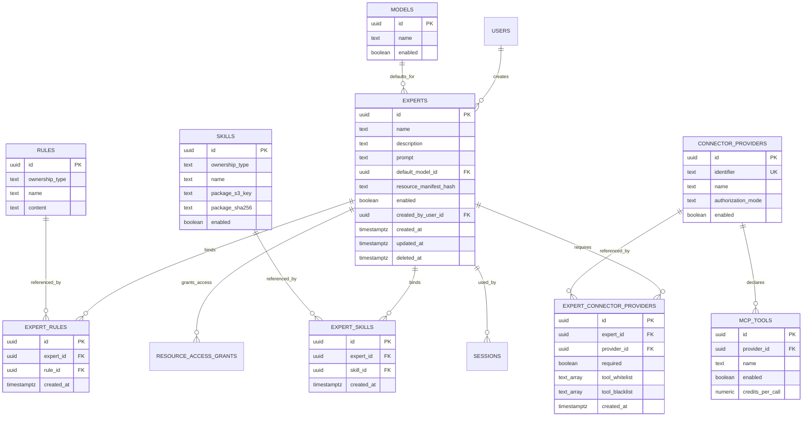

# AI 资源设计对现有实现的改动说明

> 状态：方案改动总结
>
> 范围：`monkeyai/admin`、`monkeyai/design/admin-data-model.md`、`desktop`、OhMyAgent

## 1. 总览

当前 Admin 是基于 React 内存状态的交互原型；Desktop 已具备模型、MCP 配置物化和会话级 Skill 物化；OhMyAgent 当前支持 stdio、streamable HTTP、SSE 回退和静态 Header，但不支持 MCP OAuth。

本设计不修改旧版 `mcai-gh/backend`、`mcai-gh/frontend` 和 `mcai-backend`。

## 2. 数据模型方案改动

本章总结相对于讨论前 `admin-data-model.md` 的设计变化，用于评审最终方案，不表示需要兼容或迁移任何已部署数据库。

### 2.1 Skill

现有：

- `skills.instructions` 与 ZIP 中 `SKILL.md` 重复。

改动：

- 删除 `skills.instructions`。
- 明确 Skill 包字段指向以 `SKILL.md` 所在目录为根的 S3 ZIP。
- 系统 Skill 名称全局唯一；个人 Skill 按所有者范围唯一。
- 被专家引用的 Skill 禁止删除。

### 2.2 通用文件存储

沿用 main 已确认的 S3 直存模型，不新增统一 `files` 表。服务端仍需实现统一 S3 存储适配层：

- 由服务端生成不可变 Object Key；
- 临时写入后计算大小与 SHA-256，再创建数据库记录和业务引用；
- 提供受控下载接口或短期签名 URL；
- Skill ZIP、专家 Markdown 和 Connector 图标分别在业务表记录 Object Key 与元数据，并复用同一存储接口；
- 系统专家不生成完整服务端专家 ZIP，由 Desktop 根据 Manifest 组装。

### 2.3 Rule

现有表基本保留，补充：

- 系统/个人名称唯一范围；
- 同名时系统 Rule 覆盖个人 Rule；
- 被专家引用的系统 Rule 禁止删除；
- 不增加 `enabled`。

### 2.4 MCP Server

现有 `mcp_servers` 同时承担模板、实例和连接状态，无法支持同 identifier 多实例及不同凭证。

改动：

- 删除 `mcp_servers` 概念，拆为 `connector_providers` 和 `connectors`。
- `mcp_server_credentials` 重命名为 `connector_credentials`，关联 `connector_id`。
- Credential 删除重复的 `method` 字段。
- `mcp_tools.server_id` 改为 `provider_id`。
- `mcp_tool_calls.server_id` 改为 `connector_id`。
- 资源授权类型由 `mcp_server` 改为 `connector`。

### 2.5 Expert

本次确认 Expert 固定为单 Agent，保留 `experts.prompt` 作为该 Agent 的提示词，不为未来专家团提前拆分成员表。

改动：

- 保留 `experts.prompt`。
- 增加 `experts.default_model_id` 和 `resource_manifest_hash`。
- 不新增 `expert_agents`。
- 删除 `expert_mcp_tools`；新增 `expert_connector_providers`，关联 Connector Provider 并保存必需标记和工具过滤条件。
- `expert_rules`、`expert_skills` 仅保存资源关联，按资源规范化名称和资源 ID 稳定装配。
- `expert_knowledge_bases` 及知识库相关改动移入未来规划，不进入本期表结构。

本期 Expert 表结构关系如下：



Expert 通过关系表关联 Connector Provider：

```text
experts.id
→ expert_connector_providers.expert_id
→ expert_connector_providers.provider_id
→ connector_providers.id
→ mcp_tools.provider_id
```

每项关系通过 `required`、`tool_whitelist`、`tool_blacklist` 保存启动约束和工具名称过滤条件。Expert 不绑定具体 `connectors.id` 或 `mcp_tools.id`；创建会话时根据关联 Provider 的 identifier 选择用户可用的具体 Connector 实例，并从该 Connector Provider 的已启用工具中应用白名单和黑名单。

## 3. Admin 原型改动建议

### 3.1 工具页面

当前页面以 MCP Server 为唯一实体，并在一个表单中配置 URL、授权模式和认证信息。需要改成 Connector Provider 与 Connector 两层管理。

Provider 管理应支持：

- identifier、名称、描述、图标；
- Transport 和默认 URL；
- 三种授权模式；
- OAuth Discovery/Manual 配置；
- Header Schema；
- Provider 级工具目录、启停及集中认证积分。

Connector 管理应支持：

- 同一 Connector Provider 创建多个实例；
- URL 和非敏感 Header 覆盖；
- 组织或个人所有权；
- 集中认证管理员授权；
- 独立认证状态；
- 手动测试连接并刷新工具目录。

原型中的“每次积分”显示条件保持不变：仅 centralized 工具可编辑。

当前连接测试是 `setTimeout` 模拟，正式实现需调用后端；实际 MCP 请求也应被动更新状态。

### 3.2 专家页面

当前专家表单直接保存 `prompt`，这一点保留；硬编码的工具、规则和 Skill ID 需要替换为真实资源：

- 编辑单 Agent Expert 的 Prompt；
- 选择系统 Connector Provider，并编辑必需标记、工具白名单/黑名单；
- Rule、Skill 选择实际服务端系统资源；
- 后台不再直接绑定具体 MCP Tool；
- 展示 `resource_manifest_hash` 对应的资源状态；

系统专家只允许管理员编辑。专家授权 UI 固定为可查看和运行，不展示 `read_write`。

### 3.3 Skill 页面

现有 ZIP 解析方向可复用，但需调整：

- 只接受根目录直接含 `SKILL.md` 的标准包；
- 数据库不保存 `instructions`；
- 上传后端后在 `skills` 记录 S3 Object Key 和摘要；
- 被专家引用时禁止删除；
- 更新包后触发关联专家摘要重算。

### 3.4 Rule 页面

现有系统/用户双 Tab 保留。需要补充：

- 用户 Rule 由 Desktop 创建，Admin 用户 Tab 主要用于查看和治理；
- 系统 Rule 被专家引用时禁止删除；
- 系统强制范围继续映射 `usage_requirement = required`；
- 不新增 Rule 启停按钮。

### 3.5 原型需删除或修改的表达

- `mcp_server` 命名改为 Connector。
- MCP 集中 OAuth 的“已授权”不能使用独立布尔值，应由 Credential 状态推导。
- 当前文案若声称 Header 已加密，需要改为首版明文存储、界面不回显。
- 专家硬编码工具选项改为 Provider identifier 与工具目录。

## 4. Desktop 改动建议

### 4.1 可复用现状

Desktop 当前已有两项适合复用的能力：

- `config.json` 作为权威配置，向 OhMyAgent 派生 `settings.json` 和 `mcp.json`；
- 会话级 Skill 目录物化和会话恢复机制。

### 4.2 新增服务端资源同步

需要新增：

- MonkeyAI 全量资源快照与增量版本同步；
- 系统专家、Rule、Skill、Provider 和 Connector 缓存；
- 服务端切换时清理旧服务端缓存；
- 文件摘要缓存及签名地址下载；
- 专家 `resource_manifest_hash` 比较。

### 4.3 专家管理与物化

需要新增：

- 服务端系统专家与本地专家统一列表；
- 本地专家创建、编辑、ZIP 导入导出；
- Connector identifier 映射与导入；
- 专家资源更新提示和差异列表；
- 临时目录构建、完整校验和原子替换；
- 创建会话时生成统一专家目录。

### 4.4 Connector 选择

任务启动前需要：

- 按 identifier 汇总已授权组织 Connector、个人 Connector 和本地 stdio Connector；
- 多实例选择；
- 按“用户 + 专家 + identifier”记忆最近选择；
- 必需 Connector 缺失或未认证时阻止启动；
- 非必需 Connector 允许跳过。

### 4.5 OAuth UI 与桥接

Desktop 不实现 OAuth 协议内核，但负责：

- 调用 OhMyAgent 发起授权；
- 打开系统浏览器；
- 展示授权、过期、失败和重新授权状态；
- 将 callback 结果中的 Code 与 verifier 通过已登录会话提交 MonkeyAI；
- 根据 Header Schema 收集独立认证敏感 Header 并上传。

Desktop 不保存远程 Connector Token 或敏感 Header。

### 4.6 本地 stdio

现有 stdio MCP 配置继续本地保存。需要增加 identifier，以便专家按服务类型解析。其 `env` 明文保存到 `0600` 文件，不上传、不统计、不计费。

## 5. OhMyAgent 改动建议

### 5.1 当前差距

当前 MCP Client 明确不支持 OAuth，`McpAuthTool` 对所有 Transport 返回 `unsupported`，只能从 `mcp.json` 读取静态 Header 或 stdio env。

### 5.2 MCP OAuth Client

OhMyAgent 需要新增：

- OAuth Authorization Server Metadata 与 OIDC Discovery 元数据消费；
- PKCE、state 和 localhost callback；
- 授权 URL 组装；
- 向 Desktop 返回 Code、verifier 和 redirect URI；
- 授权过程状态事件。

OhMyAgent 不负责远程 Token 交换、持久化和刷新，这些由 MonkeyAI 服务端完成。

### 5.3 专家运行时

需要新增：

- 读取 `expert/manifest.json`；
- 将 `experts.prompt` 物化为单 Agent 的主提示词；
- 将有序 Rule 注入系统指令；
- 扫描专家目录 Skill；
- 按白名单和黑名单注册 MCP Tool；
- 保持本地 stdio 与远程网关 Connector 的统一工具接口。

### 5.4 会话资源

新增统一的 `session_set_resources` 会话资源装配入口，覆盖专家、Rule、Skill 和 Connector 选择，并逐步替代仅处理 Skill 的 `session_set_skills`。资源只能在会话空闲时替换；运行中会话使用固定快照。

## 6. 接口与行为修改意见

以下内容不属于本次数据表本身，但实现时必须同步处理：

1. 服务端需要为每个 Connector 提供独立 MCP 网关端点。
2. 网关调用必须携带用户和会话身份，但不得把上游凭证返回客户端。
3. `tools/list` 应应用 Connector Provider 工具启停和专家工具过滤。
4. `tools/call` 仅记录状态、耗时和资源标识，不记录请求/响应 Payload。
5. 集中认证成功调用按工具扣费；独立和 none 只统计。
6. 产品所称任务统一对应 `sessions`；新会话固定资源快照，运行中不热更新，恢复会话时重新同步最新资源。

## 7. 与 WorkBuddy 的关系

本设计借鉴 WorkBuddy 调研中的以下思想：

- 专家以 Agent、Skill、Rule 和 Connector 依赖组成可移植包；
- Connector Provider 与用户运行实例分离；
- 专家按 identifier 声明 Connector，而不是绑定某个账号凭证；
- Credential 不进入专家包。

没有直接照搬的部分：

- WorkBuddy 原始 userdata 和运行时代码未在当前工作区中提供，现有证据主要来自调研文档；
- MonkeyAI 的 centralized/independent/none 三态、服务端网关和计费规则是本项目自己的设计；
- 本期多 Agent 调度不实现。
