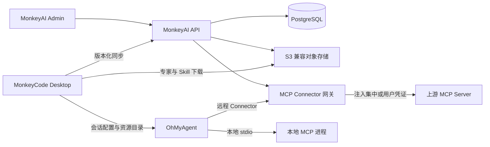
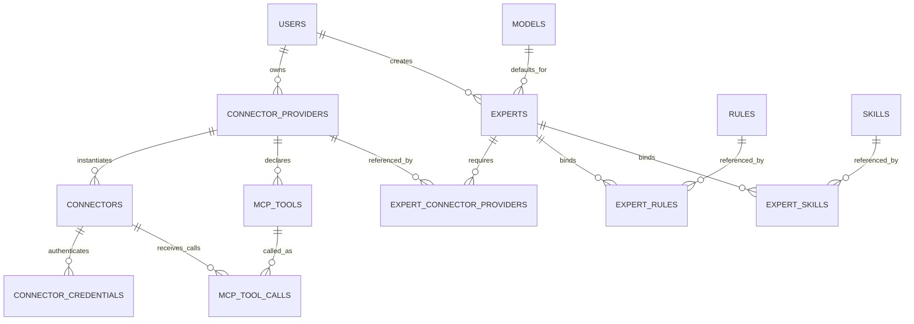

# MonkeyAI 技能、专家、规则与 Connector 设计

> 状态：已确认设计
>
> 适用范围：MonkeyAI Admin、MonkeyCode Desktop、OhMyAgent
>
> 数据结构明细：`admin-data-model.md`
>
> 暂不实现范围：`ai-resource-deferred-scope.md`

## 1. 目标

本设计定义技能、专家、规则和 MCP Connector 从管理、存储、授权、下发到 Agent 调用的完整边界。MonkeyAI 是全新版本，不复用 `mcai-gh/backend`、`mcai-gh/frontend` 或 `mcai-backend` 中的旧资源定义。知识库依赖保留为未来规划，不进入本期数据模型和实现。

设计目标如下：

1. 系统资源由 MonkeyAI 服务端统一管理，个人资源保留清晰的所有权边界。
2. Desktop 负责登录 MonkeyAI、同步资源、管理本地专家、创建会话快照和物化资源。
3. OhMyAgent 负责读取已物化资源并执行 Agent 与 MCP 调用，不持有 MonkeyAI 登录态。
4. Expert 固定为单 Agent，Rule、Skill 和 Connector 直接为该 Agent 提供能力。
5. 远程 MCP 统一通过 MonkeyAI 网关调用，凭证不下发客户端。
6. Desktop 本地 stdio MCP 保持本地运行，不进入服务端 AAA、统计或计费链路。

## 2. 总体架构



服务端资源采用“定义、实例、凭证”三层模型：

```text
connector_providers
        ↓ 1:N
connectors
        ↓ 1:N
connector_credentials
```

- Provider 描述一类 MCP 服务如何连接和认证，具有稳定 `identifier`。
- Connector 表示一个实际可选择的连接实例。
- Credential 表示某个 Connector 的组织共享凭证或用户独立凭证。

## 3. 文件与资源存储

### 3.1 S3 直存

文件内容统一保存到 S3 兼容对象存储，不保存到 PostgreSQL，也不设计统一 `files` 表。每张业务表直接保存自身文件的 Object Key、原始文件名、字节数、MIME 类型和 SHA-256。

S3 Endpoint、Bucket、Region 和访问凭据属于部署配置，不进入业务表。数据库不保存预签名 URL，读取时根据 Object Key 动态生成。

业务文件采用不可变对象语义：更新资源时写入新的 Object Key，再在数据库事务中切换业务字段；不得在原 Object Key 上覆盖内容。旧对象本期永久保留，但不提供历史查询与恢复功能。

### 3.2 Object Key 布局

Object Key 由服务端生成，不使用用户提交的原始文件名作为唯一定位。建议格式：

```text
ai-resources/<kind>/<resource-id>/<object-id>/<safe-file-name>
```

示例：

```text
ai-resources/skills/<skill-id>/<object-id>/code-review.zip
ai-resources/connector-icons/<provider-id>/<object-id>/github.svg
```

`object-id` 每次写入重新生成，保证不可变和低冲突。`safe-file-name` 仅用于运维识别。Object Key 禁止绝对路径、`..`、反斜杠路径穿越和用户控制的目录片段。

### 3.3 写入与数据库一致性

资源文件保存顺序：

1. 服务端生成临时 Object Key 和最终 Object Key。
2. 上传时流式计算大小与 SHA-256，并执行资源格式校验。
3. 校验成功后将对象复制或移动到最终 Object Key。
4. 在数据库事务中创建或更新业务记录，使其指向最终 Object Key及对应元数据。
5. 事务成功后删除临时对象；事务失败时最终对象成为未登记孤儿，本期不自动清理。

文件下载前检查对象存在；对象大小或摘要与数据库不一致时视为存储损坏，不向客户端下发。

### 3.4 各类资源字段

| 资源 | 业务表 | S3 字段 |
| --- | --- | --- |
| Skill ZIP | `skills` | `package_file_name`、`package_s3_key`、`package_size_bytes`、`package_sha256` |
| Connector 图标 | `connector_providers` | `icon_file_name`、`icon_s3_key`、`icon_mime_type`、`icon_size_bytes`、`icon_sha256` |

服务端不保存组装后的系统专家 ZIP。Prompt、默认模型及资源关系保存在数据库，Rule 正文保存在数据库，Skill ZIP 通过 `skills.package_s3_key` 定位；Desktop 根据专家 Manifest 组装专家目录。

### 3.5 Skill 包

一个 Skill 以 `SKILL.md` 所在目录为打包根目录：

```text
skill.zip
├── SKILL.md
├── references/
├── scripts/
└── assets/
```

ZIP 根目录必须直接包含 `SKILL.md`，不得额外包装同名目录。`SKILL.md` 是 Skill 指令的唯一权威来源，数据库不重复保存 `instructions`。

服务端保存：

- 从 `SKILL.md` 解析出的 `name` 和 `description`；
- 包文件名、Object Key、大小和摘要；
- 包内文件数；
- 启用状态。

下发采用“资源清单 + 按需下载”：Desktop 先获得文件 ID、摘要、大小和短期下载地址，命中本地摘要缓存时不重复下载。

服务端必须在入库前检查 ZIP 路径穿越、绝对路径、符号链接、重复路径、压缩后展开大小和文件数量，并验证根目录 `SKILL.md` 可解析。包内文件保持原始相对目录，不在服务端解压为权威存储。

### 3.6 Connector 图标

Connector Provider 直接保存图标 Object Key 和元数据。PNG 保留原始字节；SVG 必须拒绝或清理脚本、事件属性、外部资源引用和其他主动内容。图标通过受控文件接口或短期预签名地址下发，不要求 S3 对象公开可读。

### 3.7 文件读取与下发

元数据接口返回业务资源 ID、文件名、MIME、大小和 SHA-256。文件内容通过需要身份认证的下载接口或短期预签名 URL 获取：

- 下载前按当前用户和业务资源重新校验访问权；
- 签名 URL 有限时且只允许读取指定对象；
- API 不返回本地存储绝对路径或 OSS 访问密钥；
- Desktop 下载完成后必须校验大小和 SHA-256；
- 校验失败的文件不得进入缓存或专家物化目录。

## 4. 专家模型

### 4.1 服务端与本地专家

- 服务端 `experts` 仅保存管理员创建的系统专家。
- 用户个人专家仅存在 Desktop 本地，不上传 MonkeyAI。
- 本地专家通过 ZIP 文件导入导出，可经任意渠道分享，不经过服务端。
- Desktop 将两种来源统一转换成相同的会话物化目录。

### 4.2 单 Agent 结构

一个 Expert 就是一个 Agent。`experts.prompt` 保存该 Agent 的角色、目标和工作方式；Rule、Skill 与 Connector 依赖均直接作用于该 Agent。本期不保留成员、角色、团队拓扑或成员级资源范围。

### 4.3 默认模型与 Connector Provider

`experts.default_model_id` 可空并关联 `models.id`，只作为新任务默认值，用户仍可选择其他有权模型。不配置 Expert 级 `max_turns`。

Expert 通过 `expert_connector_providers` 关联系统 Connector Provider。每项关系保存 `required`、`tool_whitelist` 和 `tool_blacklist`：

- 同一 Expert 不得重复关联同一 Connector Provider；
- 白名单为空表示不限制候选工具；
- 黑名单最后执行并具有更高优先级；
- Expert 不直接绑定具体 Connector 实例或 Credential。

### 4.4 专家静态资源

Expert 通过关系表引用系统 Rule 和系统 Skill。关系表不保存人工排序，同一 Expert 不得重复引用同一资源。运行时按资源规范化名称、资源 ID 升序稳定装配；规范化名称去除首尾空格并转换为小写。

系统专家不允许引用个人 Rule 或个人 Skill，避免个人资源生命周期破坏组织专家。

### 4.5 专家授权

专家本身通过 `resource_access_grants` 授权，且只允许 `read_only`，应用层必须拒绝专家的 `read_write` 授权。用户获得专家授权后：

- 专家关联的 Rule 和 Skill 获得任务内委托使用权，不要求单独授权；
- 用户直接拥有或被授权的 Rule、Skill 进入任务可选集合；用户本次选择的资源再与专家固定资源取并集；
- 专家声明的 Connector identifier 可用，但具体组织 Connector 仍需用户拥有实例授权；
- 用户自己的同 identifier Connector 和本地 stdio Connector天然可选；

### 4.6 规则与 Skill 合并

规则装配顺序：

```text
系统强制 Rule
→ 专家绑定 Rule（按规范化名称、资源 ID）
→ 用户本次选择 Rule
```

同名 Rule 使用系统 Rule 覆盖个人 Rule。名称比较去除首尾空格并忽略大小写。

Skill 同名优先级：

```text
专家自带 Skill
→ 用户本次选择的个人 Skill
→ 系统 Skill
```

Skill 名称同样去除首尾空格并忽略大小写。专家 Skill 按规范化名称、资源 ID 升序排序；用户本次选择的 Skill 保持选择顺序。同一 Skill ID 或规范化名称只物化优先级最高的一项。

### 4.7 专家资源清单与本地更新

`experts.resource_manifest_hash` 持久化服务端当前专家资源组合的 SHA-256。摘要包含：

- `experts.default_model_id`；
- `expert_connector_providers` 关系、必需标记和工具过滤条件；
- `experts.prompt`；
- 专家 Rule 关系、名称和正文摘要；
- 专家 Skill 关系、包文件摘要及启用状态；

摘要不包含：

- Connector Provider；
- 系统强制 Rule。

以下变化在同一数据库事务内同步重算所有受影响专家的摘要：修改 `experts.prompt` 或 `experts.default_model_id`；新增、修改或删除 `expert_connector_providers`、`expert_rules` 或 `expert_skills`；修改被引用 Rule 的名称或正文；修改被引用 Skill 的名称、描述、包文件或启用状态。

摘要输入采用确定性 JSON：对象键按 Unicode 码点升序排列；Connector Provider 关系按 Provider identifier、Provider ID 升序排列，白名单和黑名单分别按规范化工具名称升序排列；Rule 和 Skill 关系按资源规范化名称、资源 ID 升序排列；字符串使用 UTF-8；缺失值与 `null` 区分；数组保持业务顺序；最终对无额外空白的 JSON 字节计算 SHA-256。

Desktop 保存本地已物化清单。服务端摘要不一致时提示用户“专家资源可更新”；用户确认前继续使用本地旧目录。确认后在临时目录构建完整新版本，全部下载、解压和校验成功后原子替换；失败则继续使用旧目录。

## 5. Rule 模型

- Rule 正文保存在 `rules.content`，不生成独立文件包。
- 系统 Rule 由管理员创建；个人 Rule 由 Desktop 创建并保存到 MonkeyAI 服务端。
- 系统 Rule 名称在系统范围唯一；个人 Rule 名称在所有者范围唯一。
- 个人 Rule 可与系统 Rule 同名，运行时系统 Rule 优先。
- Rule 本期没有启停字段。
- 被专家引用的系统 Rule 禁止删除，必须先解除引用。
- 系统 Rule 可通过 `usage_requirement = required` 强制下发；个人 Rule 只能是 `optional`。

## 6. Connector Provider

### 6.1 identifier

`identifier` 是服务类型的稳定机器标识，例如 `github`、`gitlab`、`tavily`。

- 系统 identifier 由管理员填写，格式为 `^[a-z][a-z0-9_-]{1,63}$`，在实例内唯一。
- 用户自建 Provider 自动生成 `custom:<uuid>`，不允许手填。
- identifier 创建后不可修改。
- 系统 identifier 是保留名称，用户不能创建同名 Connector Provider，只能基于系统 Connector Provider 创建个人 Connector。
- 用户 Connector Provider 仅本人使用，不支持服务端分享。

### 6.2 Connector Provider 内容

Connector Provider 保存：

- 名称、描述、图标；
- 远程 `streamable_http` 地址；
- `none`、`independent` 或 `centralized` 授权模式；
- `oauth` 或 `http_header` 授权方式；
- OAuth Client 和 Discovery 配置；
- Header Schema；
- 最近一次工具发现来源 Connector。

系统启用的 Connector Provider 对所有用户可见，用户可基于 `none` 或 `independent` Connector Provider 创建私有 Connector。`centralized` Provider 只能由管理员创建组织 Connector。

### 6.3 OAuth 配置

支持三种发现方式：

- `oauth_authorization_server`：管理员填写完整 RFC 8414 Metadata URL；
- `openid_connect`：管理员填写完整 `.well-known/openid-configuration` URL；
- `manual`：管理员直接填写授权端点和 Token 端点。

Discovery 模式只保存 URL，不缓存解析出的 Endpoint。每次授权前由服务端读取 Discovery 文档。首版不支持动态客户端注册，管理员必须预先配置 OAuth Client。

OAuth Client Secret 首版明文保存于数据库，但 API、日志和审计参数不得返回其值。

### 6.4 Header Schema

Provider 使用 `header_schema jsonb` 声明 Header：

```json
[
  {
    "key": "X-API-Key",
    "label": "API Key",
    "description": "服务访问密钥",
    "required": true,
    "sensitive": true,
    "default_value": null
  },
  {
    "key": "X-Request-Source",
    "label": "请求来源",
    "description": null,
    "required": false,
    "sensitive": false,
    "default_value": "monkeyai"
  }
]
```

管理员负责声明敏感性。敏感 Header 不得包含默认值，实际值进入 `connector_credentials.http_headers`；非敏感实例值进入 `connectors.header_values`。`none` 模式不得声明敏感 Header，也不得声明无法通过非敏感默认值或实例值满足的认证型必填 Header。

## 7. Connector 实例与凭证

### 7.1 实例

Connector 可以覆盖 Provider 的 URL 和非敏感 Header，但不能覆盖授权模式和认证方式。

- 系统 Connector 由管理员创建，通过 `resource_access_grants` 授权用户或分组。
- 用户 Connector 仅所有者可用，不支持分享。
- 同一 Connector Provider 可创建多个 Connector，例如同一 `github` 下的“研发 GitHub”和“开源 GitHub”。
- 同一用户也可以为同一 Connector Provider 创建多个私有 Connector。

`none` 和 `independent` Connector 创建时保存 `provider_snapshot`，固定当时的 URL、授权配置、OAuth 非密钥配置和 Header Schema。Connector Provider 后续普通配置变更只影响新建实例，旧实例可由用户主动升级。OAuth Client Secret 不复制到快照；服务端换取和刷新 Token 时读取 Connector Provider 当前 Secret，因此 Secret 轮换作为安全配置对既有 Connector 立即生效，且不得同时改变 Client ID 或其他快照配置。

`centralized` Connector 不保存快照，新任务使用 Provider 当前配置。Provider 禁用后，集中 Connector 对新任务不可用。

### 7.2 凭证

所有远程凭证保存在服务端 `connector_credentials`：

- `centralized`：`user_id = NULL`，每个 Connector 最多一条有效组织共享凭证；
- `independent`：`user_id` 必填，个人 Connector 的用户必须等于 Connector 所有者；
- `none`：不得存在凭证记录。

认证方式以 Connector 实际 Connector Provider 配置为准，Credential 不重复保存 `method`。重新授权覆盖原记录，不保存凭证历史。

### 7.3 Header 合并

网关按以下顺序合并，后者覆盖前者：

```text
Connector Provider Header 默认值
→ Connector header_values
→ Credential http_headers
```

所有 Header 必须在 Schema 中声明，合并和覆盖按 Header key 的 ASCII 小写形式匹配；最终发送时使用 Header Schema 声明的原始 key。合并后所有必填项必须有值。

## 8. 三种远程 MCP 授权模式

### 8.1 none

- 不创建 Credential。
- 通过服务端网关调用，但不注入认证信息。
- 记录调用统计，不扣积分。

### 8.2 centralized

- 管理员为每个组织 Connector 配置共享 OAuth 或 Header 凭证。
- 用户必须拥有该具体 Connector 的资源授权。
- 网关注入 `user_id = NULL` 的共享凭证。
- 成功调用按 `mcp_tools.credits_per_call` 扣积分。

集中 OAuth 从 Admin 发起，使用 MonkeyAI 服务端回调地址：服务端生成并校验临时 state/PKCE，管理员在浏览器完成授权，服务端直接换取并保存共享 Token，不经过 Desktop 或 OhMyAgent。集中 Header 凭证由管理员在 Admin 中填写。

### 8.3 independent

- 每个用户为具体 Connector 配置自己的凭证。
- OAuth Client 流程由 OhMyAgent 驱动，但 Token 交换和保存由服务端完成。
- Header 凭证由 Desktop 根据 Header Schema 采集并上传服务端。
- 网关注入当前用户的 Credential。
- 记录调用统计，不扣积分。

### 8.4 独立 OAuth 首次授权

```text
Desktop 发起授权
→ 服务端解析 Discovery 并返回授权元数据
→ OhMyAgent 生成 state、PKCE 和 localhost callback
→ Desktop 打开系统浏览器
→ OhMyAgent 接收 callback 并校验 state
→ Desktop 提交 code、code_verifier、redirect_uri
→ 服务端使用 Connector Provider Client 配置换取 Token
→ 服务端写入 connector_credentials
```

`state`、`code_verifier` 和回调状态只保存在 OhMyAgent 内存。`code_verifier` 仅随 Token 交换请求传输，不进入数据库、日志或审计。服务端负责 Refresh Token 并发刷新、过期和撤销。

## 9. MCP 工具目录与调用事实

`mcp_tools` 按 Connector Provider 保存，同一 Connector Provider 的全部 Connector 共享工具目录、启停状态和积分配置。

- 任意 Connector 手动测试成功后执行 `tools/list`。
- 实际网关请求也可被动更新连接状态。
- 最近一次成功结果覆盖共享工具目录。
- 新工具创建，缺失工具软删除，再次发现同名工具时恢复。
- 工具改名视为旧工具删除、新工具新增。
- `(provider_id, lower(name))` 唯一；调用时仍使用上游原始精确名称。
- 同步不得覆盖管理员设置的 `enabled` 和 `credits_per_call`。
- `credits_per_call` 仅对 `centralized` 有效。

`mcp_tool_calls` 通过 `connector_id` 和 `tool_id` 记录调用。Connector 和 Tool 软删除后事实记录继续保留。统计通过软删除记录仍可获得工具名称，不额外保存名称快照。

## 10. 服务端网关

每个远程 Connector 对客户端表现为独立的 MonkeyAI MCP 网关端点。OhMyAgent 将其注册为独立逻辑 MCP Server。

网关职责：

1. 识别用户、会话和 Connector。
2. 校验 Connector 可用性及组织 Connector 授权。
3. 根据模式选择共享凭证、用户凭证或不使用凭证。
4. 合并 Header 并连接上游 MCP。
5. 依据 Connector Provider 工具目录、启停配置和专家过滤条件暴露工具。
6. 记录不包含请求/响应 Payload 的调用事实。
7. 仅为集中认证成功调用扣费。

## 11. Desktop 同步、选择与物化

本文在产品交互中使用“任务”时，对应服务端数据实体均为 `sessions`，不引入独立 Task 实体。

### 11.1 资源同步

Desktop 使用“版本化快照 + 增量通知”：

- 首次登录或切换服务端时拉取完整授权快照；
- 后续按版本增量同步；
- 切换服务端时清空旧服务端资源快照、授权缓存和组织 Connector；
- 服务端资源归属原服务端，不自动迁移。

本地专家保留在设备上。切换服务端后若缺少 identifier，任务启动前要求映射已有 Connector Provider、在当前服务端创建 Connector，或在非必需依赖上选择跳过。

### 11.2 Connector 选择

专家只声明 identifier。任务启动时 Desktop 汇总：

```text
用户已获授权的同 identifier 组织 Connector
∪ 用户自己的同 identifier Connector
∪ 本地同 identifier stdio Connector
```

若有多个实例，用户选择一个；Desktop 按“用户 + 专家 + identifier”记住最近选择，并将最终 Connector 固化到会话快照。

必需 Connector 缺失或未认证时阻止启动；非必需 Connector 可跳过。

### 11.3 会话快照

新任务固定创建时资源快照。连续运行期间，后台修改、撤权、禁用和删除都不热更新。Desktop 重启或恢复历史会话时重新同步并使用最新服务端专家配置生成新快照。

### 11.4 专家目录

Desktop 的统一物化结构：

```text
expert/
├── manifest.json
├── agents/
│   └── expert.md
├── rules/
│   ├── 001-system-required.md
│   ├── 100-expert-rule.md
│   └── 200-user-rule.md
└── skills/
    └── <skill-name>/
        ├── SKILL.md
        └── ...
```

默认模型、Connector Provider 依赖和 Rule 可随资源清单内联下发；Skill 通过独立 ZIP 下载并由 Desktop 组装。OhMyAgent 只消费物化结果，不需要理解资源来自系统、个人或专家包。

## 12. 本地 stdio MCP

Desktop/OhMyAgent 可配置本地 stdio MCP：

- 保存 `identifier`、`command`、`args` 和 `env`；
- 配置文件权限为 `0600`；
- `env` 首版明文保存，不加密；
- 配置和凭证不上传 MonkeyAI；
- 不进入服务端授权、审计、统计或计费；
- 不进入专家导出包；
- 服务端系统专家可通过系统 identifier 映射到本地 stdio Connector。

## 13. 本地专家包

本地专家包由 Desktop 导入导出，建议结构：

```text
expert.zip
├── manifest.json
├── agents/
│   └── expert.md
├── rules/
│   └── *.md
├── skills/
│   └── <skill-name>/
│       └── SKILL.md
└── connector-providers/
    └── *.json
```

导出时可选择携带 Connector Provider 的非敏感配置，但禁止包含 Credential、本地 Connector ID、敏感 Header、Token、`env` 和本机路径。

接收者导入时可以：

- 将来源 identifier 映射到已有 Connector Provider；
- 导入 Connector Provider，并生成新的 `custom:<uuid>` 后重写 Manifest 中的 Provider identifier。

Desktop 保存稳定来源 Connector Provider ID 到本地 Connector Provider ID 的映射，后续导入新版专家包时自动沿用；只有新增依赖、映射失效或配置不兼容时重新确认。

## 14. 删除与完整性规则

- Expert 使用软删除。
- Connector Provider 被任意有效 Connector 或 Expert 引用时禁止删除。
- Connector 使用软删除，同时撤销 Credential；历史调用保留。
- 被专家引用的 Rule 和 Skill 禁止删除，必须先解除关系。
- 专家资源关系解除时物理删除，历史写入 `audits`。
- Skill 禁用后不进入专家最新清单；未确认更新的本地专家仍可继续使用旧副本。

## 15. 关系概览


