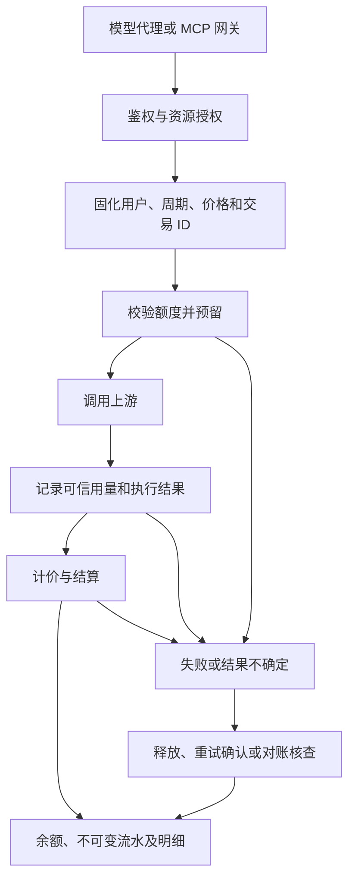

# 计费管理完整链路方案

> 状态：P1–P3 已实现并通过本地自动化验收；P4 接入代码与替身测试已完成，真实钱包联调待提供环境、应用 ID 和证书；P5 本地页面与交付检查完成，远程验收仍待联调。
>
> 基线：2026-09-07，`main` 提交 `9dd179d7`，已执行 `git pull --ff-only origin main`。
>
> 范围：MonkeyAI 管理后台、后端计费服务、模型代理、MCP 服务端网关、数据库与后台补偿任务。工作 Agent、Desktop 与 OhMyAgent 的代码改造不在本轮范围。
>
> 本文的业务取舍是推荐方案，不代表已经上线的行为。远程钱包的环境、应用 ID、证书与部分交易能力需要在远程联调阶段落实。

## 1. 交付目标

完成“管理员配置 → 用户获得周期额度 → 服务端校验并预留 → 获取真实用量 → 计价结算 → 查询明细和余额 → 周期刷新、异常补偿与对账”的闭环。

验收通过直接调用模型代理和 MCP 网关完成，不依赖 Agent 改造。系统只能对经过自己服务端的调用提供可信计量和扣费；客户端直连模型、直连 MCP 或本地 stdio 工具不具备这一前提。

本轮真实计费对象为当前已有资源的模型调用、集中认证的 MCP 工具调用。知识库执行服务目前尚未实现；截图里的知识库与“其他能力”示例不能作为真实账单保留。知识库后续复用计费服务接入，无需为本轮计费管理新建一套知识库业务。规则、技能与专家配置本身不单独收费。

## 2. 当前实现与缺口

| 部分 | 已核实的现状 | 需要完成的工作 |
| --- | --- | --- |
| 费用设置 | 已调用 `/api/admin/v1/settings/billing`；额度来自静态用户和分组，覆盖值存入设置 JSON | 真实组织关系、独立额度存储、严格校验、配置版本和生效时间 |
| 分块保存 | 四张卡片都通过 `saveBilling` 提交整份页面状态 | 按配置块局部更新，防止保存价格时顺便保存未确认的额度和计费方式；并发修改冲突提示 |
| 扣费明细 | `BILLING_RECORDS` 写死 12 条记录，筛选和分页在浏览器执行 | 数据库查询、服务端筛选分页、真实余额快照与调用详情 |
| 计费服务 | `internal/billing` 只有 `doc.go` | 定价、账户、额度、预留、结算、流水、补偿及查询 |
| 数据库 | 已有 `billing_quotas`、`credit_accounts`、`credit_ledger_entries`、两类调用表 | 冻结额、周期历史、交易状态、价格快照、幂等约束、远程交易记录 |
| 模型代理 | 已支持三种协议和部分流式用量解析；应用装配没有调用 `WithUsageRecorder` | 调用前计费检查、调用事实落库、可靠结算、协议用量补全 |
| 会话关联 | 两类调用表的 `session_id` 必填；当前代理解析器不提供会话 ID | 允许独立调用，会话可选关联并校验归属，不伪造会话 |
| MCP | 已有配置、认证、连接测试、工具发现和每次积分；没有业务调用网关 | 使用 `mcp:invoke` 调用密钥的真实执行入口、调用事实与计费接入 |
| 身份与分组 | 有真实用户、分组及多对多关系；现有授权对象接口没有返回成员归属 | 补齐必要的分组维护、成员归属及计费归属查询 |
| 百智云 | 页面仍按地址 + API Key 设计，后端没有 opensdk 依赖 | 改为服务端 opensdk + mTLS，身份绑定、预扣确认、重试和对账 |

现状依据：`admin/src/pages/billing-settings-page.tsx`、`billing-details-page.tsx`、`backend/internal/app/app.go`、`internal/proxy/usage.go`、`internal/mcp/service.go`、`internal/setting/service.go`、`migrations/000001_initial_create_schema.up.sql`。

## 3. 推荐业务口径

### 3.1 额度、余额与分组

- **分组额度是用户默认额度模板**。用户各自拥有积分账户，分组不另设共享消费池。团队默认额度 15,000、自定义分组额度 50,000 可以同时成立。
- 用户显式额度优先；否则沿用户的计费归属分组向上查找最近显式额度，最终回落团队默认额度（计费设置 `root_credits`）。`null` 表示继承，`0` 表示该周期没有可消费额度，负值非法。
- 当前授权关系允许用户属于多个分组。推荐单独设置一个“计费归属分组”，授权关系仍可多选。未指定时统一继承团队默认额度，用户角色不决定计费分组；不得把多组额度相加，也不得按数据库返回顺序选一个。
- 分组页补齐创建、改名、移动、删除及成员归属维护的最小能力，团队根节点仅用于展示，不入库，不预置管理员组。禁止环；删除仍有子组或计费归属用户的分组时要求先迁移。
- 额度配置、分组迁移和角色变化默认在下个周期影响额度，不因修改配置重新发放当期积分。确需当期补发或回收时使用独立的“调整当期积分”，必须填写原因、记录审计；回收不得侵占已冻结积分。
- 新用户首次开户按当期完整额度发放一次，不按天折算。被停用用户不能发起新调用；恢复启用不再次发放同周期额度。
- 余额分为账面剩余、冻结和可用：`可用积分 = 账面剩余 - 冻结积分`。界面明确显示三个口径，避免将“每月额度”等同于“当前余额”。

### 3.2 周期刷新

- 默认采用 `Asia/Shanghai`：每天 00:00、每周一 00:00、每月 1 日 00:00；存储时间使用 UTC，周期使用左闭右开区间。
- 到期后开启新的周期账户，旧周期余额不结转。保留旧周期及流水，不能把历史余额覆盖成新周期余额。
- 定时任务负责批量准备新周期；开户、读取余额和预留操作都校验周期，作为任务漏跑或重启后的兜底。同一用户、同一周期只允许开户发放一次。
- 停机跨过多个周期时，只准备当前周期，不补发所有错过周期的额度。
- 修改刷新周期在当前周期结束时生效。首个新周期从切换时刻到新规则的下一个自然边界，页面提前展示该过渡周期的长度和完整发放额度，之后按新规则运行。
- 调用在开始预留时绑定周期。跨零点完成、延迟确认和取消释放仍记入原周期，不占新周期额度；旧周期释放的积分也不转入新周期。

### 3.3 计价与精度

沿用“全局三项基础价格 × 模型倍率”。模型倍率与工具单价从资源配置读取，在调用开始时固化，调价只影响新调用。

```text
非缓存输入 = 总输入 Token - 缓存命中输入 Token
模型积分 = 模型倍率 × (
    非缓存输入 × 输入单价
  + 缓存命中输入 × 缓存输入单价
  + 输出 Token × 输出单价
) / 1,000,000
工具积分 = 成功调用次数 × 工具每次积分
```

- 缓存命中是总输入的一部分，不能在总输入费用之外再叠加缓存费用。协议适配后必须满足 `0 <= cached_input <= input`。
- Anthropic 的缓存读取和缓存写入分别采集。当前只有三项单价，推荐缓存写入按普通输入收费，并在价格说明中明示；读取采用缓存单价。后续需要独立缓存写入价格时扩展价格版本。
- 模型调用失败与是否有可计费用量分开记录。有完整可信用量时按实际用量计价；已发出请求但缺少最终用量时进入待核查，不直接记成免费成功或按预估强行扣款。
- 沿用数据库 `numeric(24,6)`。计费计算使用定点或十进制，API 金额采用十进制字符串；计费路径中的模型倍率、工具单价不能经过 `float64` 或 JavaScript `Number` 计算。
- 一次调用只形成一笔结算，输入、缓存、输出是组成项。先高精度求和，再按结算精度统一舍入；组成项分摊尾差，保证明细合计等于实际扣款。默认列表显示每笔总额，详情展示各组成项。
- 示例：总输入 10,000，其中缓存 4,000，输出 2,000；三项价格 100/20/400，倍率 1，则收费 `0.6 + 0.08 + 0.8 = 1.48` 积分。

## 4. 服务端执行与结算



`billing.Service` 提供少量明确用例：读取/修改配置、解析额度、准备账户、预留、结算、释放、调整、查询。代理和 MCP 定义自身需要的调用接口，由 `internal/app` 显式装配；不新增通用事件总线或独立计费微服务。

### 4.1 本地交易

1. 通过调用密钥确定用户和作用域，完成资源授权与启停检查。服务端生成并持久化调用 ID、交易 ID、价格快照和周期归属。
2. 数据库事务内锁定周期账户，以 `balance - frozen >= reserve` 原子预留。余额不足时在访问上游之前返回明确业务错误。
3. 工具按一次调用的固定费用预留。模型依据输入计量、服务端输出限制和价格上界计算预留额；服务端必须强制输出上限。缓存未知时使用可适用的最高输入单价。
4. 对无法可靠估算的协议、多模态或模型，采用已验证的模型上下文费用上界；若上界和执行限制都不能成立，暂不开放该组合的付费调用。不能只检查“余额大于零”就承诺不会并发超扣。
5. 上游执行在数据库事务之外。结束时将调用事实、交易状态、余额变化和计费流水在一个短事务中提交，未消费预留额释放。
6. 预留只是冻结，不是正式扣费。重复结算、重复取消按交易 ID 返回原结果；结果已经确定后不允许改写，只能建立关联冲正记录。
7. 如果实际费用异常超过预留上界，保留真实用量并转人工核查，停止该用户新的付费调用；不能静默截断实际用量或默认透支。该异常需要定位协议适配和上限执行问题。

交易至少区分：`created`（已创建）、`reserved`（已预留）、`settling`（待结算）、`settled`（已结算）、`released`（已释放）、`rejected`（未获准执行）、`unknown`（结果不确定）。业务调用的成功/失败状态与交易状态分开保存。

本地预留事务未提交时不得调用上游。远端调用后服务崩溃可能丢失最终结果，不能承诺跨系统的绝对一次执行；依靠持久交易、幂等入账和异常核查避免重复扣款及无声丢单。

### 4.2 模型代理接入

- 覆盖现有 `/v1/chat/completions`、`/v1/responses`、`/v1/messages` 的流式和非流式请求，补齐开始、失败、取消、完成等事实。
- Chat Completions 对兼容上游请求流式 usage，直接读取带 usage 的事件，不依赖 `[DONE]` 前最后一个分片恰好包含用量。Responses 处理完成与异常结束事件；Anthropic 补齐缓存写入和输入统计差异。
- 缺少 usage、真正的零用量、解析错误和响应中断分别记录。最终状态之后的重复事件不能再次收费。
- 用服务端调用 ID 做结算主键，上游 `response_id` 只用于关联；不同供应商可能缺失或重复该值。
- 可支持调用方提供幂等键，并将其绑定到用户、端点和请求摘要；同键不同请求拒绝受理。没有幂等键的新 HTTP 请求按新调用处理，不通过相似内容去重。一次业务的多次真实模型尝试分别记录，只有同一已接受调用的重复结算被去重。
- `session_id` 改为可空。若请求提供会话关联，则验证会话属于当前用户；未提供时照常记录独立调用，前端显示“未关联会话”。
- 流式结算使用独立且有超时的服务端上下文，不能随浏览器断连直接丢失；应用退出需停止接收新调用并有界等待结算任务。持久待结算状态由工作任务恢复。
- 调用超时只触发核查。确定未发往上游或已明确无费用的失败可以释放；已经执行但结果未知时不能仅凭超时自动释放并重新执行。

### 4.3 MCP 网关接入

- 增加例如 `/mcp/connectors/{id}` 的服务端 MCP 入口，复用现有长期调用密钥与 `mcp:invoke` 权限；用户、Connector、工具、认证上下文逐层校验。
- 覆盖初始化、工具列表和 `tools/call` 所需协议行为；列表按真实授权和启停状态过滤。复用已支持的上游 HTTP/SSE 连接方式，不向客户端下发集中认证秘密。
- `tools/call` 获取实际结果后写 `mcp_tool_calls`。集中认证且成功的调用按 `credits_per_call` 扣费；JSON-RPC 错误及 MCP `isError=true` 均视为失败并释放预留。
- 沿用现有领域约定：个人认证、无认证调用记录事实但不收费；保存这些模式的工具配置时禁止非零单价，避免页面价格与运行行为不一致。
- 初始化、工具发现、连接测试不收费。同一已接受调用的客户端重传不得重复结算；JSON-RPC ID 仅在连接会话范围内关联，不能直接当全局业务幂等键。跨会话重试需要稳定调用幂等键，没有该键的请求按新调用处理。
- 对可能产生副作用的工具，结果未知时不自动再次执行。补偿任务只重试计费确认，业务重试需要新的显式调用。
- 网关集成测试直接用协议客户端执行，不依赖 Agent 更新。Agent 后续将调用地址切换到网关，属于另一个交付任务。

## 5. 本地与百智云远程计费

推荐两种模式共用定价、额度限制和明细。远程模式保留本地周期额度作为实例内用量限制，同时由百智云钱包完成真实积分扣款；两者是不同约束，同一调用只向钱包收费一次。

| 项目 | 本地模式 | 远程模式 |
| --- | --- | --- |
| 定价 | 本地价格版本和资源倍率 | 同一价格版本，后端计算应扣积分 |
| 调用前 | 本地周期额度预留 | 本地额度预留 + 百智云钱包预扣 |
| 正式入账 | 本地余额和流水原子更新 | 远程确认成功后，本地记录额度消耗及远程结果 |
| 周期刷新 | 新周期发放本地额度 | 只刷新本地用量限制，不发放百智云积分 |
| 余额展示 | 本地当期余额和冻结额 | 当期剩余额度；百智云当前余额单独显示来源和查询时间 |
| 故障处理 | 本地事务回滚、恢复待结算交易 | 固定业务 ID 重试确认、差异核查，不自动改走本地扣费 |

### 5.1 SDK、身份和配置

- 使用 `git.in.chaitin.net/ai/baizhiyun/opensdk` 的 `OpenClienter`。应用启动装配单个客户端，在内部钱包适配层封装 `CreateBillingCharge`、`ConfirmBillingCharge` 和 `GetUserCreditBalance`。
- 部署配置提供环境、应用 ID、客户端证书、私钥和 CA。后台展示连接状态、环境、证书到期时间及脱敏的应用信息；取消“API Key 就能完成远程计费”的旧表单假设。
- dev/prod 分别配置实际应用 ID 和证书，不使用占位值启动远程模式。方案阶段不读取证书秘密，也不需要立即提供这些部署信息。
- 新增本地用户与百智云用户的已验证绑定。不能用邮箱或本地 UUID 猜钱包用户 ID；未绑定用户返回可操作的提示。多用户不得未经明确业务设计共享同一个钱包身份。
- 开启远程模式前验证配置完整性和连接能力，并展示未绑定用户范围；未满足条件时禁止启用。连接测试不创建实际扣费单。
- 从 `/api/v1/config` 下发的计费信息采用白名单，只含调用方需要的模式、价格说明和能力；不下发其他用户额度、全量覆盖表、钱包地址秘密或证书信息。

### 5.2 远程交易和精度

- 先落远程交易记录，再发起预扣。`BizID` 按 SDK 约定 `<appID3><yyyyMMddHHmmss><random10>` 生成一次并持久化；预扣、确认及重试使用同一值。
- SDK 的 `FrozenAmountCreditCents`、`ActualAmountCreditCents` 实际是整数额度单位：`100 quota = 1 credit`。数据库字段使用 `*_amount_quota`，避免和人民币分混淆。
- 本地保留六位精度的原始计价；远程总额以 `0.01` 积分结算，推荐每次调用汇总后四舍五入，记录舍入差额。低于半个最小单位的调用按零结算，不暗中设最低一分收费；该商业口径列为实施前需要确认的取舍。
- 界面展示实际结算金额，本地用量限制也消耗同一实际结算金额，原始计算结果放在详情中。预留额转换时向上取整，不能因舍入不足失去预留上界。
- 远程预扣成功后才执行上游。预扣返回明确余额不足时释放本地预留并拒绝调用；请求超时、响应丢失等保留为结果不确定，不立即判定失败。
- 实际用量写库后确认远程扣费。确认失败记录错误、尝试次数、下次重试时间；确认成功后本地入账失败，可以通过同一交易恢复，不能新建业务 ID 再收费。
- SDK 返回的余额查询不是“某笔交易扣费后的原子余额快照”。没有远端确切快照时，该列显示不可用；不以查询当前余额或减法推算来伪造历史余额。
- 当前技能可核实预扣、确认和余额查询，不能据此假设已确认交易的退款、按业务 ID 查询交易、对账单下载都可用。远程联调必须核实确认的幂等行为、取消/失败状态枚举、零金额确认、超预留行为、按业务 ID 查询或对账渠道；能力未落实前远程模式不能标记可上线。
- 本地退款采用关联原流水的冲正。远程已结算退款只有在核实钱包退款渠道后才能提供自助入口，否则走有记录的人工对账处理，不能仅增加本地余额宣称退款成功。

切换模式只影响新交易，未完成交易按开始时的模式和环境处理。禁止把远程异常单切到本地完成；模式切换、环境变更、用户解绑均展示待处理交易并校验影响，旧交易所需配置必须保留至处理结束。

## 6. 数据与接口改造

### 6.1 数据模型

| 表或数据 | 调整内容 |
| --- | --- |
| `settings` | 只保存全局计费策略，新增业务修订号、生效时间；`schema_version` 继续表示结构版本，不能充当并发版本 |
| `billing_quotas` | 作为根、分组和用户额度的唯一来源；真实 UUID、继承清除、修改人和审计，移除设置 JSON 双写 |
| 用户计费归属 | 为用户增加明确的计费归属字段和读取规则，与 `group_users` 多组授权关系分开 |
| `credit_accounts` | 从用户唯一改为用户/周期唯一，保留旧周期；增加周期额度快照、冻结额及必要版本字段，开户发放有唯一约束 |
| `billing_transactions`（新增） | 交易 ID、调用来源、用户、账户周期、计费模式、状态、预留额、原始/结算金额、价格快照、重试和错误信息 |
| `credit_ledger_entries` | 增加交易关联、账户内递增序号、幂等事件键、用户/资源快照、冲正引用；记录余额变化，不允许更新删除历史 |
| `model_calls` / `mcp_tool_calls` | 会话可空、服务端调用 ID、独立业务执行状态、完整计量和异常原因；关联计费交易 |
| `wallet_billing_records`（新增） | 唯一 `biz_id`、交易关联、外部用户、环境/应用快照、冻结与实扣 quota、请求状态、确认时间和重试信息 |
| 钱包身份绑定（新增） | 本地用户与已验证的外部用户标识、来源、绑定/撤销时间，保留历史交易身份 |
| `audits` | 配置、额度、归属、模式、人工调整和异常处理写操作者、目标及变更快照，去除秘密字段 |

本地账户只允许通过计费服务变更。数据库以约束和事务保证“同一交易的同一流水事件唯一”“同一用户周期发放唯一”“余额与冻结额非负且冻结不超余额”；历史账目通过冲正修复。

定时刷新、结算恢复和远程重试优先直接基于 PostgreSQL 待处理交易领取，使用行锁/租约和退避控制多个进程竞争。本轮不为这些任务引入额外消息队列。

### 6.2 管理与查询 API

以下为建议接口，实施时统一写入 `api/admin.yaml`；不在前端拼装计费规则。

| 接口 | 用途 |
| --- | --- |
| `GET /api/admin/v1/billing/settings` | 返回生效策略、待生效策略、修订号、远程配置状态 |
| `PATCH /api/admin/v1/billing/settings/{section}` | 只保存价格、周期或模式中的一个配置块；显式枚举 section，携带修订号，冲突返回 409 |
| `GET /api/admin/v1/billing/quotas` | 按组展开或搜索真实额度树、覆盖值、生效值、继承来源和计费归属 |
| `PUT /api/admin/v1/billing/quotas` | 原子保存本次额度变更集合，省略值表示不变，`null` 清除覆盖；返回影响人数和生效时间 |
| `GET /api/admin/v1/billing/accounts/{userID}` | 当期及历史周期、额度、余额、冻结额、下次刷新时间 |
| `POST /api/admin/v1/billing/accounts/{userID}/adjustments` | 带幂等键、原因和有符号金额的当期积分调整 |
| `GET /api/admin/v1/billing/entries` | 时间、用户、分组、类型、模式、流水类型筛选，稳定排序和服务端分页 |
| `GET /api/admin/v1/billing/transactions/{id}` | 调用事实、价格组成、结算过程、相关流水和错误 |
| `GET /api/admin/v1/billing/summary` | 与明细相同筛选口径的扣费、退款、净消耗和待处理数量 |
| `GET /api/admin/v1/billing/reconciliation` | 未结算、远程确认失败、余额/流水差异及处理状态 |
| `POST /api/admin/v1/billing/transactions/{id}/retry` | 对允许恢复的交易重试结算或远程确认，不重新执行业务 |

流水筛选中的分组默认指消费时的计费归属快照；如需按当前归属查历史，必须提供独立显式筛选。排序使用入账时间和稳定唯一键；同一账户用序号解释余额前后关系，不能用上游事件时间猜入账顺序。

面向调用方，提供只读的本人余额 API、稳定的余额不足/远程不可用等错误契约，以及 MCP 网关；不提供让客户端任意提交应扣金额的开放接口。服务端契约更新属于本轮，Agent 消费这些能力的代码不属于本轮。

原 `/settings/billing` 入口不能继续绕过计费校验直接覆写 JSON。旧入口如需过渡兼容，应转调同一计费用例并限制字段；后台和配置下发同步迁移。

## 7. 两个页面的具体变化

### 7.1 费用设置

保留截图的左右布局和四块配置，主要替换数据及事件处理。

- 左侧显示真实分组和成员；增加名称/邮箱搜索、大组按需展开、明确的继承来源。重复授权分组不复制一份用户余额，按计费归属展示用户。
- 额度编辑保留“继承/自定义”；同时显示当前周期有效额度和下一周期额度。保存前展示影响人数和生效时点，保存不隐式重置余额。
- 用户额度详情增加当期消耗、冻结、可用和下次刷新；“调整当期积分”与“调整周期额度”是两个明确操作。
- 三项模型价格增加倍率说明、计算示例、零价格及非法值校验；工具价格继续在工具页维护，这里提供入口。
- 刷新设置增加时区、下次刷新时间与周期切换预览。
- 远程模式展示服务端配置和连接状态、用户绑定覆盖情况；私钥及钱包认证凭据不进入普通页面表单。
- 每张卡片独立加载、保存和报错。请求中禁用重复提交；保存失败保留草稿并提供重试；冲突提示重新加载或重新提交。输入错误贴近字段并可被辅助技术读出。

### 7.2 扣费明细

- 去除模拟记录，保留现有表格风格和用户/内容/类型筛选，增加日期范围、分组和计费模式，分页和汇总均由服务端查询。
- 默认每次调用一行，显示入账时间、用户、资源类型/名称、用量摘要、扣除积分、当期余额；详情抽屉展开输入/缓存/输出组成和交易关联。
- 通过筛选查看发放、重置、退款、调整，解释余额变化的全部来源。冻结、待结算和异常单使用独立交易状态视图，不混成已扣款记录。
- 远程记录区分“当期剩余额度”与“百智云余额”；没有远端历史快照时不显示虚构的扣后余额。
- 使用快照展示已删除用户或资源的历史名称；金额展示保留实际精度，小额扣费不显示成无法解释的 `-0.00`。
- 补齐加载、空数据、无筛选结果、失败重试和刷新状态；筛选条件进入 URL，回退后可恢复。

本轮提供计费汇总查询作为其他统计页面的真实消费数据源。现有任务统计和历史页还依赖 Agent 会话事实，完整统计页改造不能作为本轮已完成事项；后续接入时消费同一份流水，避免重复计算费用。

## 8. 迁移和发布策略

- 当前仓库曾为重新部署收敛到初始化迁移 `000001`，那是前一个资源任务的特定安排。本次默认保留已有数据，追加 `billing` 增量迁移；不沿用旧方案去清空数据库或重写已执行迁移。
- 团队默认额度保存在配置 JSON 的 `root_credits` 中，版本 3 将旧真实根分组额度迁回该设置；仅迁移能验证用户/分组存在的 UUID 覆盖。`engineering`、`member-01` 等模拟 ID 输出迁移报告，由管理员处理，不按名称猜归属。
- 同时存在额度表和旧 JSON 时，先输出差异，表中已生效配置优先；冲突不能静默覆盖。旧字段在切换读取来源后停止写入。
- 已有账户及流水保留，补齐当前周期标识；未知历史价格或外部身份只标记未知，不用现价重算历史账单。
- 首次启用正式扣费前，完成根额度、账户初始化及真实用量采集验证，记录启用时间；不追扣启用前调用。该开关属于发布控制，与“本地/远程”商业模式分开。
- 本地闭环先上线，远程在测试环境验证后启用。回滚优先关闭新调用计费入口或切回兼容读取逻辑，已有交易继续按原模式处理，不能回滚删除账目。

## 9. 实施顺序与完成标准

| 阶段 | 工作内容 | 完成标准 | 当前状态 |
| --- | --- | --- | --- |
| P0 方案 | 现状、业务口径、接口草案、风险与验收 | 形成可评审方案，标明未确定的远程依赖 | 已完成 |
| P1 额度与配置 | 组织归属、设置局部更新、额度表、周期账户、调整和审计 | 页面保存后刷新一致；继承、开户、周期切换正确 | 已完成，本地验收通过 |
| P2 本地模型闭环 | 交易、预留、用量适配、结算、真实明细 | 不用 Agent，三种模型协议均能真实落账且并发不超扣 | 已完成，本地验收通过 |
| P3 MCP 闭环 | 调用网关、权限、认证上下文、工具计费 | 集中认证成功才扣费；发现和失败调用不扣费 | 已完成，本地验收通过 |
| P4 远程闭环 | SDK/mTLS、身份绑定、预扣确认、查询/对账渠道、补偿 | 测试环境证据覆盖成功、余额不足、超时和重复确认 | 接入代码及确认补偿测试完成；真实环境待联调 |
| P5 交付验收 | 两页交互、迁移、异常治理、运行说明 | 数据、页面和账目一致；故障能定位、恢复和审计 | 本地自动化和页面验收通过；远程验收待环境 |

P1 完成的是配置和额度能力；P2 完成模型本地计费；只有 P3、P4、P5 对应验收完成后，才可宣称本轮服务端计费完整链路交付。

模块内部保持当前项目的单体分层。计费主体放 `internal/billing`，代理只负责协议与执行，MCP 负责工具调用；组织归属由身份模块维护。迁移、`go.mod`、OpenAPI 和 `internal/app` 由集成任务统一修改，遵守已有工程约束。

## 10. 关键验收场景

| 场景 | 预期 |
| --- | --- |
| 团队 15,000、自定义分组 50,000、用户继承/覆盖/零额度 | 按确定的计费归属逐级解析，不相加、不随机取组 |
| 两张卡片有草稿，只保存价格；两名管理员同时编辑 | 不携带其他卡片草稿，不静默覆盖冲突版本 |
| 余额 10，并发多个各预留 4 的请求 | 最多两个获准执行，账户和冻结额合法 |
| 示例输入 10,000、缓存 4,000、输出 2,000 | 价格 100/20/400、倍率 1 时，最终 1.48 积分 |
| 同一调用重复回调、重复结算或远程确认重试 | 只有一笔正式收费及一组对应流水 |
| 正在调用时调价、切换模式、跨周期 | 使用调用开始时的价格、模式和周期快照 |
| 流式断连、缺 usage、服务端重启 | 记录真实状态，不伪装零消耗成功；确定结果后结算或转核查 |
| 有调用密钥但没有会话 ID | 正常计量和入账，无伪造会话记录 |
| MCP 成功、`isError`、个人认证、发现工具、超时 | 仅集中认证成功调用扣费；未知结果不自动重放工具 |
| 每日/每周/每月、重复刷新、跨月停机、恢复用户 | 周期边界正确，同周期只发一次，不累计补发错过周期 |
| 远程扣费成功但本地提交失败；远程响应超时 | 使用原业务 ID 恢复，失败与不确定分开处理，不重复收费 |
| 修改归属、删除资源或用户后查询历史 | 归属与名称快照不被新配置改写 |
| 账目核对 | 每个周期发放与调整减去扣费加退款等于账面余额；冻结合计等于未结束预留；远程实扣合计与钱包证据一致 |
| 现有数据库升级与空库初始化 | 数据保留、幂等约束有效、迁移无冲突，可恢复 |

验证采用 Go 单元测试、PostgreSQL 事务集成测试、可控制用量与异常的模型/MCP 测试上游，以及钱包测试环境。前端运行 `npm test`、`npm run lint`、`npm run build` 并检查两页真实交互；后端集成运行 `go test ./...`、`go vet ./...` 及 OpenAPI、迁移校验。

## 11. 实施前重点评审的取舍

1. 分组提供个人额度模板，用户另设单一计费归属；不引入分组共享余额池。
2. 额度变更默认下周期生效；当期补发/回收通过独立调整流水。远程模式保留本地周期额度限制。
3. 远程结算使用每调用汇总到 `0.01` 积分的舍入规则；缓存写入暂按普通输入计价。
4. 百智云真实环境、应用 ID、证书、用户绑定来源，以及交易查询、失败释放、退款与对账渠道在远程实施阶段核实。未核实的能力不能用模拟响应代替上线验收。

实施记录：已从最新 origin/main（3d9777f2）创建 feat-monkeyai-billing worktree，开始实现；保留原工作区未提交修改。


## 12. 实施记录（2026-09-07）

工作区：`/Users/yoko/chaitin/ai/aicoding/MonkeyCode-worktrees/feat-monkeyai-billing`，实施分支原为 `feat-monkeyai-billing`，提交 PR 时按仓库规则调整为 `feat/design-preview-workbench`。复用已从最新 main 创建的工作区。未改工作 Agent、Desktop 或 OhMyAgent。

已实现：

- 真实分组维护、成员授权关系与单一计费归属；根/分组/用户额度覆盖及继承。
- 配置分块保存和修订号冲突检测；周期账户、冻结余额、下周期切换、当期幂等调整和审计。
- PostgreSQL 交易预留、价格快照、定点计价、不可变流水、结算补偿、未知结果核查、本地全额冲正与对账查询。
- 三种模型协议的流式/非流式用量接入；缓存读取/写入拆分、空 usage 与零用量区分、强制输出上限、幂等拦截、可空会话。
- MCP HTTP/SSE 响应网关，覆盖初始化、工具目录及调用；集中认证成功计费，独立/免认证只记录事实。
- opensdk mTLS 初始化、已核实身份绑定、远程预扣/确认、原 BizID 重试、钱包余额查询。远程异常不转成本地收费。
- 费用设置、账户查看/调整、真实分页流水与汇总、交易详情、待处理及对账、退款入口；补齐 OpenAPI 和运行说明。

自动化证据：前端 38 项测试、lint、生产构建通过；后端完整测试及 vet 通过，启用独立 PostgreSQL/RustFS 后完整事务和 HTTP 集成测试通过。覆盖 20 个并发请求竞争 10 积分额度、跨周期结算、1.48 积分示例、重复结算和退款、余额不足不访问上游、三种 MCP 认证模式、明确远程拒绝与未知预扣、确认失败后恢复。真实 UUID 旧额度迁移和无法识别模拟 ID 的保留报告另有回归测试。

实际边界：

- 默认关闭扣费，管理员检查模型上下文上界和业务价格后开启。预留采用配置的完整上下文上界，短请求也可能要求较高可用余额；这是当前避免估算不足的实现取舍。单项积分最多 1,000,000,000,000，最多六位小数。
- 远程真实环境、应用 ID、证书尚未提供。重复确认、零金额确认、失败释放、交易查询和退款/对账渠道未获真实环境验证，P4 不标记完整验收。
- 超出预留上界的异常保持原冻结并阻止新付费调用，不自动扣超额、不伪造已退款；需核实上游证据后处理。远程预扣结果未知的交易需先取得钱包证据，不能仅通过本地解除冻结。
- 统计页面的 Agent 会话事实改造仍属于原方案排除项。本轮提供统一计费汇总接口。


页面验收记录：ego-browser 连接独立本地数据库，验证管理员登录、费用设置读取及价格保存、个人账户的可用/冻结/账面余额、当期积分补发及真实流水。实际点击发现并修复 Base UI 按钮默认不提交表单的问题，为调整、退款、核查明确设置提交类型。已检查账户弹窗截图和最终流水页面。

补充边界：修改额度、组织归属或角色前先固化现有用户的当期账户，尚未首次访问的老用户也不会提前使用下周期额度；新增事务回归测试覆盖。核查确定用量后同步更新模型/工具调用事实，保持交易和调用统计一致。最新后端完整 PostgreSQL/RustFS 集成测试、vet、前端 38 项测试/lint/build 以及 OpenAPI 引用、重复键和 diff 检查通过。


PR 交付状态（2026-09-07）：已同步 `origin/main`（`fbaed233`），合并保留用户模型/分享接口与新增计费/MCP 网关接口，解决 OpenAPI 冲突。同步后重新通过后端完整 PostgreSQL/RustFS 集成测试、`go vet ./...`、前端 38 项测试、lint、生产构建，以及两份 OpenAPI 的重复键与本地引用校验。P1–P3 和 P5 本地验收完成，进入 PR 交付阶段；P4 真实钱包联调继续保持待完成，默认扣费开关关闭。

2026-09-07 分组规则修订已实现：团队根节点不入库、不预置分组；旧系统分组授权及额度随版本 3 迁移，分组操作继续保留用户当期账户额度。
