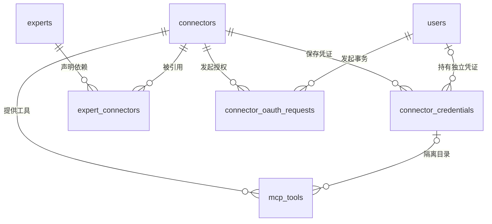
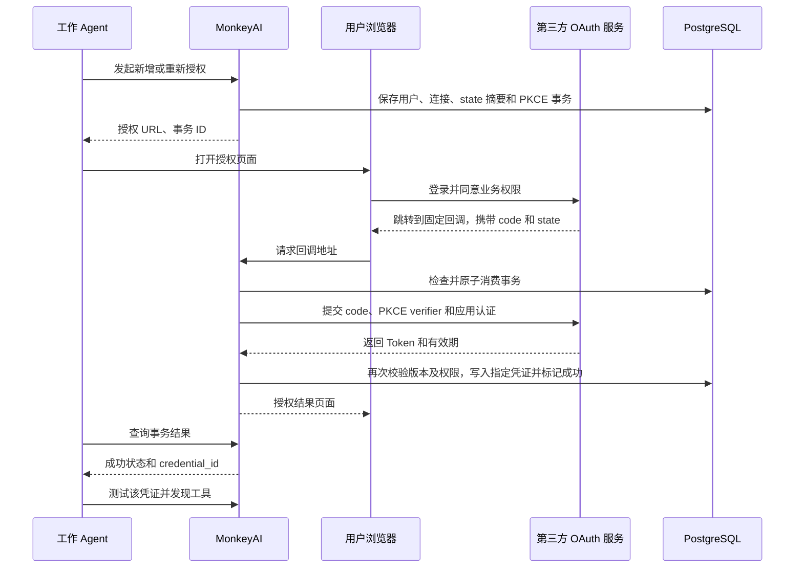

# Connector 与多凭证认证设计

> 状态：已实施，数据库已收敛为 `000001_initial_create_schema`，用于全新部署；发布操作见 [迁移与接入说明](connector-migration.md)。
>
> 日期：2026-09-11。
>
> 范围：MonkeyAI 后端、管理后台，以及工作 Agent 的连接目录、认证和 MCP 调用契约。
>
> 本文是 Connector 实现的设计依据，替代旧资源设计中关于 Provider、单用户单凭证和专家模板绑定的约定。现有运行行为仍以代码和已发布 OpenAPI 为准。

第 1 节记录本次讨论已确认的决策，其余章节据此补齐实施约定和验收要求。

## 1. 已确认的设计

1. 删除 Provider。Connector 直接保存连接地址、认证方式、OAuth 应用配置和图标。
2. 保留连接、凭证、工具三张核心表。专家直接关联 Connector，OAuth 授权事务单独保存。
3. 独立认证下，同一用户在同一 Connector 中可以持有多份凭证，分别命名、授权、测试、选择和撤销。
4. OAuth 的“添加凭证”每次新建，“重新授权”更新明确选中的凭证，不按用户覆盖全部凭证。
5. 暂不获取上游用户信息，不增加 `sub`、issuer、账户名、邮箱或用户信息接口配置。不根据上游身份、Token 或 Header 内容自动去重。
6. HTTP Header 独立认证同样支持多份凭证。保存凭证与测试连接分开，界面保存成功后默认自动测试。
7. 工具目录按连接和具体凭证隔离。集中和独立认证的 MCP 网关地址绑定具体凭证，所有地址以 `/mcp` 开头，整个会话不自动切换凭证。
8. 凭证的展示名称由用户填写，不代表经过验证的第三方账户身份。界面以“添加凭证”“重新授权”“凭证名称”表达操作。

不增加统一资源主表、账户身份表、连接模板表或凭证共享关系。现有资源授权、分享、计费和对象存储能力继续复用。

## 2. 对象关系与认证模式



| 认证模式 | 凭证数量与归属 | 工具目录 | 调用入口 |
| --- | --- | --- | --- |
| `none` | 无凭证 | `credential_id=NULL` 的连接目录 | 连接网关 |
| `centralized` | 每个连接最多一份未撤销的集中凭证，`user_id=NULL` | 集中凭证目录 | 包含集中凭证 ID 的网关 |
| `independent` | 每个用户可以创建多份独立凭证 | 每份凭证独立发现 | 包含具体凭证 ID 的网关 |

需要认证时，`authorization_method` 为 `oauth` 或 `http_header`。免认证时该字段为空。

系统连接支持三种模式，由管理员维护；个人连接只支持 `none` 和 `independent`。资源归属与认证模式相互独立。

## 3. 数据结构

### 3.1 `connectors`：连接

| 字段 | PostgreSQL 类型 | 约束或默认值 | 含义 |
| --- | --- | --- | --- |
| `id` | uuid | 主键 | 连接 ID |
| `name` | text | 非空 | 连接名称 |
| `description` | text | 默认空字符串 | 描述 |
| `icon_s3_key` | text | 默认空字符串 | 连接图标的对象存储引用 |
| `ownership_type` | text | `system` / `user` | 资源归属 |
| `owner_user_id` | uuid | 外键，非空 | 创建管理员或个人所有者 |
| `url` | text | 非空 | 远程 MCP HTTP(S) 地址 |
| `authorization_mode` | text | `none` / `centralized` / `independent` | 认证模式 |
| `authorization_method` | text | 可空，`oauth` / `http_header` | 认证方式 |
| `oauth_config` | jsonb | 默认 `{}` | OAuth 授权地址、Token 地址、Client ID 和 Scopes |
| `oauth_client_secret` | text | 默认空字符串 | 服务端保存的 OAuth 应用密钥 |
| `enabled` | boolean | 默认 `true` | 是否启用 |
| `revision` | bigint | 默认 `1` | 管理编辑版本，用于 ETag / If-Match |
| `config_revision` | bigint | 默认 `1` | 连接配置版本，用于匹配凭证、目录和授权事务 |
| `connection_status` | text | 默认 `unknown` | 仅免认证连接使用的最近测试状态：`unknown` / `connected` / `error` |
| `last_checked_at` | timestamptz | 可空 | 仅免认证连接使用的最近测试时间 |
| `last_error` | text | 可空 | 仅免认证连接使用的脱敏测试错误 |
| `created_at` | timestamptz | 默认 `now()` | 创建时间 |
| `updated_at` | timestamptz | 默认 `now()` | 更新时间 |
| `deleted_at` | timestamptz | 可空 | 软删除时间 |

OAuth 配置示例：

```json
{
  "authorization_url": "https://service.example/oauth/authorize",
  "token_url": "https://service.example/oauth/token",
  "client_id": "monkeyai-client",
  "scopes": "read write"
}
```

约束与行为：

- 删除 `provider_id`，不再维护 Provider 的标识和 Header Schema。
- `none` 必须对应空的认证方式；其他模式必须选择认证方式。非 OAuth 连接不保留 OAuth 应用配置和 Secret。
- 连接配置由系统管理员或个人所有者直接维护，分享接收方不能修改。
- `callback_url` 是响应中的派生字段，不落表，格式为 `{MONKEYAI_PUBLIC_URL}/oauth/connectors/{id}/callback`。
- 有认证的连接从具体凭证返回测试状态，不使用 Connector 行上的测试字段作为所有用户的共同状态。
- 地址、认证模式、认证方式及 OAuth 应用配置发生变化时，按第 5 节递增配置版本。

### 3.2 `connector_credentials`：连接凭证

| 字段 | PostgreSQL 类型 | 约束或默认值 | 含义 |
| --- | --- | --- | --- |
| `id` | uuid | 主键 | 凭证 ID；重新授权时保持不变 |
| `connector_id` | uuid | 外键，非空 | 所属连接 |
| `user_id` | uuid | 外键，可空 | 独立凭证所有者；集中凭证为空 |
| `name` | text | 非空 | 用户填写的展示名称，去首尾空白后为 1—128 个字符 |
| `http_headers` | jsonb | 默认 `{}` | HTTP Header 认证内容 |
| `oauth_access_token` | text | 默认空字符串 | OAuth Access Token |
| `oauth_refresh_token` | text | 默认空字符串 | OAuth Refresh Token |
| `oauth_expires_at` | timestamptz | 可空 | Access Token 到期时间；上游未提供时为空 |
| `config_revision` | bigint | 非空 | 凭证对应的连接配置版本 |
| `revision` | bigint | 默认 `1` | 人工修改、重新授权、撤销的编辑版本 |
| `connection_status` | text | 默认 `unknown` | 该凭证的最近测试状态 |
| `last_checked_at` | timestamptz | 可空 | 该凭证的最近测试时间 |
| `last_error` | text | 可空 | 该凭证的脱敏测试错误 |
| `created_at` | timestamptz | 默认 `now()` | 创建时间 |
| `updated_at` | timestamptz | 默认 `now()` | 更新时间 |
| `revoked_at` | timestamptz | 可空 | 撤销时间；保留记录供历史引用 |

索引与约束：

```sql
CREATE INDEX connector_credentials_user_idx
    ON connector_credentials (connector_id, user_id);

CREATE UNIQUE INDEX connector_credentials_centralized_idx
    ON connector_credentials (connector_id)
    WHERE user_id IS NULL AND revoked_at IS NULL;
```

- 删除原来的 `(connector_id, user_id)` 唯一约束。独立凭证的名称也不作为唯一键，客户端始终使用 ID 区分。
- 免认证不能创建凭证；独立凭证必须属于当前用户；集中凭证只能由管理员管理。这些跨表规则在服务事务中校验。
- 认证方式从 Connector 读取，不再重复保存 `method`。两类认证内容按当前方式写入，切换后清除不适用的内容。
- 不增加上游身份信息和去重字段。即使用户重复授权同一个第三方账户，也可以产生不同的凭证 ID。
- 列表和详情只返回元数据及派生认证状态，不返回 Header 值、Access Token 或 Refresh Token；需要展示时可返回 Header 名称。
- OAuth 自动刷新只更新令牌内容和 `updated_at`，不改变人工编辑版本；通过数据库行锁与人工编辑、撤销串行化。

### 3.3 `mcp_tools`：工具目录

| 字段 | PostgreSQL 类型 | 约束或默认值 | 含义 |
| --- | --- | --- | --- |
| `id` | uuid | 主键 | 工具 ID，供调用记录和计费引用 |
| `connector_id` | uuid | 外键，非空 | 所属连接 |
| `credential_id` | uuid | 外键，可空 | 发现该工具时使用的具体凭证；免认证为空 |
| `name` | text | 非空，区分大小写 | 上游工具名 |
| `description` | text | 默认空字符串 | 工具说明 |
| `input_schema` | jsonb | 默认 `{}` | 工具输入结构 |
| `enabled` | boolean | 默认 `false` | 是否允许调用 |
| `credits_per_call` | numeric(24,6) | 默认 `0`，非负 | 每次成功调用积分 |
| `config_revision` | bigint | 非空 | 发现时的连接配置版本 |
| `discovered_at` | timestamptz | 默认 `now()` | 最近发现时间 |
| `updated_at` | timestamptz | 默认 `now()` | 更新时间 |
| `deleted_at` | timestamptz | 可空 | 工具失效或上游移除的时间 |

保留现有唯一约束：

```sql
UNIQUE NULLS NOT DISTINCT (connector_id, credential_id, name)
```

有凭证的目录必须引用同一 Connector 下的凭证，写入和读取时均检查该关系。工具软删除保留历史引用；同一认证上下文重新发现同名工具时复用其 ID。

### 3.4 `expert_connectors`：专家连接依赖

| 字段 | PostgreSQL 类型 | 约束或默认值 | 含义 |
| --- | --- | --- | --- |
| `expert_id` | uuid | 外键，非空 | 专家 |
| `connector_id` | uuid | 外键，非空 | 直接引用的连接 |
| `required` | boolean | 默认 `true` | 是否为运行专家必需的连接 |
| `tool_allowlist` | text[] | 默认空数组 | 允许的工具名称；为空表示不增加此限制 |
| `tool_denylist` | text[] | 默认空数组 | 排除的工具名称，优先于允许列表 |

联合主键为 `(expert_id, connector_id)`，增加 `connector_id` 索引供引用检查。替换 `expert_connector_providers`，不在专家定义中保存某个用户的凭证 ID。

系统专家关联系统连接；个人专家可以关联所有者有权使用的连接。执行专家时，当前用户仍需获得这些连接的使用权限；专家分享不会分享连接凭证。

### 3.5 `connector_oauth_requests`：短期授权事务

| 字段 | PostgreSQL 类型 | 约束或默认值 | 含义 |
| --- | --- | --- | --- |
| `id` | uuid | 主键 | 授权事务 ID |
| `connector_id` | uuid | 外键，非空 | 目标连接 |
| `user_id` | uuid | 外键，非空 | 发起人；集中授权时也记录管理员身份 |
| `credential_id` | uuid | 外键，可空 | 指定重新授权的凭证；新增成功后回填新凭证 ID |
| `credential_revision` | bigint | 可空 | 重新授权发起时的凭证版本，用于防止并发覆盖 |
| `name` | text | 非空 | 新凭证名称；重新授权时取目标凭证当前名称 |
| `config_revision` | bigint | 非空 | 发起时的连接配置版本 |
| `state_hash` | text | 非空，唯一 | state 的 SHA-256 摘要 |
| `verifier` | text | 非空 | PKCE verifier，仅服务端使用 |
| `redirect_uri` | text | 非空 | 本次固定回调地址 |
| `expires_at` | timestamptz | 非空 | 授权有效期，默认创建后 10 分钟 |
| `consumed_at` | timestamptz | 可空 | 原子消费时间 |
| `status` | text | 默认 `pending` | `pending` / `processing` / `succeeded` / `failed` / `expired` |
| `created_at` | timestamptz | 默认 `now()` | 创建时间 |

不保存授权码或用户资料，不需要另一张 OAuth 账户表。不再保存 `centralized` 标志，使用连接当前模式并核对配置版本。事务发起人、连接和目标凭证在创建后不能由客户端修改。

创建时 `credential_revision` 为空表示新增，有值表示更新指定凭证。成功事务回填 `credential_id` 后仍可通过该字段区分原始操作。事务状态接口返回凭证 ID，客户端据此定位新凭证。

短期事务定期清理。过期未消费事务显示 `expired`；长时间停留在 `processing` 的事务结束为失败，要求重新发起，不自动重放授权码交换。

## 4. 权限与凭证归属

1. 资源授权作用于 Connector，继续使用现有资源授权和分享表。
2. 系统管理员管理系统连接及集中凭证，不读取用户独立凭证的秘密，也不替用户发起独立授权。
3. 用户管理自己的独立凭证，必须同时具有目标 Connector 的使用权限。接口从登录身份取得用户 ID，不接受客户端指定凭证所有者。
4. 分享个人 Connector 只分享使用权。接收方为自己添加凭证，不继承所有者或其他接收方的凭证。
5. 请求包含凭证 ID 时，必须同时校验连接、用户、凭证三者关系。知道凭证 ID 不构成授权。
6. 调用密钥的 `mcp:invoke` 作用域用于进入 MCP 网关；上游 Token/Header 仅由后端选择和注入。
7. 撤销连接访问权限、停用用户、停用或删除连接后，后续目录、认证、测试和网关请求都重新检查权限。凭证不能绕过资源授权。

凭证撤销是本地使用权撤销，不承诺撤销第三方平台的授权；用户可另行在第三方平台管理授权。已发送到上游的请求无法保证通过本地撤销即时取消，但后续请求不得继续使用该凭证。

## 5. 配置版本、编辑与状态

### 5.1 连接配置变更

| 变更 | 处理 |
| --- | --- |
| 名称、描述、图标、资源授权 | 更新相应管理版本，不改变认证上下文 |
| 连接启停 | 更新管理版本；停用后拒绝新调用，不自动删除凭证 |
| URL、认证模式、认证方式、OAuth 授权端点、Token 端点、Client ID 或 Scopes | 递增 `config_revision`；旧凭证停止使用、旧工具目录失效、旧 OAuth 事务不能成功写入 |
| 同一 OAuth 应用轮换 Client Secret | 更新 Secret 和管理版本；现有 Token 可继续使用，交换和刷新读取新的 Secret |

OAuth 配置规范化后比较，避免仅 JSON 键顺序变化导致凭证失效。关键配置变化的失效与更新在同一事务中完成；不能把旧凭证自动标记为适配新地址。

独立模式和集中模式之间切换时，撤销旧模式凭证，禁止把个人凭证改成共享凭证或反向转移归属。其他配置变更后，可以明确更新或重新授权原凭证以适配新版本；已撤销凭证不能通过旧回调恢复。

### 5.2 凭证修改

| 操作 | 凭证 ID | 工具目录 |
| --- | --- | --- |
| 修改名称 | 保持 | 保持 |
| 更换 HTTP Header | 保持 | 立即失效，需重新发现 |
| OAuth 重新授权成功 | 保持 | 立即失效，需重新发现 |
| OAuth 自动刷新 | 保持 | 保持；按上游原授权的续期处理 |
| 撤销凭证 | 保留历史记录 | 立即失效，后续调用拒绝 |
| 添加凭证 | 新建 | 独立发现 |

编辑、删除、重新授权使用凭证自己的 ETag / If-Match。自动刷新通过行锁与编辑、撤销串行化；锁内重新确认凭证未撤销、配置未过期，不能使已撤销凭证重新生效。

### 5.3 状态返回

认证状态和测试状态分开：

- `authorization_status=authorized`：Header 已配置，或 OAuth Token 仍有效、或存在可尝试刷新的 Refresh Token。该状态不承诺上游当前可达。
- `authorization_status=authorization_required`：配置版本不匹配、认证内容缺失，或 OAuth Token 已过期且没有刷新能力。
- `authorization_status=revoked`：凭证已撤销；常规可选列表不包含它。
- `authorization_status=not_required`：仅用于免认证连接。
- `connection_status` 表示最近测试结果，使用 `unknown` / `connected` / `error`，不充当实时认证判断或唯一调用门槛。

独立连接不持久化一个所有用户共用的“已认证”状态。列表根据当前用户的可选凭证数量提示“添加凭证”“需要重新认证”或“选择凭证”。

## 6. 用户独立 OAuth 完整流程

### 6.1 应用配置

创建者直接创建独立 OAuth Connector，保存 MCP 地址和 OAuth 应用配置。后端返回专属 `callback_url`，由创建者登记到第三方 OAuth 应用。每个 Connector 使用自己的回调路径。

不配置用户信息接口，不主动请求 `openid`、`profile` 或 `email` 来识别用户。业务所需 Scopes 仍由连接创建者填写。

### 6.2 添加凭证与重新授权

添加凭证：

```http
POST /api/v1/connectors/{id}/oauth/authorizations
Authorization: Bearer <MonkeyAI 用户访问令牌>
Content-Type: application/json

{"name":"工作凭证"}
```

重新授权已有凭证：

```http
POST /api/v1/connectors/{id}/credentials/{credential_id}/oauth/authorizations
Authorization: Bearer <MonkeyAI 用户访问令牌>
If-Match: "<凭证 revision>"
```

后端检查用户、连接权限、认证方式；重新授权时再检查凭证所有者及版本。创建事务，记录配置和目标凭证版本；新增操作此时不创建缺少 Token 的空凭证。

返回示例：

```json
{
  "id": "<授权事务 ID>",
  "authorization_url": "https://service.example/oauth/authorize?...",
  "expires_at": "2026-09-10T12:10:00Z"
}
```

### 6.3 浏览器授权与回调



授权 URL 包含 `response_type=code`、Client ID、固定 `redirect_uri`、Scopes、随机 state 和 PKCE S256 challenge。

回调不依赖浏览器中的 MonkeyAI 登录态。后端用 state 摘要定位事务，从事务取出发起用户，不信任回调提交的用户身份。

交换 Token 前检查：

1. state 存在，事务未过期、未消费，路径中的连接 ID 匹配。
2. 发起用户仍有效，仍有连接使用权限；集中模式还要求仍有管理权限。
3. 连接未停用、未删除，配置版本仍匹配。
4. 重新授权的目标凭证仍属于原用户和连接、未撤销，编辑版本未变化。

原子消费事务后才交换授权码。Token 请求携带 `grant_type=authorization_code`、code、相同回调地址、PKCE verifier，并按第三方要求使用 Client ID 和 Client Secret。

Token 交换完成后，在短数据库事务中重新检查上述权限及版本。新增操作插入新凭证；重新授权只更新指定凭证。凭证写入、原目录失效、授权事务成功和新凭证 ID 回填一并提交。

不解析 Token 来推断身份，不调用 UserInfo，不比较第三方账号。同一账号重复执行“添加凭证”会生成多份凭证。用户对旧凭证重新授权时，第三方登录账户可能发生变化，系统无法检测；应在发起界面说明此次授权会替换选中凭证，并要求调用方重新同步其工具目录。

### 6.4 成功通知与工具发现

浏览器只展示授权结果和返回 Agent 的提示，不展示 Token。Agent 查询 `/api/v1/connector-authorizations/{request_id}`；只有原发起人可以查询。

事务成功响应包含 `credential_id`。Agent 对这份凭证执行测试和工具发现，发现失败不抹掉已经保存的授权。重新授权成功后必须重新发现，不能继续使用旧目录。

### 6.5 失败、刷新与撤销

- 用户拒绝授权：事务失败，不创建凭证；重新授权失败时不覆盖仍有效的旧凭证。
- state 无效、路径不匹配或事务被重复消费：拒绝回调，不重复交换 Token。
- 授权期间连接配置改变、目标凭证被编辑/撤销或用户失去权限：事务不能写入凭证。
- Access Token 即将到期：调用或测试前对具体凭证加行锁，重新检查有效期；需要时用 Refresh Token 刷新。提前窗口沿用当前 30 秒。
- 刷新返回新 Refresh Token 时一并替换；没有返回时保留原值。自动刷新不新建凭证，也不切换到用户的另一份凭证。
- 上游明确拒绝 Refresh Token，例如 `invalid_grant`：清除该凭证已不可用的令牌内容，递增凭证版本，使目录失效，返回需要重新授权。这样此前进行中的发现任务不能重新写回目录。网络超时、上游暂时不可达不清除凭证。
- 不透明 Token 的有效期未知时，不自行解码推断到期；以上游认证结果为准。工具调用收到认证错误后不自动重放可能已产生副作用的请求。
- 撤销会使该凭证与目录停止使用；旧授权回调和刷新任务不能恢复它。

## 7. 用户独立 HTTP Header 完整流程

### 7.1 创建与填写

Connector 保存 MCP 地址，模式为 `independent`，方式为 `http_header`。用户获得连接使用权后，填写名称和一组 Header：

```http
POST /api/v1/connectors/{id}/credentials
Authorization: Bearer <MonkeyAI 用户访问令牌>
Content-Type: application/json

{
  "name": "工作凭证",
  "http_headers": {
    "Authorization": "Bearer <上游令牌>",
    "X-Workspace-ID": "workspace-123"
  }
}
```

服务端从登录态确定所有者，检查访问权限、认证模式和字段格式，生成新凭证 ID。相同 Header 内容也允许产生不同凭证，名称不用于匹配已有记录。

界面使用名称输入框和 Header 键值编辑器，不要求上游提供统一认证 Schema。`Authorization` 值由用户提供完整内容，服务端不猜测或重复添加 `Bearer` 前缀。

### 7.2 校验与保存

- 至少一个 Header，最多 30 个；请求体和字段长度受服务端限制。
- 键符合 HTTP 字段名规范；拒绝键或值中的 CR/LF，以及大小写不敏感的重复键。
- 允许 `Authorization`、`X-API-Key` 等上游认证字段；拒绝 `Host`、`Content-Length`、连接控制/传输字段、`Mcp-*` 协议字段以及由网关固定的协议协商字段。
- 网关保留 Content-Type、Accept、MCP 协议版本等控制权，不允许凭证内容改写协议处理方式。
- Header 内容只写不读，不进入日志、审计正文或错误响应。

创建成功返回凭证元数据和 `201`。界面随后自动请求测试接口；保存已经成功、测试失败时分别显示结果，保留用户输入产生的凭证。

### 7.3 测试与调用

后端读取指定凭证的 Header，执行真实 MCP 初始化和分页工具发现，写入该凭证目录，并更新其测试状态。

用户选择凭证后，通过包含凭证 ID 的网关调用工具。服务端始终校验调用者拥有这份凭证，不转发客户端用于进入 MonkeyAI 的调用密钥。

### 7.4 编辑与撤销

```http
PATCH /api/v1/connectors/{id}/credentials/{credential_id}
If-Match: "<凭证 revision>"
Content-Type: application/json

{"name":"新的展示名称"}
```

只修改名称不影响认证。请求包含 `http_headers` 时整组替换；未包含时保持原内容，不做单个秘密字段的隐式合并。空对象无效，不等价于撤销。

编辑页面不返回密钥回填，也不把掩码作为真实值提交。替换 Header 的事务同时递增凭证版本、使目录失效并重置测试状态，随后重新测试。失败时不退回旧 Header，不切换到其他凭证。

HTTP Header 没有统一续期机制，不自动刷新。上游认证失败时提示检查或替换凭证，权限不足与网络错误分别显示，不直接把所有失败都当成凭证撤销。

删除通过凭证撤销接口完成，只影响这份凭证及其目录；其他凭证继续使用。

## 8. 工具目录与调用一致性

1. 工具发现以 `(connector_id, credential_id)` 为上下文；免认证使用空凭证。
2. 调用上游前记录连接配置版本和凭证编辑版本。完整发现结束后，在事务内重新检查版本、访问权限、启停和撤销状态。
3. 只有全部分页成功且版本一致，才更新对应目录；不提交半份目录。普通重测失败保留此前有效目录，已经因换凭证或改配置失效的目录不得恢复。
4. 目录更新按同名工具复用 ID，保留系统工具原启停与积分设置；消失的工具软删除。
5. 个人 Connector 新发现工具自动启用；系统 Connector 新工具默认禁用，由管理员启用。管理员按具体凭证上下文管理系统工具，不因此获得凭证秘密或替用户调用权限。
6. 用户的工具接口和 MCP `tools/list` 只返回选中上下文中当前版本、未删除且启用的工具。独立模式的连接级接口不合并多份凭证的工具。
7. 工具调用和列表使用相同的凭证绑定，不允许用凭证 A 的目录通过凭证 B 执行。
8. 认证撤销、更新和发现写回通过数据库事务及行锁协调；已经发出的上游请求不承诺即时取消，返回的发现结果必须再次校验后才能落库。

专家的工具允许/排除列表用于生成专家资源清单；凭证网关本身执行用户对该连接的资源权限和工具启停检查。当前网关没有专家身份上下文，不能将专家清单过滤宣称为网关级权限边界。

## 9. 接口契约

### 9.1 Connector 与凭证接口

以下路径均已实施。管理端前缀为 `/api/admin/v1`，用户端前缀为 `/api/v1`。

| 方法与路径 | 用途 |
| --- | --- |
| `GET /connectors` | 管理目录或当前用户可访问的连接目录，沿用各调用方响应结构 |
| `POST /connectors` | 直接创建完整连接配置 |
| `GET /connectors/{id}` | 管理详情或个人所有者详情 |
| `PUT /connectors/{id}` | 编辑连接配置，携带 If-Match |
| `DELETE /connectors/{id}` | 软删除连接，携带 If-Match，检查专家引用 |
| `PUT /connectors/{id}/icon` | 上传该连接图标，携带连接 If-Match |
| `GET /connectors/{id}/icon` | 经连接权限检查后读取图标 |
| `GET /connectors/{id}/credentials` | 用户读取自己的凭证元数据；管理员仅管理集中凭证 |
| `POST /connectors/{id}/credentials` | 添加 HTTP Header 凭证 |
| `GET /connectors/{id}/credentials/{credential_id}` | 获取允许管理的凭证元数据及 ETag |
| `PATCH /connectors/{id}/credentials/{credential_id}` | 修改名称或整组替换 Header，携带凭证 If-Match |
| `DELETE /connectors/{id}/credentials/{credential_id}` | 撤销指定凭证，携带凭证 If-Match |
| `POST /connectors/{id}/oauth/authorizations` | 新增 OAuth 凭证的授权事务，请求包含名称 |
| `POST /connectors/{id}/credentials/{credential_id}/oauth/authorizations` | 对指定 OAuth 凭证重新授权，携带凭证 If-Match |
| `GET /connector-authorizations/{request_id}` | 原发起人查询授权事务状态和成功凭证 ID |
| `GET /oauth/connectors/{id}/callback` | 公共根路径，不带 Admin/Agent API 前缀，处理 OAuth 浏览器回调 |

用户端配置写入仅针对本人所有的 Connector；其他人分享的 Connector 通过资源目录获取，只允许管理自己的独立凭证。Provider CRUD、图标及目录接口删除，不保留空壳模板接口。

新增集中凭证时检查不存在其他未撤销的集中凭证，数据库部分唯一索引处理并发。已有集中凭证通过明确的编辑或重新授权接口更新；撤销后可以添加新的集中凭证。

### 9.2 测试、工具与网关

| 方法与路径 | 适用模式 | 语义 |
| --- | --- | --- |
| `POST /connectors/{id}/test` | 免认证；管理端集中认证 | 测试连接级上下文 |
| `GET /connectors/{id}/tools` | 免认证、集中认证 | 读取连接级上下文目录 |
| `POST /connectors/{id}/credentials/{credential_id}/test` | 用户独立认证；管理端集中认证 | 测试明确指定的凭证 |
| `GET /connectors/{id}/credentials/{credential_id}/tools` | 用户独立认证；管理端具备工具管理权限时 | 读取明确指定的凭证目录 |
| `GET /connectors/{id}/tool-contexts` | 仅管理端系统连接 | 获取凭证 ID、名称和工具上下文元数据 |
| `PATCH /connectors/{id}/tools/{tool_id}` | 仅管理端系统连接 | 设置工具启停和积分，同时校验工具所属连接 |
| `POST /mcp/connectors/{id}` | 免认证 | 根路径 MCP 连接网关 |
| `POST /mcp/connectors/{id}/credentials/{credential_id}` | 集中认证、独立认证 | 根路径 MCP 凭证网关 |

管理员可以通过管理工具目录的上下文元数据查看系统连接下某用户的具体凭证 ID、名称和工具状态；凭证管理接口仍不开放独立认证的秘密读取、编辑或授权。个人连接不开放管理员代调用。

集中和独立认证访问不带凭证的代理地址，以及独立模式访问连接级工具/测试接口，返回 `credential_selection_required`，不由后端临时选择“最新凭证”或“唯一凭证”。唯一候选的自动选择发生在 Agent 或资源解析阶段，之后仍使用明确绑定的地址。

### 9.3 错误处理

| 业务错误码 | 建议 HTTP 状态 | 含义 |
| --- | --- | --- |
| `not_found` | 404 | 资源不存在、不可访问，或凭证不属于当前用户和连接 |
| `credential_selection_required` | 400 | 独立认证请求缺少明确凭证；资源 resolve 中作为结构化问题返回 |
| `authorization_required` | 403 | 指定凭证缺少有效认证或需适配新配置 |
| `revision_conflict` | 412 | 管理版本、发现快照或授权事务目标版本发生变化；沿用现有公共错误定义 |
| `precondition_required` | 428 | 编辑缺少 If-Match |
| `upstream_error` | 502 | 上游连接、工具发现或认证交换失败；响应信息脱敏 |

MCP 请求中的业务错误保持 HTTP 状态，并在 JSON-RPC `error.data.code` 中返回业务码；协议参数错误继续使用 JSON-RPC 数字错误码。OAuth 交换/刷新失败分别使用 `oauth_exchange_failed` / `oauth_refresh_failed`，其余错误沿用既有公共定义。

## 10. Agent 目录、专家和会话绑定

### 10.1 独立连接目录

`GET /api/v1/connectors` 保留资源版本与 ETag，独立连接下返回当前用户的凭证元数据，每份凭证携带自身的 `tools` 工具目录和 `tools_version`。示例字段如下：

```json
{
  "id": "<connector_id>",
  "name": "GitHub MCP",
  "authorization_mode": "independent",
  "authorization_method": "oauth",
  "credentials": [
    {
      "id": "<credential_a>",
      "user": {"id": "<user_id>", "name": "张三", "email": "zhangsan@example.com"},
      "name": "工作凭证",
      "authorization_status": "authorized",
      "connection_status": "connected",
      "tools_version": "<工具目录摘要>",
      "tools": [],
      "mcp_gateway": {
        "url": "https://monkeyai.example/mcp/connectors/<connector_id>/credentials/<credential_a>",
        "transport": "streamable_http",
        "authentication": "api_key",
        "required_scope": "mcp:invoke"
      }
    },
    {
      "id": "<credential_b>",
      "user": {"id": "<user_id>", "name": "张三", "email": "zhangsan@example.com"},
      "name": "个人凭证",
      "authorization_status": "authorization_required",
      "connection_status": "unknown"
    }
  ]
}
```

所有凭证元数据以 `user: {id, name, email}` 返回凭证所属的平台用户，移除 `user_id`；集中凭证返回 `user: null`。用户基本信息来自平台本地用户表，不读取上游 OAuth 用户资料。Connector、凭证和专家解析不返回 `tools_path`，工具查看与测试仍使用已有 REST 接口。

独立连接未选定凭证前，不返回一个暗中选用账户的顶层网关，也不合并工具目录。需要重新认证的凭证可展示元数据，但不作为可自动选择的候选。

免认证返回连接级工具与网关；集中认证返回连接级工具、当前集中凭证 ID 和该凭证的网关地址；普通用户不能从集中认证目录拿到共享凭证的秘密。目录不返回上游 URL、认证 Header 或 Token。

新增、改名、重新授权、撤销、工具变化及权限变化影响相应用户的目录版本。单纯刷新仍有效的 OAuth Token 不因秘密字节变化而改变公开目录版本。

### 10.2 专家引用与运行选择

专家输入中的 `providers` 改为 `connectors`：

```json
{
  "connectors": [
    {
      "connector_id": "<connector_id>",
      "required": true,
      "tool_allowlist": [],
      "tool_denylist": []
    }
  ]
}
```

运行时通过 `/api/v1/resources/resolve` 指定连接和凭证。建议请求明确区分连接选择与凭证选择：

```json
{
  "expert_id": "<expert_id>",
  "connector_ids": ["<额外选择的 connector_id>"],
  "connector_bindings": {
    "<独立认证 connector_id>": "<credential_id>"
  }
}
```

`connector_ids` 用于补充专家依赖之外的连接，包括免认证和集中认证连接；`connector_bindings` 只为本次已经选中的独立连接指定凭证，不隐式增加额外连接。

解析规则：

1. 汇总专家关联连接和显式选择的连接，逐项检查当前用户的访问权限。
2. 免认证或集中认证直接解析连接级上下文。
3. 独立认证显式绑定时验证凭证归属、撤销和配置版本；绑定无效时返回错误，不替换为另一份凭证。
4. 未绑定时，只有一份已配置且当前版本可用的凭证可以自动选定。零份提示认证，多份提示选择；不根据最近使用时间或名称推断。
5. 必需连接未就绪时，`available=false`，返回包含 `connector_id` 的问题，例如 `authorization_required`、`credential_selection_required` 或 `missing_connector`。可选连接未就绪则返回非阻断提示并跳过；用户显式选择的额外连接按必需项处理。
6. 选定后返回具体 `credential_id`、该上下文工具及网关地址，按专家工具过滤规则生成清单。会话记录该绑定，不在每次请求时重新自动选择。
7. 本期一次会话对同一 Connector 只绑定一份凭证。用户可以持有多份凭证，并在不同会话选择；若未来需要同一会话同时挂载多份，再扩展会话挂载结构。

重新授权保留凭证 ID，但可能改变第三方授权内容，因此会话需要同步更新后的工具目录。系统不保证重新授权前后的第三方账户身份一致，也不自动切换凭证 ID。

## 11. 传输、计费与并发约束

### 11.1 传输与秘密边界

- 保持现有无状态 Streamable HTTP 工具代理：POST 返回 JSON，解析上游 JSON/SSE；每次调用独立握手并清理上游会话。
- 保持现有协议范围，不扩展到本地 stdio、跨调用上游会话、resources、prompts 或主动推送。
- OAuth 端点、MCP 测试和调用继续遵守后端出站地址策略、内网 CIDR 配置及禁止自动重定向的限制。
- MCP 协议头由网关控制，用户认证内容不会覆盖会话和传输协商。
- 上游秘密只在后端使用；目录、回调页面、日志、审计及错误响应不包含秘密值。审计记录操作者、连接/凭证 ID 和动作即可。

### 11.2 计费与幂等

计费规则保持：集中认证仅成功工具调用收费；独立认证与免认证只记录调用。明确失败释放预留；结果未知进入既有核查流程，不自动重放。

调用记录通过工具 ID 可以定位具体凭证上下文，历史工具和凭证均保留引用。幂等请求摘要必须包含具体 `credential_id`（免认证为空，集中认证使用实际选中 ID），防止相同工具名和参数在不同凭证下被误判为同一次请求。

沿用用户维度的幂等键规则。同一个键被用于另一份凭证时返回冲突，不执行另一账户的请求，也不返回成另一次成功调用。

### 11.3 必须处理的并发情况

| 并发情况 | 预期行为 |
| --- | --- |
| 同一用户同时新增两次 OAuth 授权 | 两个独立事务，各自生成凭证，不互相覆盖 |
| 同一 OAuth 回调重复到达 | 单次消费，只写入一次凭证 |
| 同一凭证并发重新授权 | 发起时记录编辑版本，先成功者递增版本，后完成的旧事务冲突 |
| 工具发现期间 Header 被替换 | 旧发现结果不得覆盖新认证上下文 |
| 凭证刷新期间撤销 | 锁内重新核验状态，不能刷新复活已撤销凭证 |
| OAuth 回调期间连接配置变化 | 回调写入失败，不能把旧应用 Token 记成新配置的凭证 |
| 凭证存在但资源授权已撤销 | 后续目录、测试与调用拒绝，不以凭证存在代替权限检查 |

## 12. 数据库初始化与接口切换

2026-09-11 按重新部署要求，将原 1–13 版的最终结构收敛到 `000001_initial_create_schema`。此安排替代先前的增量转换方案，具体部署步骤见 [初始化与接入说明](connector-migration.md)。

### 12.1 初始化结构

- Connector 直接保存 URL、OAuth 配置和图标引用，不创建 Provider。
- Credential 直接包含名称、编辑版本、测试状态与撤销时间；同一用户可创建多份凭证，集中凭证受部分唯一索引约束。
- 工具使用凭证与连接的组合外键，OAuth 事务直接记录凭证 ID、版本和名称。
- 专家直接关联 Connector，保留 required 与工具过滤配置，不创建旧 Provider 关联或执行候选映射。

### 12.2 部署前提

使用全新的 PostgreSQL 数据库或数据目录。初始化 SQL 不转换旧连接、凭证或历史交易；需要保留旧数据时应另行制定迁移方案，不能修改迁移版本号代替转换。`down` 删除全部业务结构，仅用于可丢弃测试库。

### 12.3 接口切换

- 删除 Provider 相关路由和 DTO；图标管理改到 Connector。
- 旧单数 `/credential` 接口改为凭证集合与具体 ID 接口。
- 独立认证目录、工具测试、OAuth 重新授权和网关都显式携带凭证上下文。
- 专家 `providers` 改为 `connectors`，`connector_bindings` 的含义由模板绑定改为凭证绑定；旧字段不能继续按新语义解释。
- 对旧的独立认证调用返回明确的需要选择凭证错误，不通过“当前只有一份”长期保留隐式选择路径。
- 后端、管理后台、Agent 消费契约和两份 OpenAPI 按同一版本发布。新库初始化完成后再启动新版本。
- 正式部署的回退需要保留完整数据库和对象存储备份；初始化 down 不能用作业务回退。

## 13. 实施拆分与验收

| 工作单元 | 主要范围 | 交付结果 |
| --- | --- | --- |
| 数据与 MCP 业务 | 初始化迁移、`internal/mcp` SQL 与服务、sqlc 配置和生成结果 | 直接连接配置、凭证集合、OAuth/Header 多凭证、图标与网关 |
| 专家与资源解析 | `internal/expert`、`internal/agentconfig` | 直接连接依赖、凭证选择、目录与版本 |
| 调用与计费集成 | `internal/app`、调用记录与幂等摘要 | 按实际凭证调用、记录与去重 |
| 前端与接口集成 | 管理后台、两份 OpenAPI、Agent 契约 | 删除模板流程、凭证管理和选择、完整公开接口 |
| 文档与迁移交付 | API 说明、资源设计、初始化说明 | 文档一致，明确新库部署与接口切换步骤 |

实施时遵守现有业务目录和集成点约束，不手工修改 sqlc 生成文件；schema 从迁移重新生成。后续迁移序号按实施分支的最新 main 分配。

验收至少覆盖：

- 同一用户同一 Connector 的两份 OAuth 凭证和两份 Header 凭证，互不覆盖，工具目录互不混用。
- 不获取上游账户资料；重复授权同一账户仍新建，明确重新授权只更新指定 ID。
- 同用户跨凭证、跨用户、跨连接的工具读取、调用、编辑和撤销隔离。
- 分享 Connector 后接收方使用自己的凭证，撤销分享后凭证不能绕过权限。
- 新增授权、失败、拒绝、超时、重复回调、并发重新授权、刷新与撤销竞争。
- Header 名称编辑、整组替换、非法字段、保存成功但测试失败，以及重新发现时旧结果不覆盖新凭证。
- OAuth/Header 测试状态按凭证展示；免认证测试状态按连接展示。
- 零份、一份、多份凭证的资源解析；显式无效绑定不回退，必需连接缺失会阻断专家。
- 个人工具自动启用、系统工具启停与积分保留、集中成功计费、独立/免认证零收费。
- 不同凭证使用相同幂等键不能误复用交易或重复执行。
- 迁移保留 ID、历史计费引用和有效授权，专家多候选映射未解决时拒绝迁移。
- 数据库集成测试、相关业务测试、全量 Go 测试与 vet、sqlc/schema 一致性、OpenAPI 检查和前端构建。

当前计划状态：

- [x] 确认删除 Provider 和三张核心表的职责。
- [x] 确认同用户同连接多凭证、OAuth 与 Header 完整流程。
- [x] 确认暂不获取上游身份资料、不自动去重。
- [x] 整理字段、接口、权限、版本、迁移、验收与领域术语。
- [x] 检查文档结构、JSON 请求与响应示例、设计入口链接和变更格式。
- [x] 实施迁移、后端、前端及接口变更。
- [x] 完成本地实现验证、迁移预检查工具和隔离环境迁移演练。

实现与本地验收已完成，结果见 [实施计划](connector-implementation-plan.md)。现有部署数据库未操作，新库初始化与部署尚未执行，发布时按 [迁移与接入说明](connector-migration.md) 完成；Desktop/OhMyAgent 外部加载器按已交付的 API 契约接入。

## 14. 用户信息与凭证地址授权

公开资源的所有者统一为 `user: {id, name, email}`，不再返回 `owner_user_id` 或 `owner_name`。第 3 节数据库字段继续作为服务端归属外键；用户基本信息参与目录版本计算。

API Key 通过全局 `POST /api/v1/api-keys` 创建，仅保存用户、名称、scope、有效期及密钥哈希；不保存连接、凭证或工具绑定。MCP 请求使用 `Authorization: Bearer <api_key>`，scope 需包含 `mcp:invoke`。一份 Key 可访问同一用户有权使用的多个凭证地址。

所有网关以 `/mcp` 开头。集中和独立凭证地址为 `/mcp/connectors/{id}/credentials/{credential_id}`，免认证地址为 `/mcp/connectors/{id}`。服务端先认证 Key 对应用户，再校验连接使用权、凭证与连接的关系、归属及当前有效性；独立凭证必须归当前用户，集中凭证须属于当前可使用的系统连接。持有地址本身不会获得权限。每份凭证的工具保留上游原始名称，通过地址隔离。

目录、专家清单和 resolve 返回 `mcp_gateway`；客户端保存选定地址并复用全局 Key。集中和独立凭证被撤销后，旧地址均不可用，后续新增凭证会有新地址；重新授权保留同一凭证 ID。配置变化仍使不匹配版本的凭证及目录失效，不回退到其他凭证。密钥轮换保持 scope 并撤销旧密钥；资源权限始终实时校验。

单个连接的测试和工具查看继续使用第 9.2 节的 REST 接口及登录 access token。集中认证测试仅管理员操作。完整请求、回包和 MCP Inspector 接入示例见 [API 接入说明](../backend/api/README.md)。
