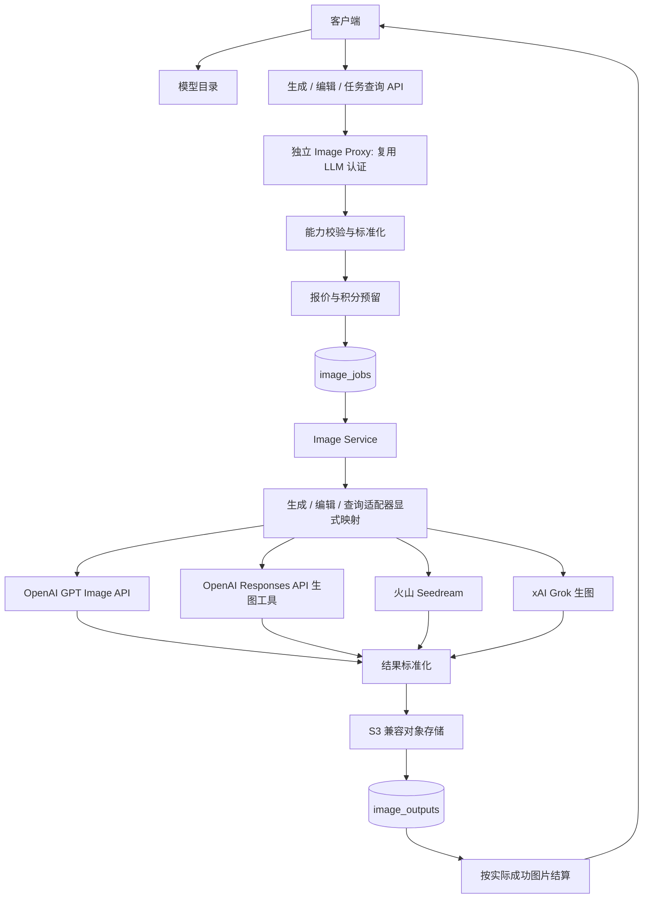

# MonkeyAI 生图模型接入设计

> 状态：待评审，尚未实现
>
> 日期：2026-09-21
>
> 范围：MonkeyAI Admin、Agent 模型目录、生图调用网关、供应商适配、对象存储、统计与计费。视频生成、模型训练、LoRA 管理和工作 Agent 改造不在本期范围。

## 1. 背景与目标

现有 Model、代理和计费链路仅适配语言模型：

- `internal/model/model.go` 中的协议只有 OpenAI Chat Completions、OpenAI Responses 和 Anthropic；
- `AdvancedConfig` 只描述上下文窗口、最大输出 Token 和视觉输入能力；
- `internal/proxy` 假设客户端协议和上游协议基本一致，通过反向代理转发请求；
- `internal/billing` 以输入、缓存输入和输出 Token 为计量单位。

生图供应商的请求和执行形态差异更大：尺寸可能使用精确宽高、宽高比、分辨率档位或自动模式；部分接口同步返回，部分接口提交任务后轮询；计费可能按图片、像素档位、平台 Credits 或图片 Token；部分供应商返回短期 URL，部分返回 Base64。

本设计目标如下：

1. 在不破坏现有语言模型行为的前提下扩展 Model 数据结构。
2. 通过生成、编辑、任务查询三个 Go 接口承接供应商能力，不在 Handler 中写供应商分支。
3. 供应商代码按具体上游模型提供能力和参数映射，管理员只选择开放的画质、比例，并按平台统一的 1K、2K、4K 档位配置积分；客户端在有效约束内组合参数。
4. 统一同步和异步供应商，提供可靠任务状态、幂等和恢复能力。
5. 支持管理员配置调用积分，按实际成功生成的图片结算。
6. 将图片结果归档到 MonkeyAI 对象存储，不长期依赖供应商临时 URL。
7. 对外统一采用 `/v1/images` 前缀提供生成、编辑和任务查询三个原生异步业务接口；首版不承诺 OpenAI Images SDK 同路径同步兼容。

## 2. 核心设计决策

### 2.1 供应商代码定义能力，模型选择开放范围

同一供应商的不同模型可能支持不同的画质、比例、图片数量、参考图和格式。适配器代码按上游模型定义原生能力、合法组合和参数映射，并将供应商原生画质映射为平台统一的 1K、2K、4K 档位；管理员仅从中选择向客户端开放的画质和比例，并配置画质档位积分。模型目录是两者的交集，不允许管理员自行填写像素映射或声明适配器不支持的选项。

### 2.2 客户端自由组合参数

不把画质、比例、格式和价格预组合为固定 Variant。模型目录分别下发：

- 可选画质档位（固定为 1K、2K、4K 的受支持子集）及默认值；
- 可选宽高比（如 1:1、9:16）及默认值；
- 图片数量范围；
- 输出格式；
- Seed、负面提示词、参考图和 Mask 等能力；
- Steps、Guidance、压缩率等高级参数范围；
- 定价规则。

客户端可在这些约束内自由组合。服务端是最终校验方，不能依赖客户端校验保证合法性。

### 2.3 生图使用独立服务，不复用文本反向代理

现有文本代理依赖请求路径与协议一一对应，并从上游响应中提取 Token 用量。规划新增独立的 `internal/imageproxy` 负责 `/v1/images` 路由、请求校验和身份关联；`internal/imagegen` 负责任务持久化、轮询、计费和图片归档。将 `internal/proxy` 已有的 `X-Api-Key` 优先、Bearer 兜底的凭据提取逻辑抽成可复用函数，生成和编辑沿用 `model.Service.Resolve`，复用 `model:invoke` 密钥验证与模型授权，并检查 `image_generation` 协议；任务查询使用同一 API Key 服务验证 `model:invoke` scope，再按用户 ID 查询本地任务，不依赖原模型仍然存在。文本代理的反向代理及 Token 计费流程不变。

### 2.4 内部统一使用任务模型

所有调用先创建本地任务。同步供应商的提交结果可以直接进入成功状态；异步供应商返回上游任务 ID，由服务轮询。任务模型负责幂等、恢复、计费和结果持久化。

### 2.5 积分与上游成本分离

用户积分由 MonkeyAI 的模型定价配置决定；供应商真实费用只作为成本和对账信息记录。平台统一按每张基础积分和 1K、2K、4K 画质档位倍率计价，宽高比和生成/编辑操作不参与定价。

## 3. 总体架构



## 4. Model 领域模型

### 4.1 模型类型、协议与供应商

```go
type Kind string

const (
    KindText  Kind = "text"
    KindImage Kind = "image"
)

type Protocol string

const (
    ProtocolOpenAIChat      Protocol = "openai_chat_completions"
    ProtocolOpenAIResponses Protocol = "openai_responses"
    ProtocolAnthropic       Protocol = "anthropic"
    ProtocolImageGeneration Protocol = "image_generation"
)

type Provider string

const (
    ProviderPassthrough      Provider = "passthrough"
    ProviderOpenAIImages     Provider = "openai_images"
    ProviderOpenAIResponses  Provider = "openai_responses_image"
    ProviderVolcengine       Provider = "volcengine"
    ProviderXAI              Provider = "xai"
    ProviderOpenAICompatible Provider = "openai_compatible"
    ProviderDashScope        Provider = "dashscope"
    ProviderBFL              Provider = "bfl"
    ProviderStability        Provider = "stability"
    ProviderGoogleVertex     Provider = "google_vertex"
    ProviderAzureOpenAI      Provider = "azure_openai"
    ProviderSiliconFlow      Provider = "siliconflow"
    ProviderTencentHunyuan   Provider = "tencent_hunyuan"
)
```

数据库不对 `provider` 使用固定 CHECK 枚举。Service 根据应用装配的适配器集合验证 Provider，避免每增加适配器都修改数据库约束。第一期实际接入三家供应商、四条调用路径：OpenAI 的 GPT Image API 与 Responses API 分别用不同适配器键，Seedream 使用火山适配器，Grok 使用 xAI 适配器。两条 OpenAI 路径可能使用不同的上游模型 ID 和请求结构，不能仅凭 `model_id` 猜测走哪个 API；这些 Provider 键只是服务端调用路径，对客户端统一暴露 `image_generation`。

### 4.2 Model 扩展

```go
type Model struct {
    // 现有字段
    ID          uuid.UUID
    ModelID     string
    DisplayName string
    Protocol    Protocol
    BaseURL     string
    APIKey      string

    Kind            Kind            `json:"kind"`
    Provider        Provider        `json:"provider"`
    ProviderOptions json.RawMessage `json:"-"`

    AdvancedConfig *AdvancedConfig `json:"advanced_config,omitempty"`
    ImageConfig    *ImageConfig    `json:"image_config,omitempty"`
    ImagePricing   *ImagePricing   `json:"image_pricing,omitempty"`
}
```

`ProviderOptions` 只保存非敏感路由配置，例如区域、部署名、API 版本和项目 ID：

```json
{
  "region": "cn-beijing",
  "api_version": "2026-01-01",
  "deployment": "image-prod",
  "project_id": "project-a"
}
```

画质、比例到上游参数的映射只存在于供应商适配器代码中，按具体上游模型或模型族区分。例如某模型的 `2K + 9:16` 可在代码中转换为 `1440×2560`，但管理员不配置这个关系，其他模型也不能复用它。适配器原生支持画质档位和比例时直接转换参数；无法识别的上游模型或组合在保存时拒绝，不用管理员自定义映射兜底。

第一阶段沿用现有 `api_key` 支持 API Key/Bearer 类型供应商。Google Vertex、AWS Bedrock 等复杂云身份在后续阶段通过服务端工作负载身份或 `credential_ref` 接入，不把服务账号 JSON、Secret Key 放入普通 JSON 配置。

### 4.3 类型约束

- `kind=text`：必须使用现有三种文本调用协议和 `AdvancedConfig`，不得配置 `ImageConfig`、`ImagePricing`；支持图片输入的视觉模型也仍是 `text`。
- `kind=image`：必须使用 `image_generation`，必须配置 `Provider`、`ImageConfig`、`ImagePricing`，忽略语言 Token 配置。
- 现有模型统一回填为 `text + passthrough`，保持当前反向代理行为。
- 同一个 OpenAI 上游模型若同时提供文本 Responses 和 Responses 生图工具，在 MonkeyAI 中配置为两个独立 Model 资源：文本使用 `openai_responses`，生图使用 `image_generation + openai_responses_image`，分别授权、展示和计费，不因路径自动跨能力调用。
- 用户模型不能修改系统模型定价和授权规则，沿用现有所有权边界。

## 5. 生图能力模型

### 5.1 客户端生成与编辑请求

生成和编辑由不同端点表示，不在请求体中传 `operation`；两种请求都使用提示词、画质和宽高比，不直接输入像素宽高：

```go
type ImageReference struct {
    FileID string `json:"file_id"`
}

type GenerateInput struct {
    Model           string           `json:"model"`
    Prompt          string           `json:"prompt"`
    ReferenceImages []ImageReference `json:"reference_images,omitempty"`
    Quality         string           `json:"quality,omitempty"`
    AspectRatio     string           `json:"aspect_ratio,omitempty"`
    Count           *uint32          `json:"count,omitempty"`
}

type EditInput struct {
    Model       string           `json:"model"`
    Prompt      string           `json:"prompt"`
    Images      []ImageReference `json:"images"`
    Mask        *ImageReference  `json:"mask,omitempty"`
    Quality     string           `json:"quality,omitempty"`
    AspectRatio string           `json:"aspect_ratio,omitempty"`
    Count       *uint32          `json:"count,omitempty"`
}
```

`quality` 只接受平台统一的 1K、2K、4K 画质档位（并非跨厂商一致的像素数或主观清晰度等级），`aspect_ratio` 对应 1:1、4:3、3:4、16:9、9:16、3:2、2:3、21:9 等比例。格式、负面提示词等仍可按第 5.3 节能力配置扩展。参考图以本地上传后返回的 `file_id` 引用，不直接把临时 URL 或 Base64 塞进异步任务 JSON。

规则如下：

- 生图端点校验模型支持 `generate`，编辑端点校验模型支持 `edit`；请求体不接受 `operation`，操作由路由确定；
- `prompt` 必填，去除首尾空白后不得为空，长度受模型配置限制；
- 生成时可不带参考图；带参考图时模型必须支持参考图引导生成，仍属于生成而非编辑；
- 编辑时 `images` 至少一张；若提供 Mask，模型必须支持 Mask，且 Mask 仅用于编辑；
- 所有参考图、编辑原图和 Mask 必须属于当前用户，图片数量不得超过模型配置的 `max_reference_images`，上传文件需经 MIME、大小和像素校验；
- 未传 `quality` 或 `aspect_ratio` 时分别使用模型默认值；显式传入时必须属于该模型公布的选项；
- 比例以 `宽:高` 的正整数标签传递，保留 `21:9` 等常见展示形式；按模型公布的选项精确匹配，不用浮点数比较；
- `count == nil`：默认生成一张；显式传零返回 `invalid_image_count`，超过模型配置上限返回 `too_many_images`；
- 1K/2K/4K 只表示平台统一的画质档位，不承诺跨供应商统一宽高；具体像素由 Provider 按模型和比例转换并以实际输出为准。

### 5.2 画质与比例能力

```go
type UIntRange struct {
    Min        uint32 `json:"min"`
    Max        uint32 `json:"max"`
    MultipleOf uint32 `json:"multiple_of"`
    Default    uint32 `json:"default"`
}
```

画质和比例的支持范围及组合约束由供应商适配器按上游模型提供。适配器必须将原生分辨率归一为平台固定的 1K、2K、4K 档位，不能向上层暴露其他画质标签；模型可只支持其中一部分。管理员仅从支持范围中选择对外开放的画质、比例和默认选项。目录中的 `allowed_aspect_ratios` 由适配器能力与已开放选项求交得到，不能由管理员随意填写。Service 在模型保存及调用前校验开放选项属于适配器支持的组合；适配器升级后若不再支持某个已配置组合，拒绝相关调用并提示管理员调整，而不是静默换尺寸。返回结果记录上游实际宽高，不把 `2K` 推断为固定像素数。

### 5.3 完整能力

```go
type ImageOperation string

const (
    ImageOperationGenerate ImageOperation = "generate"
    ImageOperationEdit     ImageOperation = "edit"
)

type DecimalRange struct {
    Min     string `json:"min"`
    Max     string `json:"max"`
    Step    string `json:"step"`
    Default string `json:"default"`
}

// image_config 持久化管理员选择，不含上游尺寸映射。
type ImageConfig struct {
    Qualities          []string `json:"qualities"`
    AspectRatios       []string `json:"aspect_ratios"`
    DefaultQuality     string   `json:"default_quality"`
    DefaultAspectRatio string   `json:"default_aspect_ratio"`
}

// 适配器按上游模型返回的能力，由代码维护。
type ImageCapabilities struct {
    Operations                  []ImageOperation    `json:"operations"`
    PromptMaxCharacters        int                 `json:"prompt_max_characters"`
    NegativePromptMaxCharacters int                 `json:"negative_prompt_max_characters,omitempty"`
    Qualities                   []string            `json:"qualities"`
    AspectRatios                []string            `json:"aspect_ratios"`
    AllowedAspectRatios         map[string][]string `json:"allowed_aspect_ratios,omitempty"`
    Count                       UIntRange           `json:"count"`
    OutputFormats               []string            `json:"output_formats"`
    SupportsNegativePrompt      bool                `json:"supports_negative_prompt"`
    SupportsSeed                bool                `json:"supports_seed"`
    SupportsReferenceImage      bool                `json:"supports_reference_image"`
    MaxReferenceImages          uint32              `json:"max_reference_images"`
    SupportsMask                bool                `json:"supports_mask"`
    SupportsTransparent         bool                `json:"supports_transparent_background"`
    Steps                       *UIntRange          `json:"steps,omitempty"`
    Guidance                    *DecimalRange       `json:"guidance,omitempty"`
    Compression                 *UIntRange          `json:"compression,omitempty"`
}

type AgentImageConfig struct {
    ImageCapabilities
    DefaultQuality     string `json:"default_quality"`
    DefaultAspectRatio string `json:"default_aspect_ratio"`
}
```

`Model.ImageConfig` 保存管理员开放的画质、比例和默认值；`AgentModel.ImageConfig` 使用 `AgentImageConfig`，复制供应商能力后按管理员选项收窄画质、比例和允许组合，并补上管理员选择的默认值。图片数量、操作、格式、参考图、Seed、Mask 等能力由代码给出，管理员不填写。安全审核、水印、超时、Prompt 优化和 Webhook 属于适配器固定策略或服务端配置，不放在客户端能力中。

### 5.4 组合校验

客户端在开放的画质、比例与供应商能力内自由组合。Service 执行以下校验：

1. 通用类型、提示词长度和范围校验；
2. 画质、比例是否已由管理员开放，以及适配器是否支持该组合；
3. Count、输出格式和高级参数校验；
4. 根据路由校验 `generate`/`edit` 能力，以及非空 `prompt`、图片归属和数量：生成可选参考图，编辑必须有原图，Mask 仅限编辑；
5. 模型级组合规则校验，例如透明背景只允许 PNG/WebP；
6. Provider 适配器根据代码定义的模型版本规则转换参数，不能静默修改客户端选择。

目录下发适配器支持且管理员开放的选项及必要组合约束；复杂交叉限制由服务端返回字段级错误。能力由适配器版本决定，发生变化时更新模型目录版本；不引入可由管理员编写的通用表达式 DSL。

## 6. 积分定价

### 6.1 定价结构

```go
type ImageQuality string

const (
    ImageQuality1K ImageQuality = "1K"
    ImageQuality2K ImageQuality = "2K"
    ImageQuality4K ImageQuality = "4K"
)

type ImagePricing struct {
    BaseCreditsPerImage string                  `json:"base_credits_per_image"`
    QualityMultipliers  map[ImageQuality]string `json:"quality_multipliers"`
}
```

积分和倍率在 API、JSON 和数据库快照中使用十进制字符串，计算使用现有定点金额能力，不经过 `float64` 或 JavaScript `Number`。基础积分和倍率都必须大于 0，允许最多 6 位小数；管理后台输入步长为 `0.1`，但不限制只能输入一位小数。

### 6.2 计费公式

```text
单图积分
  = 基础单图积分
  × 画质档位倍率

总积分
  = 单图积分
  × 实际成功图片数
```

- 只按客户端选择的 1K、2K、4K 画质档位计算可预知价格，不依赖宽高比、操作类型或未知的实际输出像素数；
- `quality_multipliers` 只允许 `1K`、`2K`、`4K` 键，并且必须覆盖模型已开放的每个画质档位；未开放档位不应出现在公开定价中；
- 倍率为正十进制数，可以小于 1，例如 `0.5`；管理后台首次启用档位时默认填入 `1`；
- 价格在任务受理时固化为快照，后续调价不影响已受理任务。

完整配置示例：

```json
{
  "base_credits_per_image": "10",
  "quality_multipliers": {
    "1K": "1",
    "2K": "1.5",
    "4K": "3"
  }
}
```

### 6.3 预留与结算

1. 根据请求图片数和 1K/2K/4K 画质档位计算最大可收费金额并冻结；
2. 冻结成功后才能提交上游；
3. 成功完成时按实际成功图片数结算；
4. 部分成功只收成功图片费用，释放剩余冻结；
5. 明确失败、内容审核拒绝或平台内部取消时全额释放冻结积分；即使上游有成本也不向用户收费；
6. 上游已接受但结果未知时进入 `unknown`，不自动免费或重新提交；
7. 用户自有模型沿用现有零价格策略，保留调用事实但不扣费；
8. 上游返回的 Cost、图片 Token 或百万像素只进入成本字段，不直接决定用户积分。

生图不能伪装为文本输出 Token。计费价格快照增加 `mode=image` 和图片计价组成项，结算逻辑按快照模式选择 Token 或图片公式。

## 7. 客户端模型目录

现有 `AgentModel` 增加 `kind`、`image_config` 和公开定价，不向客户端暴露 Provider、BaseURL、凭证或内部策略。`image_config` 是管理员开放范围与适配器能力的合成结果，不等于 `models.image_config` 的原始存储内容；目录按上游模型 ID 读取代码定义的能力，再收窄画质和比例。

```json
{
  "model": "image-model@model-id",
  "display_name": "示例生图模型",
  "kind": "image",
  "protocol": "image_generation",
  "image_config": {
    "operations": ["generate", "edit"],
    "prompt_max_characters": 2000,
    "qualities": ["1K", "2K", "4K"],
    "aspect_ratios": ["1:1", "4:3", "3:4", "16:9", "9:16", "3:2", "2:3", "21:9"],
    "default_quality": "2K",
    "default_aspect_ratio": "1:1",
    "count": {
      "min": 1,
      "max": 4,
      "multiple_of": 1,
      "default": 1
    },
    "output_formats": ["png", "jpeg", "webp"],
    "supports_negative_prompt": false,
    "supports_seed": false,
    "supports_reference_image": true,
    "max_reference_images": 3
  },
  "image_pricing": {
    "base_credits_per_image": "10",
    "quality_multipliers": {
      "1K": "1",
      "2K": "1.5",
      "4K": "3"
    }
  }
}
```

模型目录已有版本字段，能力或价格变化必须推动目录版本变化，客户端不得永久缓存旧能力。目录价格只用于展示和预估，服务端受理时的价格快照是最终依据。

## 8. 供应商接口

### 8.1 生成、编辑、任务查询

```go
type ImageGenerator interface {
    Generate(ctx context.Context, target Target, request GenerateRequest) (ProviderJob, error)
}

type ImageEditor interface {
    Edit(ctx context.Context, target Target, request EditRequest) (ProviderJob, error)
}

type ImageTaskQuerier interface {
    QueryTask(ctx context.Context, target Target, providerJobID string) (ProviderJob, error)
}
```

生成、编辑分别接收各自类型的请求；只支持生成的供应商不必实现 `ImageEditor`，同步返回结果的供应商不必实现 `ImageTaskQuerier`。异步供应商的生成或编辑调用先返回 `pending`/`running` 和上游任务 ID，后台通过 `ImageTaskQuerier` 查询；同步调用直接返回 `succeeded`。若适配器可能返回异步任务却未提供任务查询能力，启动装配时拒绝该配置。

模型能力发现不增加第四个业务接口：适配器在显式装配时提供 `Capabilities(upstreamModel)` 函数字段，管理员创建/更新模型时由 Service 调用并校验所选画质、比例及默认值；未知模型或无法覆盖的组合拒绝保存。调用前再校验一次，防止适配器版本更新后已存配置失效。

### 8.2 Target

```go
type Target struct {
    ModelID       string
    UpstreamModel string
    BaseURL       string
    APIKey        string
    Options       json.RawMessage
}
```

Target 仅在服务端内存流转，不进入 API、普通日志或任务公开字段。

### 8.3 生成与编辑请求

```go
type InputImage struct {
    Data     []byte
    MIMEType string
}

type ImageParams struct {
    Prompt         string
    NegativePrompt string
    Quality        string
    AspectRatio    string
    Count          uint32
    OutputFormat   string
    Seed           *int64
    Steps          *int
    Guidance       *string
    Compression    *int
}

type GenerateRequest struct {
    ImageParams
    ReferenceImages []InputImage
}

type EditRequest struct {
    ImageParams
    Images []InputImage
    Mask   *InputImage
}
```

Service 校验图片 `file_id` 的用户归属和有效期，读取已保存的图片，再转换为 `InputImage` 交给适配器；编辑原图必须非空，适配器不接收用户提交的任意 URL。`ImageParams.Quality`、`ImageParams.AspectRatio` 和 `ImageParams.Count` 在调用前已补齐默认值。**画质与比例到上游参数（如 `size`、`width/height`、`image_size`）的转换完全在供应商代码中实现**，`ProviderOptions` 和管理后台都不保存像素映射。

### 8.4 统一上游任务结果

```go
type ProviderJobStatus string

const (
    ProviderJobPending   ProviderJobStatus = "pending"
    ProviderJobRunning   ProviderJobStatus = "running"
    ProviderJobSucceeded ProviderJobStatus = "succeeded"
    ProviderJobFailed    ProviderJobStatus = "failed"
)

type ProviderJob struct {
    ID         string
    RequestID  string
    Status     ProviderJobStatus
    RetryAfter time.Duration

    Outputs []ProviderOutput
    Usage   ProviderUsage

    ErrorCode    string
    ErrorMessage string
}

type ProviderOutput struct {
    URL      string
    Data     []byte
    MIMEType string

    Width  uint32
    Height uint32
    Seed   *int64
}

type ProviderUsage struct {
    GeneratedImages int
    InputPixels     uint64
    OutputPixels    uint64
    ProviderCost    string
}
```

ProviderOutput 的 URL 和 Data 是 one-of。Service 负责安全下载、解码、校验和归档，适配器不得直接把上游 URL 返回客户端。

### 8.5 显式装配

```go
// imagegen 包中的装配结构，不是第四个供应商业务接口。
type Adapter struct {
    Capabilities func(upstreamModel string) (ImageCapabilities, error)
    Generator    ImageGenerator
    Editor       ImageEditor
    TaskQuerier  ImageTaskQuerier
}

// internal/app 中显式装配；Editor 和 TaskQuerier 依实际能力按需设置。
gptImages := images.New(httpClient)
gptResponses := responses.New(httpClient)
seedream := volcengine.New(httpClient)
grok := xai.New(httpClient)
adapters := map[model.Provider]imagegen.Adapter{
    model.ProviderOpenAIImages: {
        Capabilities: gptImages.Capabilities,
        Generator:    gptImages,
        Editor:       gptImages,
    },
    model.ProviderOpenAIResponses: {
        Capabilities: gptResponses.Capabilities,
        Generator:    gptResponses,
    },
    model.ProviderVolcengine: {
        Capabilities: seedream.Capabilities,
        Generator:    seedream,
    },
    model.ProviderXAI: {
        Capabilities: grok.Capabilities,
        Generator:    grok,
    },
}
```

装配时确保代码公布的操作与非空实现一致：声明支持生成必须提供 `Generator`，声明支持编辑必须提供 `Editor`；可能异步完成的操作必须提供 `TaskQuerier`。不使用 `init()` 或全局注册表。新增 Provider 时由 `internal/app` 显式装配。

## 9. 任务、幂等与恢复

### 9.1 状态机

```text
created
  ↓
reserved
  ↓
submitted
  ↓
running
  ├─ succeeded
  ├─ failed
  ├─ canceled
  └─ unknown
```

业务任务状态和计费交易状态分开保存，不能用任务失败直接推断已经释放积分。`canceled` 仅用于平台内部终止场景，首版不提供公开取消 API。

### 9.2 image_jobs

```sql
CREATE TABLE image_jobs (
    id uuid PRIMARY KEY,
    user_id uuid NOT NULL,
    model_id uuid NOT NULL,
    billing_transaction_id uuid,

    provider text NOT NULL,
    operation text NOT NULL CHECK (operation IN ('generate', 'edit')),
    provider_job_id text,
    provider_request_id text,

    status text NOT NULL,

    request_hash text NOT NULL,
    idempotency_key text,

    requested_images integer NOT NULL,
    generated_images integer NOT NULL DEFAULT 0,

    request_config jsonb NOT NULL,
    pricing_snapshot jsonb NOT NULL,
    usage jsonb NOT NULL DEFAULT '{}',

    error_code text,
    error_message text,

    created_at timestamptz NOT NULL,
    submitted_at timestamptz,
    completed_at timestamptz
);
```

`request_config` 保存结算和恢复所需的标准化参数及输入文件引用，不保存图片二进制；Prompt 是否持久化由产品隐私策略决定，默认只保存请求摘要和必要参数，不进入普通日志。已提交的异步任务只依赖持久化 Provider Job ID 轮询；服务重启后对尚未提交且缺少 Prompt 的任务释放预留、标记失败，不重造请求。

唯一约束按当前有效任务设计：

```sql
UNIQUE (user_id, idempotency_key)
```

- 同键同请求哈希：返回原任务；
- 同键不同请求哈希：返回 `409 idempotency_conflict`；
- 没有幂等键的请求按新任务处理；
- 请求哈希包含模型、由端点确定的操作、Prompt、全部生成参数和输入图片内容摘要；编辑的 Mask 摘要也必须纳入；
- 服务重启后扫描 `submitted/running/unknown` 任务继续查询；
- `Generate`/`Edit` 提交超时后不能盲目再次调用，除非供应商明确支持幂等键并使用原键。

### 9.3 image_outputs

```sql
CREATE TABLE image_outputs (
    id uuid PRIMARY KEY,
    job_id uuid NOT NULL,
    object_key text NOT NULL,
    mime_type text NOT NULL,
    width integer NOT NULL,
    height integer NOT NULL,
    byte_size bigint NOT NULL,
    sha256 text NOT NULL,
    seed bigint,
    created_at timestamptz NOT NULL
);
```

数据库只保存 Object Key 和元数据，不保存 Base64、供应商临时 URL或预签名 URL。

### 9.4 image_calls

生图调用单独使用 `image_calls`，不把图片数量伪装为 `model_calls` 的 Token。至少保存用户、模型、任务、请求状态、图片数、像素数、积分、Provider 成本、延迟和错误分类，用于统计和账单详情。

## 10. API

### 10.1 原生异步 API

三个业务接口分别承担生成、编辑和任务查询：

```text
POST /v1/images/generations  生成
POST /v1/images/edits        编辑
GET  /v1/images/tasks/{id}  查询本地任务及结果
```

参考图上传是独立的输入文件辅助接口，不计入三个生图业务接口：

```text
POST /v1/images/inputs
```

上传接口接受受限 Multipart 图片并返回归属当前用户的 `file_id`，供生成或编辑任务引用；任务完成或超过保留期后清理输入文件。生成和编辑路由分别校验对应模型能力、预留积分并创建 `image_jobs`，都返回本地任务 ID；查询路由复用 LLM 代理的凭据规则和 `model:invoke` scope，按用户 ID 查询本地任务，并在返回前校验任务所有者；不暴露或代理供应商任务 ID。后台通过 `ImageTaskQuerier` 更新异步任务状态。

生成请求（`POST /v1/images/generations`）：

```json
{
  "model": "image-model@model-id",
  "prompt": "一只坐在窗边的橘猫",
  "quality": "2K",
  "aspect_ratio": "1:1",
  "output_format": "webp",
  "count": 3
}
```

编辑请求（`POST /v1/images/edits`，先上传图片取得 `file_id`）：

```json
{
  "model": "image-model@model-id",
  "prompt": "保留人物姿态，把背景改成海边日落",
  "images": [{"file_id": "uploaded-image-id"}],
  "quality": "2K",
  "aspect_ratio": "9:16",
  "count": 1
}
```

生成接口可选 `reference_images` 进行参考图引导；编辑接口必须提供 `images` 原图，Mask 可选且须模型支持。两者由路径明确区分，不凭参考图是否存在推断操作。

生成或编辑的受理响应：

```json
{
  "id": "task-id",
  "operation": "generate",
  "status": "running",
  "pricing": {
    "reserved_credits": "45"
  },
  "created_at": "2026-09-21T10:00:00Z"
}
```

任务查询完成响应（`GET /v1/images/tasks/{id}`）：

```json
{
  "id": "task-id",
  "operation": "generate",
  "status": "succeeded",
  "outputs": [
    {
      "url": "https://storage.example/signed-url",
      "mime_type": "image/webp",
      "width": 2048,
      "height": 2048
    }
  ],
  "usage": {
    "requested_images": 3,
    "generated_images": 1,
    "credits": "15"
  }
}
```

以上响应仅为示例：该模型把 2K、1:1 映射为 2048×2048，基础积分为 10、2K 倍率为 1.5，因此每张 15 积分；请求 3 张时冻结 45，最终只归档 1 张并扣除 15，释放剩余 30。宽高比不改变价格，其他模型的 2K 也可能对应不同实际尺寸。首版不提供公开取消端点；客户端停止查询或断连不取消任务，后台仍需完成归档与计费。

### 10.2 原生异步响应与兼容边界

同一路径 `/v1/images/generations` 无法在只有 `model` 和 `prompt` 的请求中区分原生异步任务和 OpenAI Images 同步图片响应。因此首版统一返回本地任务 ID，不在同一路径兼容 OpenAI SDK 的同步响应。未来如需 SDK 兼容，应另行设计明确的 API 版本或路径，不能按请求字段猜测或静默改变语义。

### 10.3 统一错误码

```text
unsupported_image_parameter
unsupported_image_operation
invalid_image_prompt
unsupported_image_aspect_ratio
unsupported_image_size
unsupported_image_quality
unsupported_output_format
invalid_image_count
too_many_images
invalid_reference_image
content_rejected
provider_rate_limited
provider_authentication_failed
provider_unavailable
generation_timeout
generation_failed
generation_status_unknown
insufficient_credits
idempotency_conflict
```

Provider 错误统一分类为参数错误、内容拒绝、限流、鉴权、暂时故障和不可用；原始供应商错误码只写受控诊断字段，不直接向普通客户端暴露内部信息。

## 11. 图片存储与安全

### 11.1 结果归档

```text
供应商 URL/Base64
    ↓
安全下载或解码
    ↓
校验字节数、MIME 和图片头
    ↓
流式计算 SHA-256
    ↓
写入 S3 兼容对象存储
    ↓
记录 image_outputs
    ↓
生成短期签名 URL 或按请求返回 Base64
```

Object Key 建议：

```text
image-generations/<job-id>/<output-id>.<ext>
```

采用不可变对象语义，不覆盖已有输出；预签名 URL 动态生成，不入库。生成结果图片默认保留 30 天，到期清理对象存储中的图片；任务和计费记录继续保留，查询接口应返回结果过期状态，不再签发访问地址。

### 11.2 输入安全

原生异步请求使用已上传的 `file_id`，服务端必须校验输入文件归属、有效期及任务存活期间可读性。后续若支持 Multipart/Base64 或远程 URL，必须在任务创建前转换为受限输入文件；远程 URL 需使用统一安全下载器：

- 禁止回环、私网、链路本地和云元数据地址；
- 防止 DNS 重绑定；
- 限制重定向次数、连接超时、读取超时和总字节数；
- 检查实际响应地址和每次重定向目标；
- 校验 MIME、图片头、像素尺寸和解码上限；
- 默认拒绝 SVG 和其他主动内容。

供应商返回 URL 也必须经过相同安全下载器，不能因来源是供应商就跳过检查。

### 11.3 日志与隐私

普通日志不记录 API Key、Prompt 全文、参考图片、Base64、上游签名 URL 或对象存储预签名 URL。日志仅记录本地任务 ID、模型、Provider、状态、画质档位、比例、实际输出尺寸、图片数、延迟、积分和标准化错误码。

## 12. 供应商适配

### 12.1 P0：第一期，三家供应商、四条调用路径

| 路径 | 适配器 | 首期重点 |
|---|---|---|
| OpenAI GPT Image API | `openai_images` | 对接专用图片生成/编辑接口，处理图片输入与结果编码；能力与画质/比例映射按具体 GPT Image 模型定义。 |
| OpenAI Responses API | `openai_responses_image` | 对接支持 `image_generation` 工具的 Responses 模型，提取工具产生的图片而非普通文本；独立处理工具调用状态及用量。 |
| 火山 Seedream | `volcengine` | 按具体 Seedream 版本映射画质、比例和参考图，处理上游结果 URL/Base64 及组图返回。 |
| xAI Grok 生图 | `xai` | 独立实现 Grok 生图请求、图片结果和错误映射；具体版本、编辑能力、画质与比例取值以对应模型能力为准。 |

以上四条路径分别实现各自支持的 `ImageGenerator`、`ImageEditor`、`ImageTaskQuerier`；第一期编辑接口只对具体模型原生支持的情况开放，不要求所有路径都支持编辑、Mask、参考图、批量或上游异步查询。服务端只公开代码中已验证的能力，不支持的操作在请求上游前拒绝。OpenAI Responses 生图工具与现有文本模型 `/v1/responses` 代理共享供应商但不共享计费/响应解析；仍通过独立生图代理提交，最终返回 MonkeyAI 的任务 ID。

### 12.2 P1：后续接入

- 阿里 DashScope（Wan/Qwen Image）；
- BFL FLUX；
- 严格 OpenAI Images 兼容上游；
- Google Vertex Imagen/Gemini；
- Stability AI；
- SiliconFlow；
- Azure OpenAI；
- 腾讯混元。

### 12.3 P2

- AWS Bedrock；
- 百度千帆；
- 智谱 CogView；
- MiniMax；
- Replicate；
- fal.ai。

SiliconFlow、Replicate 和 fal.ai 是聚合平台，应有独立适配器。Google Imagen 和 Gemini Image 虽属于同一供应商，也需要根据上游模型族选择不同请求转换路径。第一期不把 OpenAI Responses 生图工具等同于普通文本 `/v1/responses`，也不把 xAI Grok 假定为严格 OpenAI Images 兼容接口。

## 13. 管理后台

Model 表单根据 `kind` 动态显示。

语言模型保留上下文窗口、最大输出 Token、视觉输入和倍率。生图模型管理员只需要配置基础接入信息（Provider、上游模型 ID、Base URL、凭证、授权）及以下业务项：

- 从适配器支持的 1K、2K、4K 档位中选择对外开放的画质及默认画质；
- 从适配器支持的比例中选择对外开放的比例及默认比例；
- 每张基础积分，以及每个已开放画质档位的正小数倍率；宽高比和生成/编辑操作不配置倍率。

管理员不填写宽高、1K/2K/4K 像素对应表、图片数量、操作能力、输出格式、参考图数量、Seed、Mask、Steps、Guidance 等参数。后台可只读展示适配器提供的其他能力，服务端在保存时校验画质、比例及其组合均受支持；非支持模型不能保存。区域、版本等接入必需项按适配器固定规则或专用基础接入配置处理，不暴露为管理员需维护的画质/比例映射。

后台提供显式“测试生成”操作，但保存模型时不自动调用供应商。测试生成会产生上游费用，界面必须提前说明。

## 14. 可观测性与对账

指标至少包括：

- 按 Provider、模型和状态统计的任务数；
- Generate、Edit、QueryTask、首次结果和总完成延迟；
- 轮询次数、限流次数和重试次数；
- 请求图片数、成功图片数和输出像素；
- 预留积分、结算积分和释放积分；
- 上游 Cost 与平台积分；
- `unknown` 数量、持续时间和恢复结果；
- 图片下载、校验和对象存储失败率。

链路追踪关联本地任务 ID、计费交易 ID、Provider Job ID 和 Provider Request ID。对账任务只查询已提交任务和确认计费，不自动重新执行生图业务。

## 15. 数据库迁移

新增迁移按仓库当前序号创建，不修改已执行迁移。Model 增加：

```sql
ALTER TABLE models ADD COLUMN kind text NOT NULL DEFAULT 'text';
ALTER TABLE models ADD COLUMN provider text NOT NULL DEFAULT 'passthrough';
ALTER TABLE models ADD COLUMN provider_options jsonb NOT NULL DEFAULT '{}';
ALTER TABLE models ADD COLUMN image_config jsonb;
ALTER TABLE models ADD COLUMN image_pricing jsonb;
```

同时：

- 协议约束增加 `image_generation`；
- JSON 字段增加 object 类型检查；
- 限定 `kind IN ('text', 'image')`，并增加文本/生图配置互斥检查或由 Service 严格校验；
- 新增 `image_jobs`、`image_outputs` 和 `image_calls`；
- 更新 query.sql 后通过 sqlc 重新生成，不手工编辑生成文件。

现有模型回填后 API 输出和代理行为不变。

## 16. 代码组织

```text
backend/internal/imageproxy/
  proxy.go
  proxy_test.go
backend/internal/imagegen/
  imagegen.go
  service.go
  handler.go
  postgres.go
  query.sql
  storage.go
  pricing.go
  openai/
    images/
    responses/
  volcengine/
  xai/
```

主要改动位置：

- `backend/internal/model/model.go`
- `backend/internal/model/service.go`
- `backend/internal/model/postgres.go`
- `backend/internal/model/query.sql`
- `backend/internal/app/app.go`
- 新增 `backend/internal/app/imagebilling.go`
- `backend/internal/billing/transaction.go`
- `backend/internal/billing/reconcile.go`
- `backend/api/admin.yaml`
- `backend/api/agent.yaml`
- `admin/src/pages/models-page.tsx`
- 对应 i18n 文件和数据库迁移

业务包暴露明确的路由注册方法，由 `internal/app` 统一装配，不使用全局可变状态。

## 17. 实施阶段

### 阶段一：独立代理、领域模型和模型目录

- 实现 `/v1/images/generations`、`/v1/images/edits` 和 `/v1/images/tasks/{id}` 的独立代理，复用 LLM 凭据提取、`model:invoke` 鉴权与模型授权；
- 增加 Model kind、provider、image_config 和 image_pricing；
- 完成数据库迁移和 kind 分支校验；
- 扩展 Admin 与 Agent OpenAPI；
- 管理后台仅选择适配器提供的 1K/2K/4K 画质、比例，并配置基础积分与画质倍率；比例不参与定价，映射和其他能力由适配器代码维护；
- 客户端可读取合成后的生图能力和公开价格。

### 阶段二：任务、存储和计费

- 实现三个原生业务端点、Image Service、任务状态机和幂等；
- 实现对象存储归档；
- 增加每张基础积分、1K/2K/4K 画质倍率、冻结、结算和 unknown 对账；
- 增加 image_calls 和账单详情。

### 阶段三：第一期四条调用路径

- OpenAI GPT Image API；
- OpenAI Responses API 生图工具；
- 火山 Seedream；
- xAI Grok 生图。

每条路径的能力、上游参数转换、任务状态、图片输出和错误码分别编写契约测试；实现前逐模型核对画质、比例、编辑和批量限制。

### 阶段四：完整前端与定价

- 客户端动态参数表单；
- 1K、2K、4K 画质档位倍率定价，支持正小数；比例和操作不参与定价；
- 如确有 SDK 兼容需求，另行设计无歧义的 API 版本或路径。

### 阶段五：P1/P2 供应商

按真实客户需求和凭证基础设施接入 DashScope、BFL、Google、Stability、SiliconFlow、Azure、腾讯、AWS 等供应商。

## 18. 验收标准

- 原有语言模型 API、代理和计费行为不变；
- 客户端分别调用生成、编辑和任务查询接口；生成可选参考图，编辑必须提供原图；
- 客户端能读取模型级 1K/2K/4K 画质子集和比例选项并自由组合合法参数，不依赖输入像素宽高；
- 保存模型和调用前都校验所选画质/比例组合受适配器支持，不静默改成邻近尺寸；
- 适配器版本改变能力时，已保存但不再支持的组合被拒绝，并更新模型目录版本；
- 同步和异步供应商使用同一任务模型；
- 同一幂等键不会重复生成或重复扣费；
- 定价只使用每张基础积分和所选 1K/2K/4K 画质倍率，正小数倍率计算准确，宽高比和生成/编辑操作不改变价格；
- 部分成功按实际成功图片数收费；
- 服务重启后能恢复异步任务查询；
- 任务查询只返回归属于当前用户的本地任务和归档结果，不泄露供应商任务 ID；
- 客户端断连不丢失任务、归档和结算；
- 供应商临时 URL 失效不影响已归档结果；
- Prompt、图片和凭证不进入普通日志；
- 第一期开通 GPT Image API、OpenAI Responses 生图工具、Seedream、Grok 四条调用路径；Responses 生图工具图片与普通文本响应独立解析并独立计费；
- Provider 适配器分别实现所需的 `ImageGenerator`、`ImageEditor`、`ImageTaskQuerier`，并用 `httptest.Server` 覆盖能力返回、画质/比例映射、鉴权、同步、异步、限流和失败映射；
- Model、Imagegen、Billing 单元测试及 `go test ./...`、`go vet ./...` 通过；
- OpenAPI、迁移和 sqlc 生成一致性检查通过。

## 19. 已确认规则与后续决策

已确认：原生接口始终异步；结果图片默认保留 30 天；明确失败或内容审核拒绝全额退还积分，结果未知进入对账；编辑能力按具体模型开放；平台画质统一为 1K、2K、4K，定价仅使用每张基础积分和画质倍率，倍率允许正小数，宽高比和操作类型不参与定价。

后续仍需确认 Prompt 全文是否持久化及其审计/隐私要求；Google/AWS 等后续云供应商使用工作负载身份还是统一 Secret/Credential 管理。
